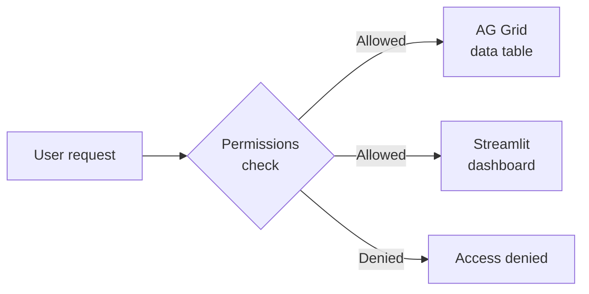

Data is only useful if the right people can see it — and only the parts they're allowed to. Lex App gives you fine-grained access control and interactive dashboards, both defined directly on your models.

## Building Blocks

### [[access-and-dashboards/permissions|Permissions]]
Field-level and row-level access control, integrated with [Keycloak](https://www.keycloak.org/documentation). Define `permission_read()`, `permission_edit()`, and `permission_delete()` methods directly on your model — the framework enforces them on every API request and frontend interaction.

### [[access-and-dashboards/streamlit/index|Streamlit Dashboards]]
Interactive [Streamlit](https://docs.streamlit.io/) dashboards, in both directions: Lex App shows your dashboard, and your dashboard embeds Lex App's own pages and controls. A section of its own, in reading order:

| | |
|---|---|
| [[access-and-dashboards/streamlit/dashboards on your models\|Dashboards on Your Models]] | A dashboard attached to a model — on the record page, or over the whole table |
| [[access-and-dashboards/streamlit/standalone dashboards\|Standalone Dashboards]] | A dashboard of its own, spanning several models |
| [[access-and-dashboards/streamlit/embedding app pages\|Embedding App Pages]] | `lex_view()` — a real table or form inside your dashboard, with events back in Python |
| [[access-and-dashboards/streamlit/embedding app controls\|Embedding App Controls]] | `lex_widgets()` — the real Calculate button, its status and its live log |
| [[access-and-dashboards/streamlit/sessions and authentication\|Sessions & Authentication]] | Who the dashboard runs as, and what to configure before deploying |

There is a [complete project](https://github.com/ExcellenceCloudGmbH/DemoNorthwindAnalytics) you can clone and run that demonstrates every one of them.
