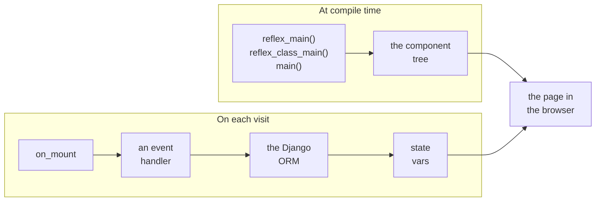
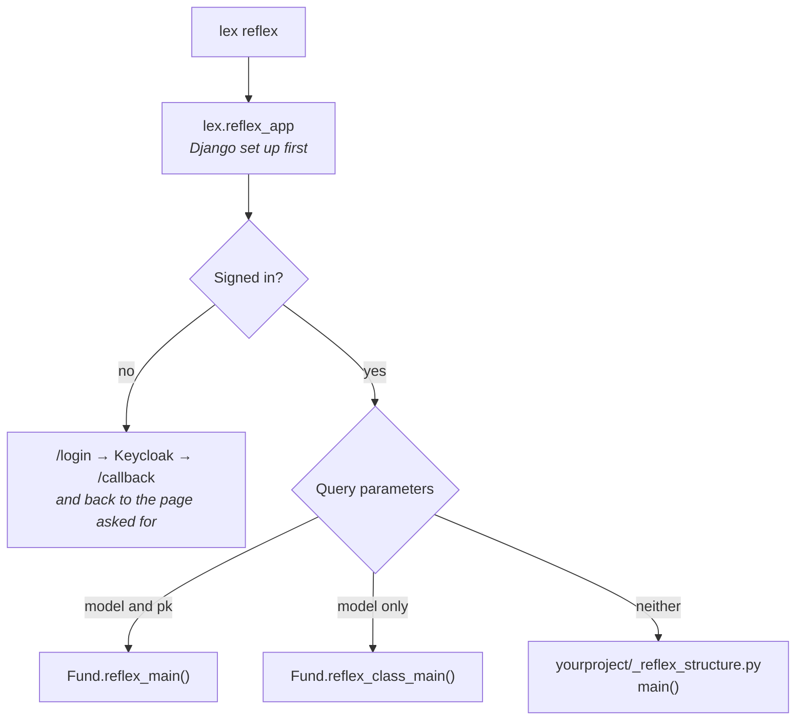

A Lex App project can write its dashboards in [Reflex](https://reflex.dev/docs/) — Python that compiles to a React app — as well as, or instead of, [[access-and-dashboards/streamlit/index|Streamlit]]. A Reflex dashboard takes the same place in Lex App as a Streamlit one: a `lex` command and an IDE run configuration, the same `?model=&pk=` links, an entry in the sidebar, the project's own models through the Django ORM, and the signed-in user from the same Keycloak.

What differs is how Reflex runs, and it changes how you write a dashboard. A Streamlit script runs top to bottom on every interaction, so a dashboard is code that draws. A Reflex app is **compiled ahead of time** into a frontend that talks to a Python backend over a WebSocket. A dashboard is a component tree, built once, and its data lives in a **state** whose event handlers fill it in, per user, at run time.



## Streamlit and Reflex, side by side

| | Streamlit | Reflex |
|---|---|---|
| Run it | `lex streamlit` | `lex reflex` |
| Locally at | `:8501` | `:8502`, backend `:8503` |
| In Lex App's sidebar | `IS_STREAMLIT_ENABLED` | `IS_REFLEX_ENABLED` |
| A record's dashboard | `streamlit_main(self)` | `reflex_main(cls)` |
| A table's dashboard | `streamlit_class_main(cls)` | `reflex_class_main(cls)` |
| The project's own | `_streamlit_structure.py` | `_reflex_structure.py` |
| Signing in | a proxy in front | inside the app |
| The ORM | call it | async, or `run_orm` |
| Permissions | `st.session_state` | `current_permissions` |

A record's Reflex dashboard is a component, not code that runs with the record: its state reads the record with `current_record`. Signing in is [Reflex Enterprise](https://reflex.dev/docs/enterprise/auth/overview/)'s `AuthPlugin`, with no proxy in front, and `has_permission` turns a permission into an `auth=` check.

Everything a dashboard author needs from Lex App is importable from one place:

```python
from lex.lex_app.reflex import current_record, run_orm, has_permission
```

| Name | What it is |
|---|---|
| `current_record` | the record `?model=&pk=` names, read from any state |
| `run_orm` / `orm` | synchronous Django code, run from an async event handler |
| `current_permissions` | the signed-in user's Keycloak UMA permissions |
| `has_permission` | an `auth=` check built from one of them |
| `current_access_token` | the user's Keycloak access token, for calling the Lex App API as them |
| `LexUser` | the signed-in user's names, as vars a component can show |
| `lex_config` | the Reflex configuration a project's `rxconfig.py` returns |

## What to read, in order

| Page | Answers |
|---|---|
| [[access-and-dashboards/reflex/dashboards on your models\|Dashboards on Your Models]] | How do I attach a dashboard to a model, for one record or the whole table? |
| [[access-and-dashboards/reflex/standalone dashboards\|Standalone Dashboards]] | How do I write the project's own dashboard, with pages of its own? |
| [[access-and-dashboards/reflex/the django orm\|The Django ORM]] | How do I read and write my models from an event handler? |
| [[access-and-dashboards/reflex/sessions and authentication\|Sessions & Authentication]] | Who is signed in, what may they see, and what does Keycloak need? |
| [[access-and-dashboards/reflex/running and deploying\|Running & Deploying]] | How do I run it locally, and what does production need? |

> [!important] Reflex Enterprise
> Signing in comes from [Reflex Enterprise](https://reflex.dev/docs/enterprise/overview/), which lex-app installs together with Reflex. It is free during development once the machine is signed in to Reflex — `lex reflex login`, once — and running in production mode needs a paid Reflex tier. [[access-and-dashboards/reflex/running and deploying|Running & Deploying]] has the details.

## Which one runs

One Reflex app serves every kind of dashboard, and the query string decides which you get — exactly as it does for Streamlit:



`?model=fund&pk=42` is the record's dashboard and `?model=fund` the table's — [[access-and-dashboards/reflex/dashboards on your models|Dashboards on Your Models]]. With neither, `/` shows [[access-and-dashboards/reflex/standalone dashboards|the project's own dashboard]], and any further pages the project declares have routes of their own.

With `IS_REFLEX_ENABLED=true`, Lex App's sidebar gains a **Reflex** entry that frames the project's own dashboard, the way the Streamlit entry frames Streamlit's. The record page's [[using-the-app/record-detail/analytics tab|Analytics tab]] and the grid's dashboard toggle open Streamlit dashboards; a Reflex record or table dashboard is opened by its URL — from a link on the project's own dashboard, for instance.

## What stays with Streamlit

`lex_view` and `lex_widgets` — [[access-and-dashboards/streamlit/embedding app pages|embedding Lex App's pages]] and [[access-and-dashboards/streamlit/embedding app controls|its controls]] inside a dashboard — are Streamlit components, and a Reflex dashboard does not have them. A Reflex dashboard links to Lex App's pages instead, or calls the Lex App API as the signed-in user; see [[access-and-dashboards/reflex/sessions and authentication|Sessions & Authentication]].

The two can run side by side: `lex streamlit` and `lex reflex` use different ports, and a project can carry both a `_streamlit_structure.py` and a `_reflex_structure.py`.
