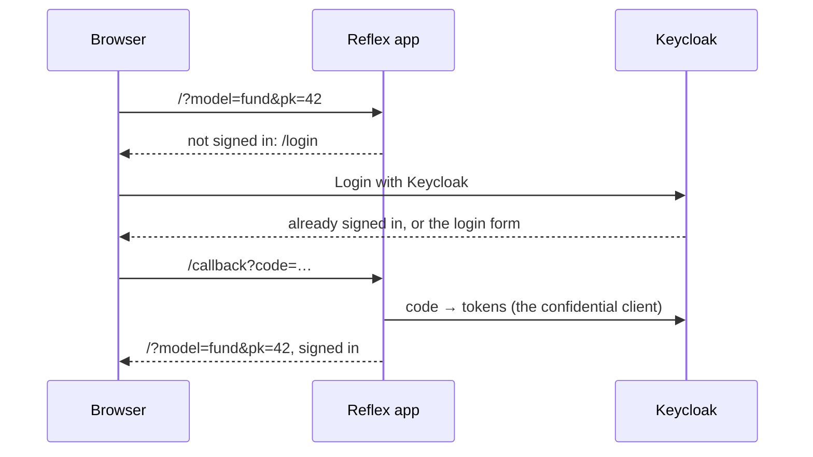

A Reflex dashboard runs as the person looking at it, and it signs them in itself. There is no proxy in front of it, as there is for [[access-and-dashboards/streamlit/sessions and authentication|Streamlit]]: [Reflex Enterprise](https://reflex.dev/docs/enterprise/auth/overview/)'s `AuthPlugin` runs the sign-in inside the app, and Lex App points it at the project's own Keycloak. This page is what happens, and the two things Keycloak needs before it works.

## Every page requires sign-in

Every page, event handler and state var requires a signed-in user unless it says otherwise. A visitor who is not signed in is sent to `/login`, clicks **Login with Keycloak**, signs in at Keycloak, and comes back through `/callback` to the page they asked for — query string included, so `?model=fund&pk=42` survives the round trip. Someone already signed in to Keycloak, in Lex App for instance, is not asked for a password again.



Something that must be public says so with `auth=False` — `@rxe.page(route="/status", auth=False)`, `@rxe.event(auth=False)`, `rxe.var(auth=False)`. On a dashboard that is rarely right.

## Inside Lex App's frame

Framed by Lex App — the **Reflex** entry in the sidebar — the dashboard behaves the same with two differences:

- **Signing in takes one click in a popup.** Keycloak's login page refuses to render inside a frame, so Reflex Enterprise signs in through a small popup window instead. The user clicks **Login with Keycloak** once; being signed in to Lex App already, the popup finishes by itself and closes.
- **The dashboard's own header is left out.** Lex App opens it with `lex_embed=1`, and the page then draws neither the signed-in user nor a **Sign out** button: Lex App's header shows both.

A dashboard served over HTTP from anywhere but `localhost` cannot keep anyone signed in, framed or not — the sign-in cookies are `Secure`, and browsers drop them on plain HTTP. The symptom is a login loop. Serve it over HTTPS.

## What to configure

### Nothing new in `.env`

The dashboard signs in with the settings the project already has for Keycloak — the realm, and the confidential client Django signs users in through:

| The plugin needs | Lex App reads | Overrides, strongest first |
|---|---|---|
| The issuer | `KEYCLOAK_URL` and `KEYCLOAK_REALM` | `LEX_KEYCLOAK_ISSUER_URI`<br>`OIDC_ISSUER_URI` |
| The client ID | `OIDC_RP_CLIENT_ID` | `LEX_KEYCLOAK_CLIENT_ID`<br>`OIDC_CLIENT_ID` |
| The client secret | `OIDC_RP_CLIENT_SECRET` | `LEX_KEYCLOAK_CLIENT_SECRET`<br>`OIDC_CLIENT_SECRET` |

The issuer is the realm's URL, `<KEYCLOAK_URL>/realms/<KEYCLOAK_REALM>`. The overrides are Reflex Enterprise's own variables, and a set one always wins. `KEYCLOAK_CLIENT_ID` is never used: in Lex App it names the client handed to the browser, which is not the one a dashboard signs in through.

Two of the proxy's settings apply here too, with the same meaning: `OIDC_ISSUER`, when the tokens carry a different issuer from the URL the server reaches Keycloak on, and `OIDC_VERIFY_SSL=false`, for a local Keycloak with a self-signed certificate. The proxy's session settings — `SESSION_SECRET`, `TOKEN_REDIS_URL`, `LEX_PROXY_REPLICAS` — do not: the sign-in keeps nothing on the server to configure.

### Keycloak: two lists of URLs

Keycloak only sends a user back to a URL it knows. In the confidential client's settings — the client `OIDC_RP_CLIENT_ID` names — add the dashboard's origin to two lists:

| Keycloak setting | Add, for development and for production |
|---|---|
| **Valid redirect URIs** | `http://localhost:8502/callback`<br>`https://dashboards.example.com/callback` |
| **Valid post logout redirect URIs** | `http://localhost:8502/*`<br>`https://dashboards.example.com/*` |

The callback is built from the address in the browser, so every origin people actually use needs an entry — and behind a reverse proxy, the app must see the public scheme and host, or it builds an `http://` callback that matches nothing. A missing entry shows up as Keycloak's *Invalid parameter: redirect_uri* instead of the login form.

## Staying signed in

Access tokens are short-lived, and the dashboard renews its own before it expires — in the background, coordinated across the tabs a user has open, without reloading the page. The tokens live in HTTP-only cookies: the page's JavaScript never sees them, and nothing about the sign-in is kept on the server. (Reflex does keep each user's page state on its backend, so more than one backend replica needs a shared Redis — see [[access-and-dashboards/reflex/running and deploying|Running & Deploying]].)

A dashboard session is bound to the user's **Keycloak session**, exactly like a Lex App or Streamlit session. Signing out of Lex App, an administrator ending the session, or the realm's maximum session lifetime ends the dashboard's session too: its next renewal fails, and the user is signed out.

> [!note] Why the dashboard does not ask for `offline_access`
> Reflex's own documentation adds the `offline_access` scope to obtain a refresh token. Keycloak issues one without it — the Streamlit proxy has always renewed with exactly that — and with it the refresh token becomes an *offline* token that outlives the Keycloak session. A dashboard would then stay signed in after the user signed out of Lex App. It is left out on purpose.

## Who is signed in

In a component, the user is a set of vars:

| Var | Holds |
|---|---|
| `LexUser.display_name` | the name, else the username, else the email |
| `LexUser.username` | Keycloak's `preferred_username` |
| `User.name`, `User.email` | the `name` and `email` claims |
| `User.sub` | Keycloak's stable user ID |

```python
import reflex as rx
from reflex_enterprise.auth import User

from lex.lex_app.reflex import LexUser


def greeting() -> rx.Component:
    return rx.text("Signed in as ", LexUser.display_name, " (", User.email, ")")
```

All are empty until sign-in. In an event handler, `await User.current()` returns the signed-in user's claims, or `None`.

`User.logout` is the event that signs out — `rx.button("Sign out", on_click=User.logout)`. It ends the user's Keycloak session, which is the same one Lex App signs in with.

## What they may see

The ORM reads as the dashboard, **not** as the user. Lex App's [[access-and-dashboards/permissions|permission methods]] — `permission_read` and the rest — guard the API and the grid; a query in a handler returns whatever it asks for. Decide what a user may see with their Keycloak permissions:

**`current_permissions(self)`** returns the user's Keycloak UMA permissions — the list a Streamlit dashboard reads from `st.session_state.permissions`, one `{"rsname": …, "scopes": […]}` entry per resource:

```python
import reflex as rx

from lex.lex_app.reflex import current_permissions


class Overview(rx.State):
    resources: list[str] = []

    @rx.event
    async def load(self):
        permissions = await current_permissions(self)
        self.resources = sorted({p["rsname"] for p in permissions})
```

It asks Keycloak once per access token, and again after each renewal, so a changed role takes effect within minutes. If Keycloak cannot answer, the user keeps what they were last granted; someone Keycloak never answered for gets nothing.

**`has_permission(target, scope)`** turns one of them into an `auth=` check — for an event handler (`rxe.event`), a state field (`rxe.field`) or a computed var (`rxe.var`):

```python
import reflex as rx
import reflex_enterprise as rxe

from Input.Fund import Fund
from lex.lex_app.reflex import has_permission, run_orm


def _fund_count() -> str:
    return str(Fund.objects.count())


def _round_budgets() -> None:
    for fund in Fund.objects.all():
        fund.budget = round(fund.budget)
        fund.save()


class FundActions(rx.State):
    fund_count: str = rxe.field("", auth=has_permission(Fund, "read"))

    @rxe.event(auth=has_permission(Fund, "read"))
    async def load(self):
        self.fund_count = await run_orm(_fund_count)

    @rxe.event(auth=has_permission(Fund, "edit"))
    async def round_budgets(self):
        await run_orm(_round_budgets)
```

`target` is a model — resolved to the Keycloak resource Lex App registers for it, `<app_label>.<ModelName>` — or a resource name as a string. `scope` is one of the scopes Lex App registers: `list`, `read`, `create`, `edit`, `delete`, `export`; `read` when left out. Only a **model-wide** grant counts: a grant scoped to single records does not open a check on the whole model, the same rule the API's default read check follows. A denied event is refused with a notice; a denied var is not sent to the browser at all.

A page's own `auth=` is on or off, not a check. For a page only some users may open, put the check on the vars and handlers that carry its data.

## Calling the Lex App API as the user

`current_access_token(self)` returns the signed-in user's Keycloak access token. Sent as a bearer token, it calls the Lex App API as that user, so their permissions apply exactly as they do in the grid:

```python
import httpx
import reflex as rx

from lex.lex_app.reflex import current_access_token


class Funds(rx.State):
    rows: list[dict] = []

    @rx.event
    async def load(self):
        token = await current_access_token(self)
        async with httpx.AsyncClient(base_url="http://localhost:8000") as client:
            response = await client.get(
                "/api/model_entries/fund/list",
                headers={"Authorization": f"Bearer {token}"},
            )
        self.rows = response.json()["results"]
```

`http://localhost:8000` is `lex start` locally; in production it is wherever the dashboard reaches the Lex App backend. The token never reaches the browser, and it is always a current one: the dashboard renews it before it expires.

## Related

- [[access-and-dashboards/permissions|Permissions]] — the scopes and resources `has_permission` checks
- [[access-and-dashboards/reflex/running and deploying|Running & Deploying]] — HTTPS, public URLs and the rest of production
- [[reference/Environment Variables|Environment Variables]] — every setting named on this page
