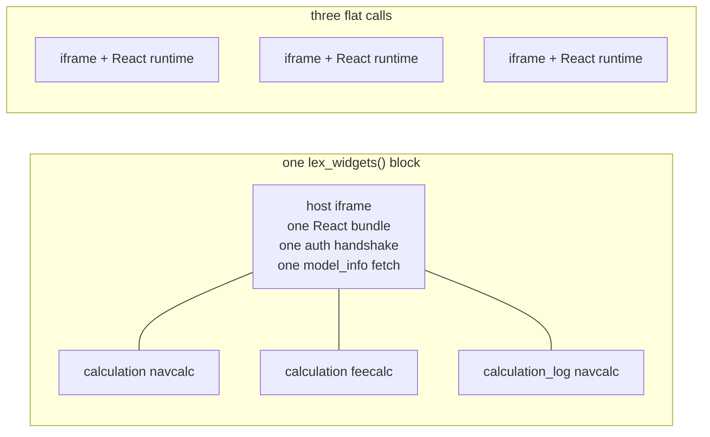

A Streamlit dashboard can host the application's *own* controls. Not a screenshot of the Calculate button, and not a re-implementation of it — the real control, wired to the real record, with the same status pill, the same live log and the same permissions as the grid.

**Four pages of [Northwind Analytics](https://github.com/ExcellenceCloudGmbH/DemoNorthwindAnalytics) run everything below against real data:** *The three widgets*, *Shaping a control* — every argument rendered live — *Reacting to a run*, and *Layout and cost*.

Use this when a dashboard is where the work happens: a report page where the reader should be able to re-run the calculation they are looking at, without leaving for the grid and coming back.

<!-- 📸 TODO: a Streamlit page with a Calculate control and its live log
     beside a chart.

     BLOCKED on authentication, not on a dashboard. The e2e project now has
     one (Fund.streamlit_main), and the capture harness can start
     `lex streamlit` on request — both were added for this. What stops it is
     that the Streamlit proxy authenticates with a Keycloak JWT while the
     harness signs in with a Django admin session, so the embed renders
     "Authentication Failed".

     Wiring JWT issuance into the fixture is real auth work that the security
     specs have a stake in; it is not a screenshot task. The capture exists
     and is skipped (`docshots.spec.ts`, "the Analytics tab") — when someone
     does that work, the test passes and the figure appears. -->

## One widget

Each widget has a flat, one-call form. It takes the model's name and the record's primary key:

```python
from lex.lex_app.streamlit import lex_calculation

lex_calculation("navcalc", pk=1)
```

That renders the full control — the status pill, the Calculate button and the button that opens the live log.

| Call | What it renders |
|---|---|
| `lex_calculation(model, pk)` | The Calculate control: status pill, button, log button |
| `lex_calculation_log(model, pk)` | The calculation log as a **live stream** |
| `lex_calculation_log_tree(model, pk)` | The finished run's **execution tree** |

The stream and the tree answer different questions. The stream shows what is happening now; the tree shows how a completed run was structured. Reach for the stream while you are watching, and the tree when you are navigating something that already finished.

Both follow the record's **latest** run. To show one particular run instead —
last month's, say, next to today's — pass its id as `calculation_id`, the same
id the audit log records for each run:

```python
lex_calculation_log_tree("navcalc", pk=1, calculation_id="a3f9c2…")
```

It has to be a string. Anything else is dropped on the way to the browser, and
the widget quietly falls back to the latest run.

## Several widgets

Every flat call is its own iframe, and therefore its own React runtime. That is the right trade for one or two controls and the wrong one for ten. Once a page has several, open a widget page and declare them together — they then share a single frame:

```python
from lex.lex_app.streamlit import lex_widgets

with lex_widgets(key="report") as page:
    page.calculation("navcalc", pk=1, title="Net asset value")
    page.calculation("feecalc", pk=1, title="Fees")
    page.calculation_log("navcalc", pk=1, height=420)
```



Widget count is free; block count is not. Both sides above render the same three
controls, and the right-hand one boots three React applications that contend for
the same network and main thread. You see it as widgets still coming up after
you scroll down — which looks like lazy loading and is not: every frame starts
at once, and each pays for its own boot. Fewer blocks is the fix.


One block, three widgets, after the run. The control carries the status, the
live log has the calculation's own `LexLogger` output in it, and the execution
tree and consolidated log below are the same run seen two other ways.

`lex_widgets()` and the flat calls are the same code path — the flat form enters and exits the block in one call. There is one manifest builder and one host, so the two cannot drift apart in what they think a widget is.

## Shaping a control

`page.calculation()` is composable, and **absence means hidden**. The default is minimal; you add what a layout needs.

| Argument | Effect |
|---|---|
| `variant` | `"full"` (pill + button), `"status"` (pill alone), `"action"` (button alone) |
| `title` | A heading above the control. Omit it and no heading renders |
| `fields` | Record fields beside the control, drawn by the application's own field renderer — a foreign key shows its display name, a datetime is formatted as the grid formats it |
| `show_log` | Put the log inline under the control |
| `log_height` | Height of that inline log, in pixels. Only applies with `show_log=True` |
| `show_log_button` | A button that opens the run's log in a dialog over the page — see [below](#the-log-dialog). On by default |
| `on_status` | Return the latest status envelope instead of `None` |
| `id` | Name the widget yourself — see [Widget ids](#widget-ids) |

The inline log takes `log_height`; the standalone log widgets take `height`.
Give one to the other and Python raises `TypeError` for an unexpected keyword
argument before anything renders.

When the log is the point, declare it separately rather than with `show_log=True`. A control wants a single line; a two-pane tree wants width and height. Declaring them apart is what lets the control sit in a narrow column and the log run full width beneath it.

## The log dialog

The log button opens a Streamlit dialog over the **page**, not a popup inside
the widget. It is wide, holds the live log at 820 pixels tall, and shows the run
the button belongs to. Each click opens it once.

A popup could not work there: inside an embedded frame it is clipped to the
frame's own box, so a log several hundred rows long would show through a slot a
few lines high. The dialog is bounded by the browser window instead. It behaves
the same for the flat `lex_calculation` and for a control inside a block.

## Layout

**Width belongs to Streamlit, not to the widget.** A custom component occupies a full-width block, so even a lone button spans the page. Constrain it the way you would constrain any Streamlit element:

```python
narrow, rest = st.columns([1, 6])
with narrow:
    with lex_widgets(key="run") as page:
        page.calculation("navcalc", pk=1, variant="action", show_log_button=False)
with rest:
    st.write("… your own content, beside the button …")
```

`min_height` is a **floor, not a size** — the height used before the host reports what it actually needs. It defaults to 48 pixels, one control row. Raise it only when you know a block is tall and want to avoid the initial reflow — a control with a log and a tree under it, for instance, which would otherwise open as one row and then jump to its full height:

```python
with lex_widgets(key="revalue", min_height=640) as page:
    page.calculation("navcalc", pk=1)
    page.calculation_log("navcalc", pk=1, height=260)
    page.calculation_log_tree("navcalc", pk=1, height=300)
```

It belongs to the block and to the flat calls, not to the individual widgets inside a block.

## Reacting to a result

With `on_status=True`, the call returns the latest status envelope, so the rest of the page can respond to a run finishing:

```python
status = lex_calculation("navcalc", pk=1, on_status=True)
if status and status["payload"]["status"] == "SUCCESS":
    st.success("Recalculated — the figures below are current.")
```

The envelope has the same shape as the one
[[access-and-dashboards/streamlit/embedding app pages#The event envelope|the one lex_view returns]]:

| Key | Meaning |
|---|---|
| `type` | Always `"calculation_status"` here. The call filters on it, and on the widget, before returning anything |
| `id` | `"<widget_id>:<status>"`. An envelope with the same id as the one before it is dropped, so you see each *change* of status, once |
| `payload.widget_id` | Which widget this is about, when a block has several |
| `payload.model` | The model the widget is wired to |
| `payload.pk` | The record's primary key |
| `payload.status` | The calculation's state — `SUCCESS`, `ERROR`, `IN_PROGRESS`, and the rest of the [[calculations/calculation models#The State Machine|state machine]] |

It arrives on the **next** rerun, not during the one that started the run.

The control also reports the record's current status as soon as it loads, so a
record that already succeeded returns `SUCCESS` before anyone has clicked. To
react only to a run that finishes on this page, compare with the status you saw
last, for instance in `st.session_state`.

## Blocks in a loop

A block's key comes from the line it is written on, so blocks on different lines
never collide — with or without `key`. Two blocks from the **same** line do: a
block inside a loop, or a helper function that opens one and is called twice.
Streamlit then raises a duplicate-key error (`StreamlitDuplicateElementKey`)
naming a `lex_widgets_…` key you never wrote.

Give each iteration its own key, or move the loop inside a single block, which
is cheaper anyway:

```python
for pk in fund_pks:
    with lex_widgets(key=f"fund_{pk}") as page:
        page.calculation("navcalc", pk=pk)

# or one frame for all of them:
with lex_widgets(key="funds") as page:
    for pk in fund_pks:
        page.calculation("navcalc", pk=pk)
```

A key that is the same on every iteration does not help: the line is still part
of it. The flat calls are different — `lex_calculation` folds the model and pk
into its key, so a loop over different records is fine as it is.

## Widget ids

You rarely need to set widget ids yourself. An id is derived from what the widget is *about* — its kind, model and primary key, like `calculation_navcalc_1` — not from its position, so putting a widget behind an `if` does not renumber the ones after it. Ids used to be positional, and on the rerun where such a condition flipped, a status envelope could be routed to the wrong widget.

The case that needs `id=` is the same kind, model and pk twice in one block. The
repeats are numbered in the order you declare them (`calculation_navcalc_1__1`),
so when the first of the two sits behind an `if`, the second one's id shifts on
the rerun where the condition flips. Name both:

```python
with lex_widgets(key="nav") as page:
    if can_run:
        page.calculation("navcalc", pk=1, variant="action", id="nav_button")
    page.calculation("navcalc", pk=1, variant="status", id="nav_pill")
```

Keep explicit ids distinct from each other and from the derived ones.

> [!warning] A malformed widget raises rather than rendering blank
> `WidgetSpecError`, a `ValueError`, is raised when a widget's *values* cannot
> make a spec — a `variant` other than `"full"`, `"status"` or `"action"`,
> `fields` given as a bare string instead of a list, a `log_height` or `height`
> that is not a positive whole number, a pk that is neither a string nor an
> integer, or two widgets given the same `id` (checked when the block closes). A
> misspelled option is caught earlier, by Python: an unexpected keyword
> argument raises `TypeError`. Either way it surfaces as an exception rather
> than an empty frame, because an empty frame looks like a loading state and
> gets waited on.
>
> A model or primary key that does not *exist* is a different case and does not
> raise: that widget renders an error card and its siblings keep working. The
> spec was well-formed; the record was not there.

## Related

- [[access-and-dashboards/streamlit/embedding app pages|Embedding App Pages]] — the same idea for a whole lex-app route, and reacting to what happens in it
- [[access-and-dashboards/streamlit/standalone dashboards|Standalone Dashboards]] — the page these controls usually live on
- [[calculations/logging|Logging]] — what appears in the log these widgets display
