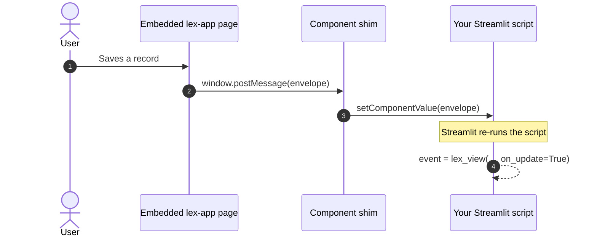

`lex_view()` puts a real Lex App page — a table, a form, a record — inside a [Streamlit](https://docs.streamlit.io/) script.

**Four pages of [Northwind Analytics](https://github.com/ExcellenceCloudGmbH/DemoNorthwindAnalytics) run everything below against real data:** _A route, embedded_, _Narrowing with a serializer_, _Reacting to events_ — which prints the live envelope beside the table — and _Chaining forms with Flow_.


That is the application's grid, not a copy of it: the same saved views, the same filters, the same export, living inside a Streamlit page.

There are three levels to this, and you can stop after the first:

| Level     | What you write                         | What you get                                      |
| --------- | -------------------------------------- | ------------------------------------------------- |
| **Embed** | `lex_view("investor")`                 | A plain iframe. Returns `None`.                   |
| **React** | `lex_view("investor", on_select=True)` | The user's actions come back to Python as events. |
| **Chain** | `lex_view("investor", flow=…)`         | The user is routed from one form to the next.     |

```python
from lex.lex_app.streamlit import lex_view
```

Call it without callback flags and it behaves exactly as a plain embed always has — nothing about existing call sites changes. Turn on one or more `on_*` flags when you want Python to react to what the user does.

The embedded page keeps lex-app's own chrome. On narrower layouts its sidebar collapses to icons instead of disappearing completely, and the account menu lives in the top bar — so users can still navigate and reach their account controls without leaving the dashboard.

## Basic usage

```python
import streamlit as st
from lex.lex_app.streamlit import lex_view

event = lex_view("investor", on_select=True)

if event and event["type"] == "select":
    st.write("Selected row IDs:", event["payload"]["ids"])
```

When at least one callback flag is set, `lex_view()` switches from a plain iframe to a bidirectional component and returns the latest **event envelope** (or `None` until the first event arrives). Each time the user acts in the embedded page, Streamlit re-runs your script with the new event as the return value.

## Callback flags

Turn on only what you need:

| Flag           | `type`       | `payload`                | Fires when…                                   |
| -------------- | ------------ | ------------------------ | --------------------------------------------- |
| `on_create`    | `"create"`   | `resource`, `id`, `data` | A create form saves                           |
| `on_update`    | `"update"`   | `resource`, `id`, `data` | An edit form saves                            |
| `on_delete`    | `"delete"`   | `resource`, `id`         | A record is deleted from the edit toolbar     |
| `on_select`    | `"select"`   | `resource`, `ids`        | The grid selection changes (debounced 150 ms) |
| `on_navigate`  | `"navigate"` | `from`, `to`             | The embedded app routes somewhere else        |
| `on_flow_step` | —            | —                        | Nothing is emitted for this type — see below  |

`data` on a create or update is the **whole saved record** as the API returned it, not just the id.

`on_select` is opt-in for a reason: it drives a Streamlit re-run on _every_ grid selection change, which is expensive. The framework only wires the grid's selection callback when you explicitly ask for it.

> [!warning] `on_flow_step` does not deliver an event today
> The flag is accepted and forwarded as `?emit_flow_step=true`, and the
> embedded app maps it — but nothing emits a `flow_step` event, so a handler
> guarded on `event["type"] == "flow_step"` never runs.
>
> Flows themselves work: the routing happens inside the embedded app and needs
> no event to reach Python. Setting `on_flow_step=True` does have one real
> effect, which is switching `lex_view` into bidirectional mode — but any
> `on_*` flag does that. **To follow a flow's progress, use `on_create` and
> `on_update`**, which fire at each step that saves.

## How an event reaches your script

There is no polling and no backend round-trip. The embedded page posts a message
to its parent, a small shim hands it to Streamlit, and Streamlit re-runs your
script — so the event arrives as the return value of the same `lex_view(...)`
call that drew the frame.



Because the script re-runs, everything below the `lex_view(...)` call is
evaluated again with the event in hand. The envelope carries an `id` so a re-run
does not deliver the same event twice.


The panel on the right is `st.json(event)` and nothing else — five rows ticked
in the embedded table, and the envelope that came back for them.

## The event envelope

Every event the embedded page sends back is a dict with a stable shape:

| Key       | Meaning                                                                                                                                                 |
| --------- | ------------------------------------------------------------------------------------------------------------------------------------------------------- |
| `type`    | The event kind — `"create"`, `"update"`, `"delete"`, `"select"` or `"navigate"`                                                                         |
| `payload` | Type-specific data; the table under [[access-and-dashboards/streamlit/embedding app pages#Callback flags\|Callback flags]] gives the keys for each type |
| `id`      | A unique event ID, used to de-duplicate re-runs so your handler doesn't fire twice for the same event                                                   |
| `ts`      | Milliseconds since the epoch, set in the browser when the event was raised                                                                              |
| `source`  | Always `"lex-app"`                                                                                                                                      |
| `version` | The bridge protocol version                                                                                                                             |

A create event, in full:

```python
{
    "source": "lex-app",
    "version": 1,
    "type": "create",
    "id": "01J8ZQ…",
    "ts": 1758723041123,
    "payload": {
        "resource": "investor",
        "id": 42,
        "data": {"id": 42, "name": "Acme Holdings", "currency": "EUR", ...},
    },
}
```

Guard your handler on `event and event["type"] == "..."` — `event` is `None` on the first render before anything has happened. The type check matters for a second reason: every event type shares one component value, so a handler that reads `event["payload"]["ids"]` without checking the type will raise the moment a different event arrives.

## Redirect flows (`flow=`)

For multi-step workflows, pass a routing table with `flow=`. Each key is `"<resource>/<operation>"` (operation is `create` or `update`); each value is the route to open next. Targets support the `{resource}` and `{id}` template tokens.

```python
event = lex_view(
    "investor",
    on_create=True,
    flow={
        "investor/create": "/cashflow/{id}/edit",
        "cashflow/update": "/investor",
    },
)
```

You can also build the table declaratively with `Flow()`, which reads a little better for longer chains:

```python
from lex.lex_app.streamlit import Flow

flow = (
    Flow()
    .after_create("investor", "/cashflow/{id}/edit")
    .after_update("cashflow", "/investor")
)

lex_view("investor", on_create=True, flow=flow)
```

### Staying put after a save

For repeated entry — enter a record, clear the form, enter the next — route to `STAY`
instead of a path:

```python
from lex.lex_app.streamlit import STAY, Flow

flow = Flow().after_update("cashflow", STAY)
```

`STAY` means _don't navigate; stay on this form and clear it_. It exists as a constant
rather than a bare string so a typo is an error where you wrote it, instead of a redirect
that quietly never happens.

> [!note] Only `create` and `update` can be routed
> Writing a `delete` rule raises `FlowError` immediately. The app does emit a
> record-deleted event, but it has no delete-redirect resolver — so such a rule would be
> accepted, serialised, shipped, and then ignored. Rejecting it at the call site turns a
> silent no-op into a message you can act on.

For the simpler single-hop case you don't need a flow table at all — `redirect_after`, `redirect_after_create`, and `redirect_after_update` each take a single route (with the same `{resource}` / `{id}` tokens).

### When the order matters

Everything above is a **mapping**: a rule fires whenever its operation happens,
wherever the user is. That answers "after any investor is created, go here" — and
it cannot answer three questions, because a mapping has no position in it:

- **Order.** `create t1 → create t2 → create t1` needs the same key twice.
- **Repetition.** `STAY` repeats one form; it cannot cycle a pair.
- **References.** `{id}` always means the record just saved, so a step cannot
  say "edit the record step 1 made".

For those, build the flow as a **sequence** instead. The same `Flow` object, a
different set of methods — each call appends a step, and the flow advances one
position per save:

```python
from lex.lex_app.streamlit import Flow, ref

flow = (
    Flow()
    .create("investor", as_="inv")   # name it, to come back to it later
    .create("vehicle")               # no id needed — follows the step before
    .update("investor", id=ref("inv"))
    .table("investor")               # the ending
)

lex_view("investor", on_create=True, flow=flow)
```

| Method                                    |        | What it opens                                    |
| ----------------------------------------- | ------ | ------------------------------------------------ |
| `.create(resource, *, as_=None)`          | step   | the create form                                  |
| `.update(resource, id=None, *, as_=None)` | step   | the edit form for one record                     |
| `.goto(path)`                             | step   | any route; `{id}` and `{resource}` interpolate   |
| `.table(resource=None)`                   | ending | the table — defaults to the last step's resource |
| `.show(resource=None, id=None)`           | ending | one record's detail page                         |
| `.end_goto(path)`                         | ending | any route                                        |
| `.loop()`                                 | ending | start again from the first step                  |
| `.loop_last()`                            | ending | repeat the final step                            |

#### Which record a step edits

`update` takes an id three ways, and choosing between them is the point of the
step:

```python
.update("cashflow")                  # the record the PREVIOUS step produced
.update("cashflow", id=3)            # a literal you knew when writing the flow
.update("cashflow", id=ref("inv"))   # a step you named with as_
```

References point **backwards only** — `ref("inv")` for a step not yet written
raises `FlowError` where you wrote it, rather than failing at run time. Names
must be unique for the same reason: two steps sharing one name would give
`ref()` two answers and silently take the later.

An implicit id needs a previous step that actually saves something. After a
`.goto()` — which saves nothing — the next step must name its record.

#### Repeating

```python
Flow().create("investor").loop_last()                # one form, over and over
Flow().create("investor").create("vehicle").loop()   # cycle the pair forever
```

`loop_last()` is `STAY` with a cursor that does not move: the form clears in
place. `loop()` restarts from step one and **clears the bindings** on each pass,
so a `ref` cannot reach back into the previous lap — an iteration is a fresh run.

> [!warning] The two forms cannot be mixed
> Adding a step to a flow that already holds mapping rules raises `FlowError`,
> and so does adding anything after an ending. A step fires at its position and a
> mapping rule fires whenever its operation happens; a flow holding both has no
> single answer. Pick one.

Existing flows are unaffected — a mapping serialises to exactly the bytes it
always did, and `after_create` / `after_update` / `after_save` / `STAY` keep
working unchanged.

## Choosing a serializer

Use `serializer=` when the embedded view should shape its data with a specific DRF serializer registered on the model:

```python
lex_view("investor", serializer="InvestorWithFundSerializer")
```

If the name isn't a serializer registered for that model, the embedded request returns HTTP `400` with a validation error rather than silently falling back.

## Existing embed options still work

All the layout and routing options you already use remain available alongside the callbacks: `hide_toolbar`, `hide_actions`, `redirect_after` / `redirect_after_create` / `redirect_after_update`, `height`, `width`, `scrolling`, `extra_params`, and `base_url`. (In bidirectional mode `width` and `scrolling` are ignored — the component is always full width.)

## Light and dark

You don't need to pass anything. The embedded page takes its light/dark mode from the
host page and stays in step with Lex App in both directions, without a reload — see
[[using-the-app/themes|Themes]].

> [!warning] The `theme` argument is superseded
> `lex_view()` still accepts `theme="light"` / `theme="dark"`, but the embedded app no
> longer reads it — it follows the host page instead. Passing it has no effect; it is
> kept so existing call sites don't break.

## Related

- [[access-and-dashboards/streamlit/embedding app controls|Embedding App Controls]] — the same idea for a single control rather than a whole page
- [[model-your-data/serializers|Serializers]] — what `serializer=` selects, and how to register one
- [[access-and-dashboards/streamlit/standalone dashboards|Standalone Dashboards]] — the page these calls usually live on
