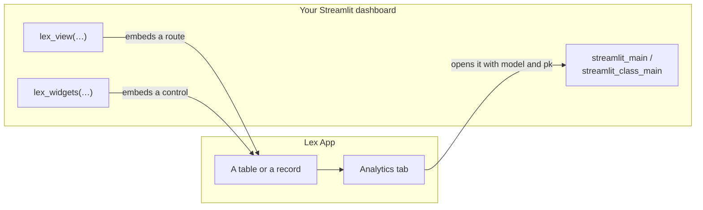
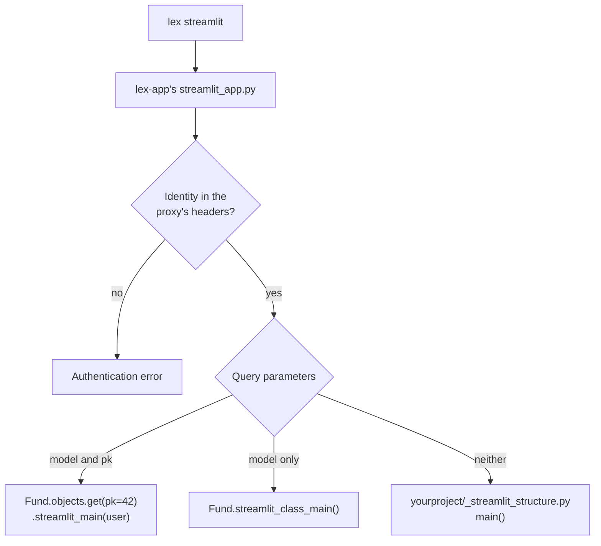

A Lex App project can carry interactive [Streamlit](https://docs.streamlit.io/) dashboards, and the two embed into **each other**. Hold on to that before reading anything else here: "a Streamlit dashboard" means two different jobs depending on which way round you are, and most of the confusion on this subject comes from mixing them.

**Downward**, lex-app opens your dashboard. The Analytics tab on a record, and the chart icon on a table, both point at the Streamlit process with the model and primary key in the query string; the framework calls your `streamlit_main` or `streamlit_class_main` with them. You write Streamlit; the framework decides when it is shown.

**Upward**, your dashboard opens lex-app. `lex_view` embeds one of the application's routes — a table, a form, a record — and `lex_widgets` embeds one of its controls. These are the same components the application renders, not copies, so a filter applied in an embedded table is the same filter, saved to the same view.

## What to read, in order

| Page | Answers |
|---|---|
| [[access-and-dashboards/streamlit/dashboards on your models\|Dashboards on Your Models]] | How do I attach a dashboard to a model, so it shows up on the record page or the grid? |
| [[access-and-dashboards/streamlit/standalone dashboards\|Standalone Dashboards]] | How do I write a dashboard that is not about one model — a whole application of its own? |
| [[access-and-dashboards/streamlit/embedding app pages\|Embedding App Pages]] | How do I put a real lex-app table or form on my dashboard, and react in Python when the user acts on it? |
| [[access-and-dashboards/streamlit/embedding app controls\|Embedding App Controls]] | How do I put the real Calculate button and its live log on my dashboard? |
| [[access-and-dashboards/streamlit/sessions and authentication\|Sessions & Authentication]] | Who is the dashboard running as, and what do I configure before deploying it? |

The first two are downward, the next two are upward, and the last applies to all of them.

## A project you can run

**[ExcellenceCloudGmbH/DemoNorthwindAnalytics](https://github.com/ExcellenceCloudGmbH/DemoNorthwindAnalytics)** is a complete, public Lex App project written for exactly this section. Five funds, their positions and one calculation that values a fund — enough data for every page to show something real, and small enough to read in a sitting.

Its `_streamlit_structure.py` is a ten-page dashboard, and its sidebar is organised the same way this section is — by which way round the embedding goes. Every page on this site has a page there that runs it:

| Its page | What it calls | Documented in |
|---|---|---|
| Overview | `st.metric`, `st.bar_chart` and `lex_widgets` in one layout | — |
| A route, embedded | `lex_view("fund")`, and every plain-embed argument | [[access-and-dashboards/streamlit/embedding app pages\|Embedding App Pages]] |
| Narrowing with a serializer | `lex_view(serializer="summary")` | [[model-your-data/serializers\|Serializers]] |
| Reacting to events | all six `on_*` flags, with the live envelope beside the table | [[access-and-dashboards/streamlit/embedding app pages\|Embedding App Pages]] |
| Chaining forms with Flow | `flow=` as a mapping and as a sequence, each with its wire form | [[access-and-dashboards/streamlit/embedding app pages\|Embedding App Pages]] |
| The three widgets | `calculation`, `calculation_log`, `calculation_log_tree` | [[access-and-dashboards/streamlit/embedding app controls\|Embedding App Controls]] |
| Shaping a control | every argument `page.calculation()` takes, rendered live | [[access-and-dashboards/streamlit/embedding app controls\|Embedding App Controls]] |
| Reacting to a run | `on_status=True` and the status envelope | [[access-and-dashboards/streamlit/embedding app controls\|Embedding App Controls]] |
| Layout and cost | width, `min_height`, and one block versus many | [[access-and-dashboards/streamlit/embedding app controls\|Embedding App Controls]] |
| Record and table dashboards | `streamlit_main` and `streamlit_class_main` | [[access-and-dashboards/streamlit/dashboards on your models\|Dashboards on Your Models]] |

Each of those pages follows the same four beats — what it shows, the code, the live thing, what to notice. It also carries a real `Fund.streamlit_main`, which is what the [[using-the-app/record-detail/analytics tab|Analytics tab]] renders, and the serializer that makes `serializer="summary"` resolve. Clone it and run it; the pages here explain what you are looking at.

## Which one runs

One Streamlit process serves all three kinds of dashboard, and the query string decides which you get:

The frontend links to the first two branches with `?model=fund&pk=42` and `?model=fund` respectively — the record- and table-level dashboards of [[access-and-dashboards/streamlit/dashboards on your models|Dashboards on Your Models]]. The third is [[access-and-dashboards/streamlit/standalone dashboards|a standalone dashboard]].

Streamlit runs as a separate process alongside your application. See [[start-here/running your app]] for how to start it.

> [!tip]
> We recommend running Streamlit from your IDE (e.g. PyCharm) using the `lex streamlit` command, which handles environment configuration automatically.
