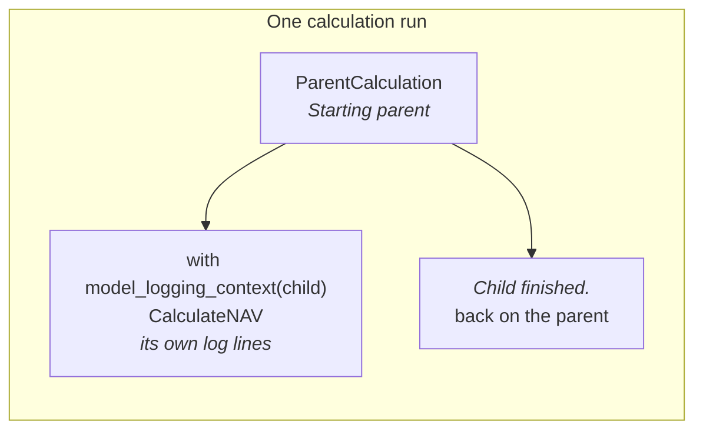

Lex App provides `LexLogger`, a builder-pattern logging API that produces rich, Markdown-formatted log entries. It supports text, headings, tables, DataFrames, code blocks, and more — all stored in the database and displayed in the frontend.

LexLogger is context-aware: it automatically links log entries to the correct calculation, model instance, and parent/child hierarchy without any manual ID passing.

## Basic Usage

Chain builder methods together, then call `.log()` to save:

```python
from lex.audit_logging.handlers.LexLogger import LexLogger

def calculate(self):
    LexLogger().add_text("Processing started").log()

    # Rich formatting with heading
    LexLogger().add_heading("Invoice Summary", level=2) \
               .add_text("Processing completed successfully.") \
               .log()
```

> [!warning]
> Always call `.log()` at the end of your chain. Without it, nothing is written to the database.

## Tables and DataFrames

```python
# Markdown table
headers = ["Invoice ID", "Amount", "Status"]
rows = [
    ["INV-001", "500.00", "Paid"],
    ["INV-002", "1200.00", "Pending"],
]

LexLogger().add_heading("Invoice Summary") \
           .add_table(headers, rows) \
           .log()
```

```python
# Pandas DataFrame
import pandas as pd

df = pd.DataFrame({
    'Quarter': ['Q1', 'Q2', 'Q3', 'Q4'],
    'Revenue': [100000, 120000, 115000, 130000]
})

LexLogger().add_text("Quarterly Revenue Report:") \
           .add_dataframe(df) \
           .log()
```

## Code and JSON

```python
import json

config = {"tax_rate": 0.19, "currency": "EUR"}

LexLogger().add_text("Current Configuration:") \
           .add_code(json.dumps(config, indent=2), language="json") \
           .log()
```

## Context-Aware Logging

LexLogger automatically resolves the current execution context. You don't need to pass IDs manually — it figures out which calculation is running and which model instance is executing.

## Nested Calculations

When a parent calculation triggers a child, use `model_logging_context` to maintain the log hierarchy:

```python
from lex.audit_logging.utils.ModelContext import model_logging_context


class ParentCalculation(CalculationModel):
    def calculate(self):
        LexLogger().add_text("Starting parent").log()

        child = CalculateNAV.objects.filter(quarter=self.quarter).first()
        with model_logging_context(child):
            child.is_calculated = "IN_PROGRESS"
            child.save()

        LexLogger().add_text("Child finished.").log()
```

This ensures logs from the child appear nested under the parent in the frontend.

Each `with` block puts a model on top of the context for as long as it is open,
and takes it off again at the end. A log call always attaches to whatever is on
top, and remembers the one beneath it — which is what produces the tree rather
than a flat list:



Nesting is not limited to one level: a child that opens a context of its own
sits under it in the same way. Nothing is passed by hand — no calculation id, no
instance — which is the point. An id threaded through every call site is an id
that eventually gets threaded wrongly.

## Grouping logs into sections

A long calculation is easier to follow when its log reads like a document — with a
title for each phase of the work. Pass a plain **string** to `model_logging_context`
and everything logged inside that block is grouped under a titled section, no backing
model required:

```python
def calculate(self):
    with model_logging_context("Data collection"):
        LexLogger().add_text("Loaded 1,240 investor positions.").log()

        with model_logging_context("Validation"):
            LexLogger().add_list(["Schemas OK", "No missing funds"]).log()

    with model_logging_context("Aggregation"):
        LexLogger().add_text("Rolled positions up to the fund level.").log()
```

Each title becomes its own node in the execution tree, and sections nest freely — inside
one another and around child calculations. The result is a table of contents for the run:

```
Investor Track Record
├─ Data collection
│  └─ Validation
└─ Aggregation
```

A few things worth knowing:

- **Sections that never log anything are skipped.** If a block produces no output, it
  simply doesn't appear in the tree — so you can wrap optional work in a section without
  cluttering the log when it does nothing.
- **Re-entering the same title continues the same section.** Opening
  `model_logging_context("Validation")` twice under the same parent appends to one node
  rather than creating a duplicate.
- **Headings only shape the tree.** They don't change which record a log belongs to, so
  live streaming and the calculation's status are unaffected — a section is purely a way
  to organise what you write.

> [!tip]
> Reach for a **string** context to structure *one* calculation's own log into phases,
> and a **model instance** context (above) to nest a *child calculation's* logs under
> their parent. They compose: a model section can contain string sections, and vice versa.

For the complete method list, see the [[reference/LexLogger API|LexLogger API reference]].

> [!note]- Migrating from V1?
> If you're coming from `CalculationLog.create()`:
>
> | Aspect | V1 (Old) | Current |
> |---|---|---|
> | API | `CalculationLog.create(...)` | `LexLogger()` builder pattern |
> | Formatting | Plain text only | Rich Markdown |
> | Context | Manual — pass IDs yourself | Automatic |
> | Nested calculations | Not supported | Built-in parent/child hierarchy |
>
> Replace all `CalculationLog.create(...)` calls with `LexLogger()`, remove manual context/ID passing, and always end chains with `.log()`.

## In the Frontend

LexLogger output is rendered in the frontend in real-time:

- **Calculation Log Panel** — a slide-out drawer during calculation showing live Markdown-rendered output as the calculation progresses, including background calculations after an initial HTTP `202` response
- **Execution tree** — the left pane lists every node — model instances *and* the string sections above — so you can click straight to the part of the log you care about
- **Collapsible sections** — in the consolidated log, any section can be folded away; collapsing a heading hides its whole sub-tree, so you can focus on one phase of a long run at a time
- **Rich Rendering** — headings, tables, DataFrames, and code blocks are all rendered with proper formatting and syntax highlighting

See the [[using-the-app/record-detail/index|Record Detail]] page for how logs appear in context.

## Exporting a log

A calculation log can be downloaded as a PDF, either whole or from any node in
the execution tree down.

**The export renders what the screen renders.** That is a deliberate contract,
not a coincidence: a log that reads as a formatted report on screen and arrives
as a wall of `##` and `|` characters in the PDF is useless as evidence, which is
exactly what a customer reported in July 2026. Two things were matched to the
log view to fix it and are kept matched:

- **The same markdown surface.** Tables, fenced code blocks and strikethrough
  are enabled because the log view renders them. One tempting extra —
  `code-friendly` — is deliberately *not* enabled: it silently disables
  `__bold__` inside a word, which the log view does render, so the PDF would
  have diverged from the screen without anything failing.
- **A stylesheet mirroring the log view.** Bordered headings, shaded monospace
  code blocks, bordered tables with a tinted header row, a left-rail blockquote.
  Long lines wrap rather than run off the sheet.

The contract is worth stating plainly: **anything the log view renders appears
rendered in the PDF, never as raw markdown syntax.**

### Exporting one section

The execution tree is what makes a partial export meaningful. Each node is a
section you opened with `model_logging_context`, so "export this part" means
"export this node and everything under it".

Add `include_descendants=true` to the download request to take a node together
with all of its nested children as a single PDF:

```
GET .../download-markdown-pdf?include_descendants=true
```

Without it you get that node alone. On a long run with several phases, that is
the difference between sending somebody the aggregation step and sending them
the whole afternoon.

> [!tip]
> This is the payoff for structuring a log with sections. A calculation that
> logs everything flat has one node, so there is nothing to export a part of —
> see [[calculations/logging#Grouping logs into sections|Grouping logs into sections]] above.
