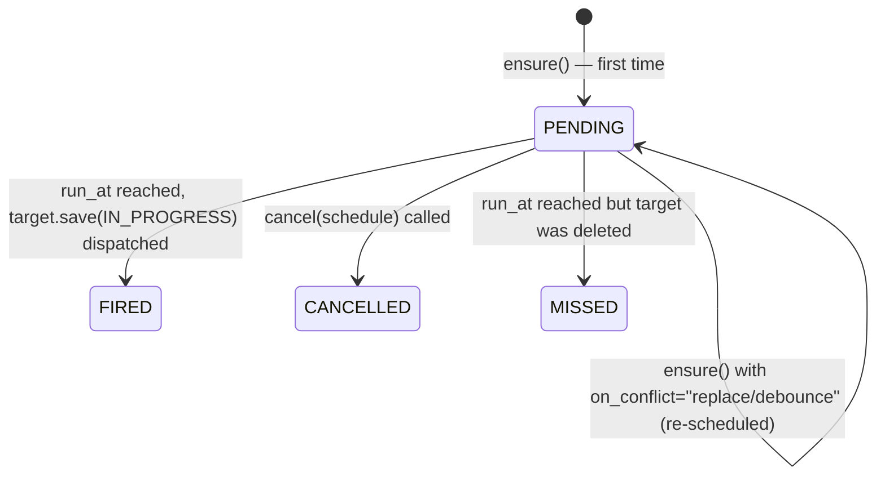

Most calculations run **immediately** when a user clicks **Calculate** or saves a record (see [[calculations/calculation models|Calculations]]). Some calculations should run **later** — at a fixed wall-clock time ("tonight at 18:00") or after a delay ("in 6 hours"). Scheduled calculations are the framework's answer to that.

## When to use it

The classic shape is **"someone is still typing, but I want one consolidated run later"**:

> Klaus is entering provisions throughout the afternoon. Each provision he saves *would* trigger the recalculation of `Report`. But Klaus might still add more, and his colleague Miriam might also add provisions, and the report is only needed by Rebekka by tomorrow morning. So instead of recalculating `Report` on every save, we want to schedule a single run for **18:00 tonight** the first time it's needed — and have every subsequent save quietly join the same scheduled run.

Other examples that fit the same shape:

- **End-of-day reconciliation** — every booking entered today should trigger one reconciliation run after the daily cut-off, not one per booking.
- **Delayed cleanup** — when a record is marked `archived`, run an archival calculation in 24 hours so the user has time to undo.
- **Batch reporting** — when a user uploads a CSV, schedule the heavy report calculation for off-hours instead of running it during business hours.

If you need a **recurring** schedule (every Monday at 09:00), use Celery Beat directly — that is what it is for. `ScheduledCalculation` is for **one-shot** future runs of a specific calculation on a specific record.

## The API

```python
from lex.lex_app.scheduling import ScheduledCalculation
from datetime import timedelta

# In Provision.calculate(), or a lifecycle hook on Provision:
ScheduledCalculation.ensure(
    target=report,                  # any CalculationModel instance
    run_at=timedelta(hours=6),      # or a timezone-aware datetime
    dedupe_tag="daily-report",
    on_conflict="dedupe",           # "dedupe" | "replace" | "debounce"
)
```

That's the whole user-facing surface. Behind the scenes the framework records the schedule, registers a one-shot Celery Beat task at `run_at`, and when the time arrives it transitions `report` to `IN_PROGRESS` — exactly as if a user had clicked **Calculate**. The whole [[calculations/calculation models#The State Machine|calculation state machine]] (audit log, history, websocket broadcast, error capture, [[calculations/calculation models#Cancel|cancel button]]) applies unchanged.

### Parameters

| Parameter     | Type                              | Meaning                                                                                                |
|---------------|-----------------------------------|--------------------------------------------------------------------------------------------------------|
| `target`      | `CalculationModel` instance       | The record whose `calculate()` will run when the schedule fires.                                       |
| `run_at`      | `timedelta` or aware `datetime`   | When to fire. `timedelta` is interpreted relative to *now*. `datetime` must be timezone-aware.         |
| `dedupe_tag`  | `str` (short, developer-supplied) | Label that identifies "the same scheduled job". Required — the dedupe contract is explicit by design.  |
| `on_conflict` | `str` (default `"dedupe"`)        | What to do if a `PENDING` schedule already exists for this `(target, dedupe_tag)`.                     |

### Conflict semantics — the part worth thinking about

`on_conflict` controls what happens when `ensure()` finds an existing `PENDING` schedule for the same `(target, dedupe_tag)` pair. The default is what most callers want:

| `on_conflict` | Behaviour                                                                                                       | Use when                                                            |
|---------------|-----------------------------------------------------------------------------------------------------------------|---------------------------------------------------------------------|
| `"dedupe"` *(default)* | No-op. The existing schedule keeps its original `run_at` and `task_id`. Returns the existing row.               | "Run the report by 18:00 tonight" — the deadline doesn't move when more inputs arrive. |
| `"replace"`   | Cancels the existing Celery task, replaces the row with the new `run_at`. Returns the new row.                  | The new caller has a more accurate run time and the old one was a guess. |
| `"debounce"`  | Like `"replace"`, but only if the new `run_at` is *later* than the existing one. Otherwise no-op.               | "Wait 6 hours after the *last* edit" — every edit pushes the deadline back. |

`"debounce"` deliberately has the failure mode of "if writes never stop, the report never fires". Use it only when the input stream is genuinely bounded.

## What you get for free

The same things you get from a normal calculation:

- **Audit log** — when the schedule fires, the resulting calculation logs to `AuditLog` like any other run.
- **History** — `target` goes through `IN_PROGRESS → SUCCESS/ERROR` and every state lands in history.
- **Cancel** — calling `ScheduledCalculation.cancel(schedule)` revokes the Celery task and marks the schedule `CANCELLED`. After it has fired, cancel falls through to [[calculations/calculation models#Cancel|the regular calc-cancel path]].
- **Websocket** — frontend subscribers see `IN_PROGRESS` the moment the schedule fires, the same way an immediate calc is broadcast.

## Schedule lifecycle



| State       | Meaning                                                                                                  |
|-------------|----------------------------------------------------------------------------------------------------------|
| `PENDING`   | Created, Celery one-shot task is queued, waiting for `run_at`.                                           |
| `FIRED`     | The task fired and dispatched the calculation. The target's own state machine takes over from here.      |
| `CANCELLED` | A caller cancelled the schedule before it fired. The Celery task was revoked.                            |
| `MISSED`    | The task fired but the target had been deleted in the meantime — recorded as a no-op for visibility.     |

## Requirements

`ScheduledCalculation.ensure()` requires `CELERY_ACTIVE=true`. Without a Celery worker and beat scheduler running, the framework cannot dispatch tasks at a future time. Calling `ensure()` without Celery raises `ScheduledCalculationUnavailable` rather than silently doing nothing — a missed schedule is a worse outcome than a clear error.

## Worked example

```python title="Provision.py"
from datetime import timedelta
from lex.core.models.CalculationModel import CalculationModel
from lex.lex_app.scheduling import ScheduledCalculation


class Provision(CalculationModel):
    # ...fields...

    def calculate(self):
        # do whatever Provision needs to do for itself
        ...

        # Make sure today's report is queued. First call schedules it for 18:00;
        # subsequent calls (Klaus's second provision, Miriam's first) are no-ops.
        report = Report.objects.get_today()
        ScheduledCalculation.ensure(
            target=report,
            run_at=_today_at(18, 0),
            dedupe_tag="daily-report",
        )
```

When 18:00 arrives, the framework calls `report.save()` with `is_calculated=IN_PROGRESS` — and from there it is an ordinary calculation. Rebekka opens the report by 09:00 the next morning and sees the latest numbers.

