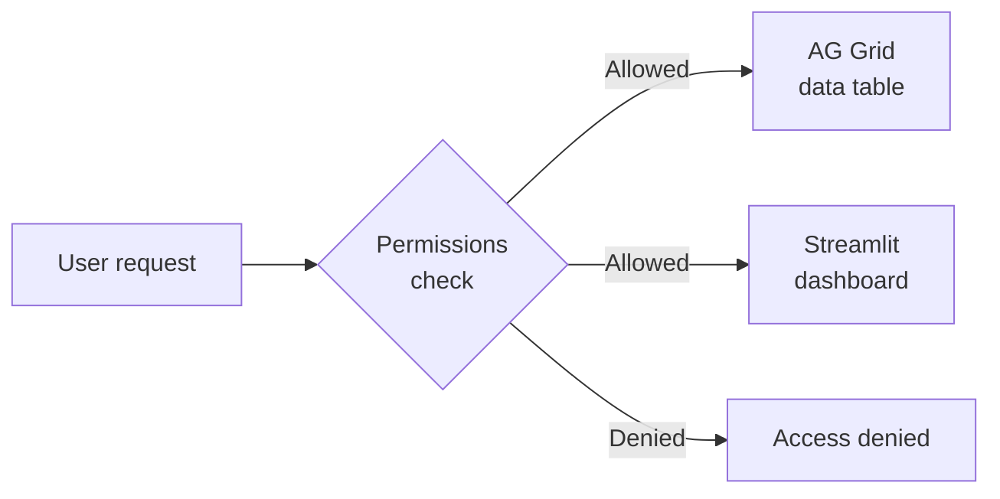

Data is only useful if the right people can see it — and only the parts they're allowed to. LEX gives you fine-grained access control and interactive dashboards, both defined directly on your models.

## Building Blocks

### [[features/access-and-ui/permissions|Permissions]]
Field-level and row-level access control, integrated with [Keycloak](https://www.keycloak.org/documentation). Define `permission_read()`, `permission_edit()`, and `permission_delete()` methods directly on your model — the framework enforces them on every API request and frontend interaction.

### [[features/access-and-ui/streamlit dashboards|Streamlit Dashboards]]
Attach interactive [Streamlit](https://docs.streamlit.io/) visualizations to your models. Table-level dashboards show aggregate views; record-level dashboards show detail for a specific instance. Charts, metrics, filters — anything Streamlit supports.
