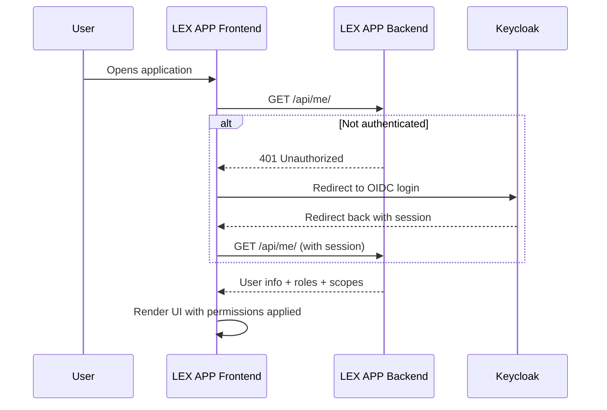

LEX provides fine-grained access control through permission methods defined directly on your models. You can control which fields a user can view, edit, or export, which records they can see, and which actions they can perform — all integrated with [Keycloak](https://www.keycloak.org/documentation).

## The UserContext Object

All permission methods receive a `UserContext` dataclass with clean user information:

```python
@dataclass(frozen=True)
class UserContext:
    user: Any              # Django User object
    email: str             # User's email address
    is_authenticated: bool # Is user logged in?
    is_superuser: bool     # Is user a superuser?
    groups: Set[str]       # Group names, e.g. {'admin', 'finance'}
    keycloak_scopes: Set[str]  # Keycloak permission scopes
```

## Basic Example

```python title="MyModel.py"
from lex.core.models.LexModel import LexModel, UserContext, PermissionResult
from django.db import models


class MyModel(LexModel):
    name = models.CharField(max_length=100)
    sensitive_field = models.CharField(max_length=100)
    owner_email = models.EmailField()

    def permission_read(self, user_context: UserContext) -> PermissionResult:
        if user_context.is_superuser or 'admin' in user_context.groups:
            return PermissionResult.allow_all()
        return PermissionResult.allow_all_except({'sensitive_field'})

    def permission_delete(self, user_context: UserContext) -> bool:
        return user_context.is_superuser or self.owner_email == user_context.email
```

## Permission Methods

### Field-Level (return `PermissionResult`)

| Method | Purpose |
|---|---|
| `permission_read(user_context)` | Which fields the user can view |
| `permission_edit(user_context)` | Which fields the user can modify |
| `permission_export(user_context)` | Which fields the user can export |

### Action-Level (return `bool`)

| Method | Purpose |
|---|---|
| `permission_create(user_context)` | Can this user create new instances? |
| `permission_delete(user_context)` | Can this user delete this instance? |
| `permission_list(user_context)` | Can this user list instances of this model? |

### `PermissionResult` Factory Methods

| Method | Behavior |
|---|---|
| `PermissionResult.allow_all()` | Allow access to all fields |
| `PermissionResult.allow_fields({'a', 'b'})` | Allow only specific fields |
| `PermissionResult.allow_all_except({'x'})` | Allow all except specified fields |
| `PermissionResult.deny()` | Deny access entirely |

## Real-World Examples

### HR Salary Visibility

Only HR managers can see the salary field:

```python title="EmployeeContract.py"
class EmployeeContract(LexModel):
    name = models.CharField(max_length=100)
    role = models.CharField(max_length=100)
    salary = models.DecimalField(max_digits=10, decimal_places=2)

    def permission_read(self, user_context: UserContext) -> PermissionResult:
        if 'hr_manager' in user_context.groups or user_context.is_superuser:
            return PermissionResult.allow_all()
        return PermissionResult.allow_all_except({'salary'})
```

### Expense Reports — Record Ownership

Finance sees all reports, employees only see their own:

```python title="ExpenseReport.py"
class ExpenseReport(LexModel):
    employee_email = models.EmailField()
    amount = models.DecimalField(max_digits=10, decimal_places=2)

    def permission_read(self, user_context: UserContext) -> PermissionResult:
        if 'finance_manager' in user_context.groups:
            return PermissionResult.allow_all()
        if self.employee_email == user_context.email:
            return PermissionResult.allow_all()
        return PermissionResult.allow_fields(set())  # row hidden
```

## Keycloak Integration

By default, permission methods fall back to Keycloak scopes. After running `lex Init`, your models are synced to Keycloak as Resources and your permission methods are registered as Scopes. Manage permissions at [excellence-cloud.de](https://excellence-cloud.de).

You can also use Keycloak scopes directly in your custom logic:

```python
def permission_read(self, user_context: UserContext) -> PermissionResult:
    if 'read' in user_context.keycloak_scopes:
        return PermissionResult.allow_all()
    return PermissionResult.deny("No read permission in Keycloak")
```

<details>
<summary>Migrating from V1?</summary>

If you're coming from `ModificationRestriction`:

| Aspect | V1 (Old) | Current |
|---|---|---|
| Approach | Separate `ModificationRestriction` class | Permission methods on your model |
| User info | Raw `user` object + `violations` list | Clean `UserContext` dataclass |
| Granularity | Model-level only | Field-level and row-level |
| Keycloak | Manual integration | Built-in scope resolution |

Remove `ModificationRestriction` class definitions, remove `modification_restriction = MyRestriction()`, and add `permission_*` methods directly to your model. Run `lex Init` to sync to Keycloak.

</details>

## Authentication Architecture

LEX APP uses [Keycloak](https://www.keycloak.org/documentation) as its identity provider. Users authenticate once via OIDC (OpenID Connect), and the session is shared across the entire application — including embedded [[features/access-and-ui/streamlit dashboards|Streamlit dashboards]].

The frontend authentication flow:



The `SessionAuthGate` component handles this transparently — including redirect-loop protection, automatic retries, and a clear unauthorized page for users without assigned roles.

### Access Scopes

Permissions are enforced across 6 scopes:

| Scope | What It Controls |
|---|---|
| **read** | Which fields a user can view |
| **edit** | Which fields a user can modify |
| **export** | Which fields appear in exports |
| **create** | Whether a user can create new records |
| **delete** | Whether a user can delete records |
| **list** | Whether a user can view the model's table |

These scopes are synced to Keycloak when you run `lex Init`, enabling centralized policy management.

## In the Frontend

Permissions are enforced at every layer:

- **Grid cells** — fields the user can't read are hidden; fields they can't edit are read-only
- **Action buttons** — the Create and Delete buttons are hidden if the user doesn't have those permissions
- **Inline editing** — attempting to edit a restricted field shows it as disabled
- **Exports** — restricted fields are excluded from exported files

See [[interface/the-grid/index|The Grid]] for how permissions appear in the user interface.
