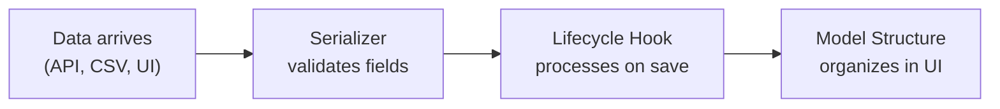

Every piece of data in a LEX application passes through a pipeline: it enters the system, gets validated, and is organized for consumption. The building blocks in this section control how that flow works.

## Building Blocks

### [[features/data-pipeline/serializers|Serializers]]
Custom [Django REST Framework](https://www.django-rest-framework.org/) serializers that validate incoming data at the API layer. Define field-level rules, cross-field constraints, and multiple views of the same model.

### [[features/data-pipeline/lifecycle hooks|Lifecycle Hooks]]
React to model events — creation, update, deletion — with explicit [django-lifecycle](https://rsinger86.github.io/django-lifecycle/) decorators. Process uploaded files, trigger side effects, and enforce validation rules.

### [[features/data-pipeline/model structure|Model Structure]]
Control how models appear in the frontend sidebar. Group models into categories, customize display names, and hide internal models from end users.
