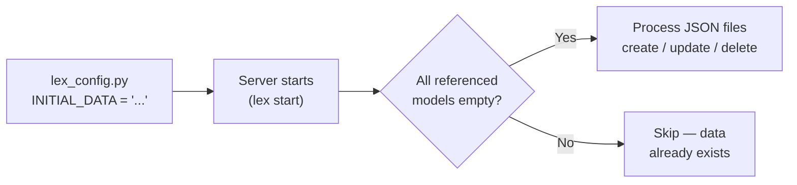

Initial data upload lets you define **seed data as JSON** and have the framework load it automatically on server start. Instead of clicking through the UI or writing ad-hoc scripts, you describe what to create in structured files and the framework handles the rest.

## How It Works



On every server start, Lex App:
1. Reads the `INITIAL_DATA` path from `lex_config.py`
2. Validates the path exists and the JSON is well-formed
3. Resolves all subprocess references to build a flat action list
4. Checks whether **every model referenced** in the JSON has zero rows
5. If all models are empty, processes each action in order

> [!warning]
> The auto-load is **all-or-nothing**. If even one referenced model has existing data, the entire load is skipped. This prevents accidental double-loading.

## Configuration

Create (or edit) `lex_config.py` in your project root:

```python title="lex_config.py"
INITIAL_DATA = "Tests/test_data.json"
```

The path is **relative to your project root** (the directory containing `.env`).

> [!note]- Legacy alternative: `_authentication_settings.py`
> Older projects may use `_authentication_settings.py` instead:
> ```python title="_authentication_settings.py"
> initial_data_load = "Tests/basic_test/test_data.json"
> ```
> The framework checks `lex_config.py` first and falls back to `_authentication_settings.py`. New projects should always use `lex_config.py`.

## JSON Format

### Top-Level File (Subprocess List)

The file referenced by `INITIAL_DATA` is an ordered list of subprocess references:

```json title="Tests/test_data.json"
[
  {"subprocess": "Tests/01_create_teams.json"},
  {"subprocess": "Tests/02_create_employees.json"},
  {"subprocess": "Tests/03_create_expenses.json"}
]
```

Each `subprocess` entry points to another JSON file containing the actual actions. Subprocesses are executed **in order**, so create parent objects before children that reference them.

> [!tip]
> Subprocesses can themselves contain `subprocess` references — the framework flattens them recursively into a single ordered action list.

### Action Files

Each subprocess file is a list of action objects:

```json title="Tests/01_create_teams.json"
[
  {
    "class": "Team",
    "action": "create",
    "tag": "team_design",
    "parameters": {
      "name": "Design",
      "budget": 15000.00,
      "manager_email": "thomas.mueller@apex-consulting.com"
    }
  }
]
```

Every action object has these fields:

| Field | Required | Description |
|---|---|---|
| `class` | ✅ | Model class name (must match a registered model) |
| `action` | ✅ | One of `create`, `update`, or `delete` |
| `tag` | For `create` | A label to reference this object later via `tag:` |
| `parameters` | For `create`/`update` | Field names → values to set |
| `filter_parameters` | For `update`/`delete` | A [Django queryset filter](https://docs.djangoproject.com/en/stable/ref/models/querysets/#field-lookups) to find existing objects |

## Actions

### `create`

Creates a new model instance with the given parameters, then saves it.

```json
{
  "class": "Employee",
  "action": "create",
  "tag": "emp_anna",
  "parameters": {
    "first_name": "Anna",
    "last_name": "Schmidt",
    "team": "tag:team_design"
  }
}
```

The `tag` is stored in memory so later actions can reference this object via `tag:emp_anna`.

### `update`

Finds an existing object via `filter_parameters`, then sets the fields in `parameters`:

```json
{
  "class": "Employee",
  "action": "update",
  "tag": "emp_anna_updated",
  "filter_parameters": {
    "email": "anna.schmidt@apex-consulting.com"
  },
  "parameters": {
    "role": "manager"
  }
}
```

`filter_parameters` is a standard [Django field lookup](https://docs.djangoproject.com/en/stable/ref/models/querysets/#field-lookups) dictionary — the framework calls `Model.objects.filter(**filter_parameters).first()` to locate the object.

### `delete`

Deletes all objects matching `filter_parameters`:

```json
{
  "class": "InvestorTrackRecord",
  "action": "delete",
  "filter_parameters": {}
}
```

An empty `filter_parameters` (`{}`) deletes **all** instances of that model. Use specific filters to target individual records.

## Special Value Prefixes

### `tag:` — Foreign Key References

Use the `tag:` prefix to reference an object created earlier in the same data load:

```json
"team": "tag:team_design"
```

This resolves to the actual model instance tagged `team_design` during a previous `create` action. Use it for `ForeignKey`, `OneToOneField`, or any field that expects a model instance.

### `datetime:` — Date and Time Parsing

Use the `datetime:` prefix to parse date strings into Python `datetime` objects:

```json
"date": "datetime:2026-01-15"
```

The framework uses [dateutil.parser](https://dateutil.readthedocs.io/en/stable/parser.html), so most common formats work: `2026-01-15`, `2026-01-15T09:30:00`, `15/01/2026`, etc.

## File Uploads

For `FileField` parameters, provide the **relative path** to the file (from the project root). The framework reads the file and stores it using [Django's default storage](https://docs.djangoproject.com/en/stable/ref/files/storage/):

```json
{
  "class": "UploadInvestmentStructure",
  "action": "create",
  "tag": "upload_structure",
  "parameters": {
    "upload_name": "Structure Upload",
    "upload_time": "datetime:2022-06-30",
    "vehicle_file": "Tests/UploadFiles/Structure/VehicleUpload.xlsx",
    "investor_file": "Tests/UploadFiles/Structure/InvestorUpload.xlsx"
  }
}
```

## Auto-Load Conditions

The framework only auto-loads initial data when **all** of the following are true:

| Condition | Details |
|---|---|
| `INITIAL_DATA` is set | Either in `lex_config.py` or `_authentication_settings.py` |
| The path is valid | The file exists and contains well-formed JSON |
| The JSON structure is correct | Top-level list of `subprocess` entries or action objects |
| All referenced models are empty | Every model class mentioned in `class` fields has zero rows in the database |
| Server is starting normally | Running via `lex start` (uvicorn), not during Init or inside a Celery worker |

If any condition fails, the auto-load is silently skipped.

> [!tip]
> To re-trigger the load after data already exists, drop and recreate the database:
> ```bash
> lex create_db
> lex Init
> lex start
> ```

## Execution Order

1. The top-level JSON is read and all `subprocess` references are **recursively resolved** into a flat list of action objects
2. Actions are processed **in order** — first file's actions, then second file's, etc.
3. For each action, the model class is looked up from the registered models
4. `tag:` and `datetime:` values in `parameters` (or `filter_parameters`) are resolved
5. The action (`create`, `update`, or `delete`) is executed
6. If [audit logging](https://docs.djangoproject.com/en/stable/topics/logging/) is enabled, each operation is recorded in the audit trail

> [!important]
> Order matters. If Employee references Team via `tag:team_design`, the Team `create` action must appear **before** the Employee action — either in the same file or in an earlier subprocess.

## Example Project Structure

A typical initial data setup looks like:

```
Tests/
├── test_data.json                  ← Top-level subprocess list
├── 01_create_teams.json            ← Create Team objects
├── 02_create_employees.json        ← Create Employees (references Teams)
├── 03_create_expenses.json         ← Create Expenses (references Employees)
└── UploadFiles/                    ← Files for FileField parameters
    └── Structure/
        ├── VehicleUpload.xlsx
        └── InvestorUpload.xlsx
```

```python title="lex_config.py"
INITIAL_DATA = "Tests/test_data.json"
```

> [!tip]
> For a hands-on walkthrough, see the [[tutorial/Part 2 — Data Models|TeamBudget tutorial Part 2]] which builds a complete initial data setup from scratch.
