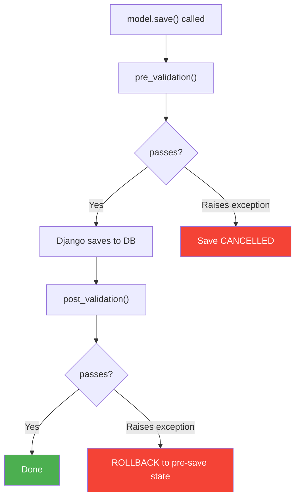

LEX models support lifecycle hooks — methods that run automatically at specific points in a model's lifecycle. Hooks are declared with the `@hook` decorator from [django-lifecycle](https://rsinger86.github.io/django-lifecycle/), making execution explicit and traceable.

## Basic Example

```python title="UploadBalanceSheet.py"
from django_lifecycle import hook, AFTER_CREATE
from lex.core.models.LexModel import LexModel
from django.db import models


class UploadBalanceSheet(LexModel):
    quarter = models.ForeignKey('Quarter', on_delete=models.CASCADE)
    balance_sheet_file = models.FileField(upload_to='balance_sheets/')
    processed_rows = models.IntegerField(default=0)

    @hook(AFTER_CREATE)
    def process_file(self):
        import pandas as pd
        df = pd.read_excel(self.balance_sheet_file.path)

        for _, row in df.iterrows():
            BalanceSheetEntry.objects.create(
                quarter=self.quarter,
                account_name=row['Account'],
                amount=row['Amount']
            )

        self.processed_rows = len(df)
        self.save(skip_hooks=True)
```

The `@hook(AFTER_CREATE)` decorator tells LEX to call `process_file()` immediately after the record is saved for the first time. The method name is yours to choose — what matters is the decorator.

## Available Hooks

| Hook | When It Fires |
|---|---|
| `BEFORE_CREATE` | Before the first `save()` (new record) |
| `AFTER_CREATE` | After the first `save()` (new record) |
| `BEFORE_UPDATE` | Before subsequent `save()` calls |
| `AFTER_UPDATE` | After subsequent `save()` calls |
| `BEFORE_SAVE` | Before any `save()` (create or update) |
| `AFTER_SAVE` | After any `save()` (create or update) |
| `BEFORE_DELETE` | Before `delete()` |
| `AFTER_DELETE` | After `delete()` |

## Conditional Hooks

You can add conditions to hooks so the method only runs when a specific criteria is met:

```python title="Invoice.py"
from django_lifecycle import hook, AFTER_UPDATE
from django_lifecycle.conditions import WhenFieldValueIs, WhenFieldHasChanged


class Invoice(LexModel):
    status = models.CharField(max_length=50)
    amount = models.DecimalField(max_digits=10, decimal_places=2)

    @hook(AFTER_UPDATE, condition=WhenFieldValueIs("status", "Paid"))
    def send_receipt(self):
        EmailService.send_receipt(self)

    @hook(AFTER_UPDATE, condition=WhenFieldHasChanged("amount"))
    def log_amount_change(self):
        LexLogger().add_text(f"Amount changed to {self.amount}").log()
```

## Preventing Recursion

When calling `save()` inside a hook, always use `skip_hooks=True` to prevent infinite loops:

```python
@hook(AFTER_CREATE)
def process_and_save(self):
    self.status = "Done"
    self.save(skip_hooks=True)  # prevents the hook from firing again
```

> [!warning]
> Calling `self.save()` without `skip_hooks=True` inside a hook will cause infinite recursion. Always use `skip_hooks=True` when saving inside hooks.

## Validation Hooks

`LexModel` also provides two built-in validation hooks that run as part of the save lifecycle. These are not Django's standard `clean()` / `full_clean()` — they're LEX-specific hooks with a powerful rollback mechanism.



### `pre_validation()` — Guard Before Save

Use this to block invalid data from being saved. If you raise an exception, the save is cancelled entirely — nothing is written to the database.

```python title="Invoice.py"
class Invoice(LexModel):
    amount = models.DecimalField(max_digits=10, decimal_places=2)
    due_date = models.DateField()
    status = models.CharField(max_length=50, default="Draft")

    def pre_validation(self):
        if self.amount < 0:
            raise ValueError("Invoice amount cannot be negative.")

        if not self.pk and self.due_date < timezone.now().date():
            raise ValueError("Due date must be in the future for new invoices.")
```

### `post_validation()` — Verify After Save + Auto-Rollback

Use this for checks that need the saved state (e.g., aggregate constraints). If you raise an exception, the framework automatically rolls back the record to its pre-save state.

```python title="ExpenseReport.py"
class ExpenseReport(LexModel):
    amount = models.DecimalField(max_digits=10, decimal_places=2)
    quarter = models.ForeignKey('Quarter', on_delete=models.CASCADE)

    def post_validation(self):
        total = ExpenseReport.objects.filter(
            quarter=self.quarter
        ).aggregate(total=models.Sum('amount'))['total'] or 0

        if total > self.quarter.expense_budget:
            raise ValueError(
                f"Total expenses ({total}) exceed quarterly budget "
                f"({self.quarter.expense_budget}). This expense was rolled back."
            )
```

<details>
<summary>How the rollback works internally</summary>

Before `pre_validation()` runs, the framework captures a snapshot of all model field values. If `post_validation()` raises an exception:

1. Field values are restored from the snapshot
2. A `save(skip_hooks=True)` is executed to persist the rollback
3. The operation is wrapped in `transaction.atomic()` with savepoints
4. A `ValidationError` is raised to the caller

</details>

## Which Pattern Should I Use?

| Use Case | Pattern |
|---|---|
| User-initiated, long-running calculation with progress tracking | [[features/processing/calculations\|CalculationModel]] + `calculate()` |
| Automatic processing on create (fire-and-forget) | `LexModel` + `@hook(AFTER_CREATE)` |
| Block invalid data before save | `LexModel` + `pre_validation()` |
| Verify constraints after save (with auto-rollback) | `LexModel` + `post_validation()` |
| Side effects after save (logging, notifications) | `LexModel` + `@hook(AFTER_SAVE)` |

<details>
<summary>Migrating from V1?</summary>

If you're coming from `UploadModelMixin`, here's what changes:

| Aspect | V1 (Old) | Current |
|---|---|---|
| Base class | `UploadModelMixin` | `LexModel` |
| Trigger mechanism | Implicit global signals | Explicit `@hook` decorators |
| Method name | `update()` | Any name you choose |
| When it runs | Hidden — hard to trace | Clearly declared on the decorator |

### Migration Steps

1. Change base class: `UploadModelMixin` → `LexModel`
2. Add `from django_lifecycle import hook, AFTER_CREATE`
3. Replace `def update(self):` with `@hook(AFTER_CREATE)` + a descriptive method name
4. Add `self.save(skip_hooks=True)` if saving inside the hook

</details>
