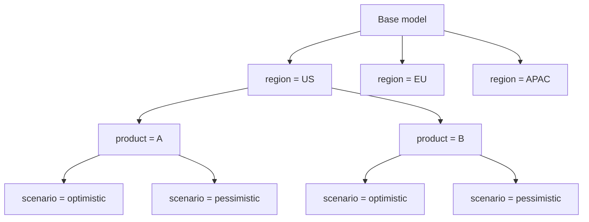
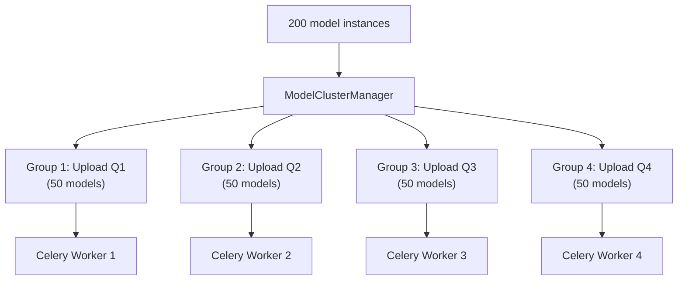
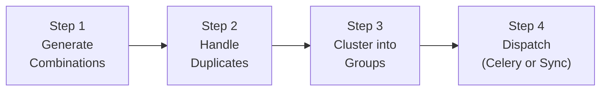

Sometimes one record isn't enough. When you need to calculate a liability for every award in an upload, or generate a report for every region-quarter combination, you don't want to create those records by hand. `CalculatedModelMixin` does it for you — you declare the **dimensions**, and the framework generates every combination, deduplicates, groups them for parallel processing, and dispatches them to Celery or runs them synchronously.

> [!tip]
> Browse the full source on [GitHub](https://github.com/ExcellenceCloudGmbH/lex-app/blob/lex-app-v2/lex/core/mixins/CalculatedModelMixin.py).

## The Problem

Imagine you're building a compensation system. An upload batch arrives containing 200 employee awards. For each award, you need to calculate a liability — pulling in HR data, currency rates, social security percentages, and previous-period values. That's 200 records that need to be created, populated, and saved.

You *could* write a loop in a `CalculationModel.calculate()` method. But then you'd need to handle:
- Generating all the combinations yourself
- Checking for duplicates (what if the same upload is re-calculated?)
- Grouping the work into batches for parallel processing
- Dispatching to Celery workers and handling failures
- Falling back to synchronous execution when Celery is down

`CalculatedModelMixin` handles all of this. You declare two things — the dimensions and the calculation logic — and the framework does the rest.

## How It Works

### 1. Declare Your Dimensions

Every `CalculatedModelMixin` has a `defining_fields` list — the fields that together form the "axes" of the combination space. The framework generates one record for every unique combination of values:

```python
from lex.core.mixins.CalculatedModelMixin import CalculatedModelMixin
from django.db import models


class AssetCalculation(CalculatedModelMixin):
    upload = models.ForeignKey('Upload', on_delete=models.CASCADE)
    award = models.ForeignKey('Award', on_delete=models.CASCADE)

    # Output fields
    award_amount = models.FloatField()
    market_value = models.FloatField()
    gain_loss = models.FloatField()

    defining_fields = ['upload', 'award']

    def get_selected_key_list(self, key: str) -> list:
        if key == 'award':
            return list(Award.objects.filter(upload=self.upload))

    def calculate(self):
        self.award_amount = self.award.original_value
        self.market_value = self.award.current_value
        self.gain_loss = self.market_value - self.award_amount
```

When the framework calls `AssetCalculation.create()`, it:

1. Creates a base instance with `upload` already set
2. Calls `get_selected_key_list('award')` → gets 200 awards
3. Creates 200 `AssetCalculation` instances — one per award
4. Calls `calculate()` on each one
5. Saves them all

> [!note]
> `defining_fields` also creates a **unique constraint** on the database table automatically. Re-running `create()` with the same upload and award will update the existing record instead of creating a duplicate.

### 2. Implement `get_selected_key_list()`

This method tells the framework what values each defining field can take. It receives the field name as a string and returns a list of values:

```python
def get_selected_key_list(self, key: str) -> list:
    if key == 'upload':
        return list(Upload.objects.all())
    if key == 'award':
        return list(Award.objects.filter(upload=self.upload))
    return []
```

The values can be anything — model instances (for ForeignKey fields), strings, numbers. The framework deep-copies the base model for each value and sets the field.

> [!warning]
> Notice how `award` is filtered by `self.upload`. This is important — the framework processes fields **in order**, so by the time it expands `award`, the `upload` field is already set on the model instance.

### 3. Implement `calculate()`

This is your business logic — identical to `CalculationModel.calculate()`. Read from `self.upload`, `self.award`, or any other field, query the database, compute results, and assign them to `self`:

```python
def calculate(self):
    # Step 1: Pull input data
    hr_data = self.award.hr_record
    currency_rate = CurrencyRate.objects.get(currency=hr_data.award_currency)

    # Step 2: Compute
    self.base_amount = hr_data.original_value
    self.converted_amount = self.base_amount / currency_rate.rate

    # Step 3: Look up previous period (if exists)
    previous = self.__class__.objects.filter(
        award=self.award,
        upload=self.upload.previous_upload
    ).first()
    if previous:
        self.delta = self.converted_amount - previous.converted_amount
```

You don't call `self.save()` — the framework handles that.

## The Combination Engine

The combination is **multiplicative**. If you have three defining fields:

```python
defining_fields = ['region', 'product', 'scenario']
```

And each field returns:
- `region` → `['US', 'EU', 'APAC']` (3 values)
- `product` → `['A', 'B']` (2 values)
- `scenario` → `['optimistic', 'pessimistic']` (2 values)

The framework generates **3 × 2 × 2 = 12** model instances, covering every combination.



> [!tip]
> You can **override** field values when calling `create()`:
> ```python
> # Only generate for US and EU, optimistic scenario
> MyModel.create(region=['US', 'EU'], scenario=['optimistic'])
> ```
> Overridden fields skip `get_selected_key_list()` and use the provided values directly.

## Parallel Processing with `parallelizable_fields`

For large batches, you can tell the framework how to **group** models for parallel execution on [[features/processing/celery and async calculations|Celery workers]]:

```python
class LiabilityCalculation(CalculatedModelMixin):
    upload = models.ForeignKey('Upload', on_delete=models.CASCADE)
    award = models.ForeignKey('Award', on_delete=models.CASCADE)

    defining_fields = ['upload', 'award']
    parallelizable_fields = ['upload']

    def get_selected_key_list(self, key: str) -> list:
        ...

    def calculate(self):
        ...
```

`parallelizable_fields` must be a **subset** of `defining_fields`. They control how models are grouped into Celery tasks:

| `parallelizable_fields` | Grouping | Result |
|---|---|---|
| `[]` (empty) | All models in one group | 1 Celery task (or 1 sync batch) |
| `['upload']` | One group per upload | If 3 uploads → 3 Celery tasks |
| `['upload', 'region']` | One group per (upload, region) pair | 3 uploads × 4 regions → 12 Celery tasks |

The framework builds a **nested cluster** based on these fields, then flattens it into independent groups that can run in parallel:



> [!note]
> Parallel dispatch requires `CELERY_ACTIVE=true` in your environment. Without it, all groups are processed synchronously in sequence. See [[features/processing/celery and async calculations]] for the full Celery setup.

## The Four-Step Pipeline

When you call `MyModel.create()`, four things happen internally:



### Step 1 — Generate Combinations

`ModelCombinationGenerator` expands each defining field by calling `get_selected_key_list()` (or using overrides from `create(**kwargs)`). It deep-copies the base model for each value, producing the full cartesian product.

### Step 2 — Handle Duplicates

For each generated combination, the framework queries the database for an existing record with the same defining field values. Three outcomes:

| Existing Records | What Happens |
|---|---|
| **0** | New record — will be inserted |
| **1** | Existing record — reuses its primary key (update in place) |
| **> 1** | Data integrity error — raises an exception |

This means `create()` is **idempotent** — re-running it with the same inputs updates existing records rather than creating duplicates.

### Step 3 — Cluster into Groups

`ModelClusterManager` groups the models based on `parallelizable_fields`. If empty, all models go into a single group. Otherwise, it builds a nested dictionary and flattens it into independent processing groups.

### Step 4 — Dispatch

The framework checks `CELERY_ACTIVE` and whether `calculate()` has been decorated with `@lex_shared_task`. If both are true, it uses `CeleryTaskDispatcher` to dispatch each group as a separate Celery task inside a `WaitForTasks` context. Otherwise, everything runs synchronously via `calc_and_save_sync()`.

The dispatcher has **multi-level fallback**: if a single task fails, that group is retried synchronously while others continue on Celery. If Celery itself goes down, the entire batch falls back to synchronous processing. Your calculations always complete.

## CalculatedModelMixin vs. CalculationModel

These two base classes both have a `calculate()` method but serve fundamentally different purposes:

| | `CalculationModel` | `CalculatedModelMixin` |
|---|---|---|
| **Purpose** | Single-record calculation triggered by the user | Batch generation of many records from combinations |
| **Trigger** | User clicks **Calculate ▶️** in the UI | `cls.create()` called programmatically |
| **Number of records** | Operates on **one existing** record | Creates/updates **many** records |
| **State machine** | Yes — `NOT_CALCULATED` → `IN_PROGRESS` → `SUCCESS` / `ERROR` | No built-in state tracking |
| **`defining_fields`** | Not used | Core concept — drives the combination engine |
| **Use case** | "Calculate this report" | "Generate a liability for every award in this upload" |

> [!info] They work together
> A common pattern is to have a `CalculationModel` record (the "trigger") whose `calculate()` method calls `CalculatedModelMixin.create()` on a batch model. The trigger provides the UI button and state tracking; the mixin handles the bulk generation.

## Common Patterns

### Pattern 1: Upload → Per-Record Calculations

The most common pattern. An upload record arrives, and you need to generate one output for every child record:

```python
class PayoutCalculation(CalculatedModelMixin):
    upload = models.ForeignKey('Upload', on_delete=models.CASCADE)
    award = models.ForeignKey('Award', on_delete=models.CASCADE)

    # ... output fields ...

    defining_fields = ['upload', 'award']

    def get_selected_key_list(self, key: str) -> list:
        if key == 'award':
            return list(Award.objects.filter(upload=self.upload))

    def calculate(self):
        # Calculate payout for this specific award
        ...
```

### Pattern 2: Report Per Upload

One summary report for each upload batch:

```python
class LiabilityReport(CalculatedModelMixin):
    upload = models.ForeignKey('Upload', on_delete=models.CASCADE)
    report_file = models.FileField(upload_to='reports/')

    defining_fields = ['upload']

    def get_selected_key_list(self, key: str) -> list:
        if key == 'upload':
            return list(Upload.objects.all())

    def calculate(self):
        # Aggregate all liability data for this upload into a report
        data = LiabilityCalculation.objects.filter(upload=self.upload)
        df = pd.DataFrame(data.values())
        # Generate Excel, save to self.report_file
        ...
```

### Pattern 3: Multi-Dimensional Grid

Calculations that span multiple independent axes — regions, products, scenarios:

```python
class ForecastModel(CalculatedModelMixin):
    region = models.ForeignKey('Region', on_delete=models.CASCADE)
    product = models.ForeignKey('Product', on_delete=models.CASCADE)
    scenario = models.CharField(max_length=50)

    forecast_value = models.DecimalField(max_digits=19, decimal_places=2)

    defining_fields = ['region', 'product', 'scenario']
    parallelizable_fields = ['region']

    def get_selected_key_list(self, key: str) -> list:
        if key == 'region':
            return list(Region.objects.all())
        if key == 'product':
            return list(Product.objects.all())
        if key == 'scenario':
            return ['optimistic', 'realistic', 'pessimistic']

    def calculate(self):
        # Compute forecast for this specific (region, product, scenario)
        ...
```

With 10 regions, 5 products, and 3 scenarios, `create()` generates **150 records** — grouped into 10 Celery tasks (one per region) with 15 models each.

## Quick Reference

```python
from lex.core.mixins.CalculatedModelMixin import CalculatedModelMixin

class MyBatchModel(CalculatedModelMixin):
    # 1. Define the dimensions
    defining_fields = ['upload', 'item']
    parallelizable_fields = ['upload']  # optional

    # 2. Define the fields
    upload = models.ForeignKey('Upload', on_delete=models.CASCADE)
    item = models.ForeignKey('Item', on_delete=models.CASCADE)
    result = models.FloatField()

    # 3. Tell the framework what values each dimension can take
    def get_selected_key_list(self, key: str) -> list:
        if key == 'item':
            return list(Item.objects.filter(upload=self.upload))

    # 4. Write your business logic
    def calculate(self):
        self.result = compute_something(self.upload, self.item)

# Trigger: generate all combinations and calculate
MyBatchModel.create()

# Trigger with overrides
MyBatchModel.create(upload=[specific_upload])
```
