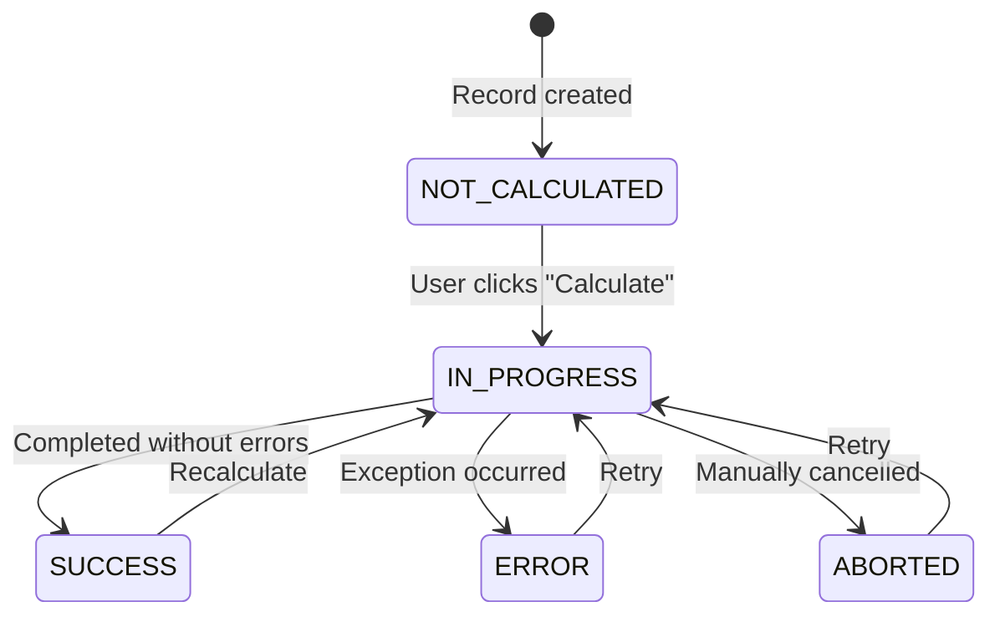

A `CalculationModel` is a model whose records can be "calculated" on demand. When a user clicks **Calculate** in the frontend, LEX transitions the record to `IN_PROGRESS`, calls your `calculate()` method, and then transitions to `SUCCESS` or `ERROR` depending on the outcome. You only write the business logic — everything else is handled for you.

## Defining a Calculation Model

Inherit from `CalculationModel` and implement `calculate()`:

```python title="CalculateNAV.py"
from lex.core.models.CalculationModel import CalculationModel
from django.db import models


class CalculateNAV(CalculationModel):
    quarter = models.ForeignKey('Quarter', on_delete=models.CASCADE)
    nav_value = models.DecimalField(max_digits=19, decimal_places=2, null=True)

    def calculate(self):
        investments = Investment.objects.filter(quarter=self.quarter)
        total = sum(inv.market_value for inv in investments)
        self.nav_value = total
```

That's it. No decorators, no manual `self.save()`, no recursion guards. The framework handles state management, error capture, and saving automatically.

## The State Machine

The `is_calculated` field is a state machine with clear transitions:



| State | Meaning |
|---|---|
| `NOT_CALCULATED` | Record exists, no calculation run yet |
| `IN_PROGRESS` | Calculation is currently running |
| `SUCCESS` | Completed without errors |
| `ERROR` | An exception occurred (details stored in `calculation_error_message`) |
| `ABORTED` | Manually cancelled |

## What You Get Automatically

You don't need to define or manage any of the following — they're inherited from `CalculationModel`:

- **`is_calculated`** — the state field
- **Recursion guard** — prevents re-entrant calculation loops
- **Error capture** — exceptions are caught and stored in `calculation_error_message`
- **Auto-save** — the record is saved automatically after `calculate()` returns
- **[[features/processing/celery and async calculations|Celery support]]** — dispatch to [Celery](https://docs.celeryq.dev/) workers for parallel execution

<details>
<summary>How the state machine works internally</summary>

The `CalculationModel` base class uses `@hook(AFTER_UPDATE)` on the `is_calculated` field. When it transitions to `IN_PROGRESS`, the framework calls `calculate_hook()` which:

1. Sets `is_calculated = IN_PROGRESS`
2. Decides whether to run synchronously or via Celery (`should_use_celery()`)
3. Calls your `calculate()` method
4. On success: sets `is_calculated = SUCCESS` and saves
5. On exception: sets `is_calculated = ERROR`, stores the traceback in `calculation_error_message`, and saves

You never need to manage this yourself.

</details>

## Another Example

```python title="CalculateBalanceSheet.py"
class CalculateBalanceSheet(CalculationModel):
    quarter = models.ForeignKey('Quarter', on_delete=models.CASCADE)
    total_assets = models.DecimalField(max_digits=19, decimal_places=2, null=True)

    def calculate(self):
        assets = Asset.objects.filter(quarter=self.quarter)
        self.total_assets = assets.aggregate(Sum('value'))['value__sum']
```

<details>
<summary>Migrating from V1?</summary>

If you're coming from `ConditionalUpdateMixin`, here's what changes:

| Aspect | V1 (Old) | Current |
|---|---|---|
| Base class | `ConditionalUpdateMixin` | `CalculationModel` |
| Method name | `update()` | `calculate()` |
| Decorator | `@ConditionalUpdateMixin.conditional_calculation` | Not needed |
| State field | Boolean `is_calculated` | Enum with 5 states |
| Recursion guard | Manual `dont_update` flag | Automatic |
| Error handling | Manual `try/catch` | Automatic (stored in `calculation_error_message`) |
| Save | Manual `self.save()` | Automatic after method returns |

### Migration Checklist

- [ ] Change base class: `ConditionalUpdateMixin` → `CalculationModel`
- [ ] Remove the `@conditional_calculation` decorator
- [ ] Rename method: `update()` → `calculate()`
- [ ] Remove `is_calculated = IsCalculatedField(...)` (inherited automatically)
- [ ] Remove `calculate = CalculateField(...)` (inherited automatically)
- [ ] Remove the `dont_update` recursion guard
- [ ] Remove manual `self.save()` calls

</details>
