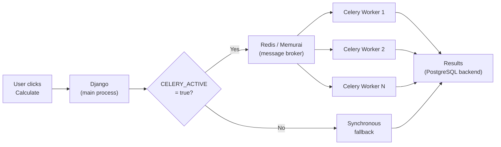

When a calculation triggers other calculations — say, a parent that kicks off five children — the framework can dispatch those children to [Celery](https://docs.celeryq.dev/) workers in parallel instead of processing them one by one. This is transparent to your code: you write the same `calculate()` method either way.

## Architecture



The key design principle: **Celery is optional**. If the broker is down or Celery isn't configured, the framework falls back to synchronous processing automatically. Your calculations still run — just sequentially instead of in parallel.

## Prerequisites: Redis (or Memurai on Windows)

Celery needs a message broker to dispatch tasks. Lex App uses **Redis** by default.

> [!info]- Linux / macOS — Install Redis
> ```bash
> # Ubuntu / Debian
> sudo apt install redis-server
> sudo systemctl enable --now redis
>
> # macOS (Homebrew)
> brew install redis
> brew services start redis
> ```
> Verify with `redis-cli ping` — you should get `PONG`.

> [!info]- Windows — Install Memurai
> Redis doesn't run natively on Windows. Use [Memurai](https://www.memurai.com/get-memurai) instead — a Windows-native, Redis-compatible in-memory datastore.
>
> 1. Download the **Developer Edition** (free, intended for development and testing) from [memurai.com/get-memurai](https://www.memurai.com/get-memurai)
> 2. Run the installer — Memurai starts automatically as a Windows service
> 3. Verify with `memurai-cli ping` — you should get `PONG`
>
> Memurai is fully compatible with the Redis API, so no code changes are needed. It listens on the same default port (`6379`).
>
> **Limitations of the Developer Edition:** restarts required every 10 days, max 10 connected hosts, 50% RAM cap. For production on Windows, use the [Enterprise Edition](https://www.memurai.com/get-memurai).

By default, the framework connects to `redis://127.0.0.1:6379/1` for local development (both Linux/macOS Redis and Windows Memurai).

## How It Works

### The `@lex_shared_task` Decorator

To make a `calculate()` method Celery-capable, decorate it with `@lex_shared_task`:

```python
from lex.lex_app.celery_tasks import lex_shared_task

class HeavyReport(CalculationModel):
    @lex_shared_task
    def calculate(self):
        # Your calculation logic — same as always
        ...
```

`@lex_shared_task` wraps your method into an enhanced Celery task with:

- **Context-aware dispatch** — respects `WaitForTasks` and `FireAndForget` context managers
- **Automatic status callbacks** — the `CallbackTask` base class updates `is_calculated` to `SUCCESS` or `ERROR` on completion
- **Context propagation** — calculation IDs and audit logging context are forwarded to workers

Without the decorator, `calculate()` always runs synchronously — even when `CELERY_ACTIVE=true`.

### The Dispatch Flow

When a user clicks **Calculate ▶️**, the framework decides sync vs. async:

1. Is `CELERY_ACTIVE=true` set in the environment?
2. Does the `calculate()` method have a `.delay()` attribute (i.e., is it decorated with `@lex_shared_task`)?

If **both** are true, the calculation is dispatched to a Celery worker via `calc_and_save.delay()`. Otherwise, it runs synchronously in the request thread.

For batch calculations (a parent triggering children), the framework uses `CeleryTaskDispatcher` to:

1. **Group** the child models into batches (clustered by calculation order)
2. **Dispatch** each group as a separate `calc_and_save` Celery task inside a `WaitForTasks` context
3. **Monitor** task completion (blocks until all groups finish)
4. **Retry** failed groups synchronously as a fallback

```python
# You don't call any of this directly.
# The framework handles dispatch when your calculate() triggers children.

class ParentCalculation(CalculationModel):
    @lex_shared_task
    def calculate(self):
        children = ChildCalculation.objects.filter(quarter=self.quarter)
        for child in children:
            child.is_calculated = "IN_PROGRESS"
            child.save()  # Triggers child calculation → dispatched to Celery
```

## Environment Variables

| Variable | Where to Set | Purpose |
|---|---|---|
| `CELERY_ACTIVE=true` | `.env` file (main app **and** workers) | Enables the Celery dispatch path. Without this, all calculations run synchronously. |
| `IS_RUNNING_IN_CELERY=true` | Worker command only | Tells the framework the process is a Celery worker (skips app startup tasks like data loading). **Do not** set this in the main app's `.env`. |

Add `CELERY_ACTIVE=true` to your project's `.env` file so it's always active when you run the app (from the terminal or PyCharm):

```env
CELERY_ACTIVE=true
```

## Running Workers

Start Celery workers in a **separate terminal** alongside your running app:

> [!info]- Linux / macOS
> ```bash
> IS_RUNNING_IN_CELERY=true CELERY_ACTIVE=true lex celery -A lex_app worker \
>   --loglevel=info \
>   --concurrency=12 \
>   --prefetch-multiplier=1 \
>   -n worker1@%h
> ```
>
> | Flag | Meaning |
> |---|---|
> | `--concurrency=12` | Number of parallel worker threads/processes |
> | `--prefetch-multiplier=1` | Don't prefetch extra tasks — important for long-running calculations |
> | `-n worker1@%h` | Worker name (`%h` expands to hostname). Use `worker2@%h`, `worker3@%h`, etc. for additional workers |
>
> You can run multiple worker processes on the same machine by changing the `-n` name.

> [!note]
> On **Windows**, Celery's default prefork pool isn't supported. Use the `--pool=solo` or `--pool=threads` flag, or run workers via [WSL](https://learn.microsoft.com/en-us/windows/wsl/).

For development, you can skip running workers entirely — everything runs synchronously by default when `CELERY_ACTIVE` is not set or `false`.

## `WaitForTasks` and `FireAndForget`

The framework provides two context managers for advanced dispatch control. You typically don't need these — the framework uses them internally — but they're available for custom task orchestration.

> **Legacy names:** `RunInCelery`, `AwaitDispatch` and `UnblockCelery` still work as aliases.

### `WaitForTasks`

Dispatches `@lex_shared_task`-decorated calls to Celery workers and **blocks on exit** until every dispatched task has finished. Without this context, tasks run synchronously in the current thread.

```python
from lex.lex_app.celery_tasks import WaitForTasks

with WaitForTasks():
    my_task(data)       # dispatched to a Celery worker
    other_task(data)    # dispatched to a Celery worker (runs in parallel)

# Execution reaches here only after BOTH tasks have completed
```

#### Selective dispatch

You can control which tasks get dispatched and which stay synchronous:

```python
# Only dispatch calc_and_save — everything else runs synchronously
with WaitForTasks(include_tasks={"calc_and_save"}):
    ...

# Dispatch everything EXCEPT initial_data_upload
with WaitForTasks(exclude_tasks={"initial_data_upload"}):
    ...
```

#### Nesting

`WaitForTasks` blocks can be nested. Each scope independently tracks and waits for only the tasks dispatched within it:

```python
with WaitForTasks():                    # outer scope
    compute_portfolio.delay(fund_a)     # dispatched, tracked by outer
    compute_portfolio.delay(fund_b)     # dispatched, tracked by outer

    with WaitForTasks():                # inner scope
        compute_nav.delay(q1)           # dispatched, tracked by inner
        compute_nav.delay(q2)           # dispatched, tracked by inner
    # ← blocks here until q1 and q2 finish

    generate_report.delay(fund_a)       # dispatched, tracked by outer

# ← blocks here until fund_a, fund_b, and the report finish
```

All four portfolio/NAV tasks run in parallel on Celery workers, but the calling thread waits at each scope boundary for the tasks it owns.

### `FireAndForget`

Dispatches tasks to Celery **without waiting** for them. Use this for side-effects that don't affect the caller's correctness — notifications, cache warming, analytics, etc.

On its own, `FireAndForget` simply dispatches and moves on:

```python
from lex.lex_app.celery_tasks import FireAndForget

with FireAndForget():
    send_report_email(report)       # dispatched, nobody waits
    notify_slack_channel(report)    # dispatched, nobody waits

# Execution continues immediately — emails may still be sending
```

When nested inside a `WaitForTasks` block, it **overrides** the blocking behaviour for specific calls:

```python
from lex.lex_app.celery_tasks import WaitForTasks, FireAndForget

with WaitForTasks():
    compute_nav.delay(q1)               # dispatched, parent WILL wait

    with FireAndForget():
        send_report_email(report)       # dispatched, parent WON'T wait
        notify_slack_channel(report)    # dispatched, parent WON'T wait

    compute_nav.delay(q2)               # dispatched, parent WILL wait

# Blocks until q1 and q2 finish. Emails/Slack may still be in flight.
```

#### When to use `FireAndForget`

| Use case | Why fire-and-forget |
|---|---|
| Email / Slack / webhook notifications | Caller doesn't need the result |
| Audit-log enrichment (async) | Nice-to-have, not on the critical path |
| Cache warming / precomputation | Optimisation, not required for correctness |
| Analytics / telemetry events | Tracking shouldn't slow calculations |

The key question: *"If this task fails or is delayed, does the caller break?"* If **no** → `FireAndForget`. If **yes** → let `WaitForTasks` handle it.

### Priority hierarchy

When contexts are nested, the **innermost** matching context wins:

| Priority | Context | Behaviour |
|---|---|---|
| 1 (highest) | `FireAndForget` | Dispatch to Celery, don't wait |
| 2 | `WaitForTasks` | Dispatch to Celery, block on exit |
| 3 (default) | No context | Run synchronously in-process |

## Failure Handling

The dispatcher handles failures at multiple levels:

| Failure Type | What Happens |
|---|---|
| **Celery import fails** | Entire batch runs synchronously |
| **Single task dispatch fails** | That group runs synchronously, others continue on Celery |
| **Task execution fails** | Failed group retried synchronously |
| **Broker goes down mid-run** | Remaining groups run synchronously |

This means your calculations are resilient — they always complete, even if the infrastructure has issues.

## When to Use Celery

| Scenario | Celery Useful? |
|---|---|
| Single calculation, no children | No — no parallelism to gain |
| Parent triggers 2–3 children | Maybe — overhead may not be worth it |
| Parent triggers 10+ children | Yes — significant speedup |
| Long-running calculations (minutes+) | Yes — prevents blocking the web process |
| Development / small projects | No — synchronous is simpler |

## Monitoring

Celery tasks are logged with full context:

```
Starting Celery dispatch for 5 groups containing 23 total models
Dispatch summary: 5/5 groups dispatched to Celery
Task processing completed: 5/5 tasks successful
```

You can also monitor Celery with [Flower](https://flower.readthedocs.io/):

```bash
lex celery -A lex_app flower
```

This gives you a web dashboard at `http://localhost:5555` with real-time task monitoring.
