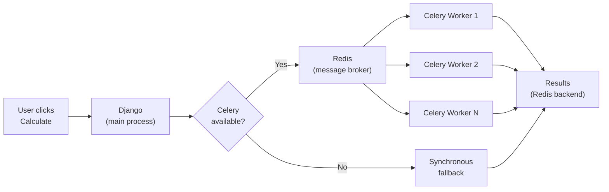

When a calculation triggers other calculations — say, a parent that kicks off five children — LEX can dispatch those children to [Celery](https://docs.celeryq.dev/) workers in parallel instead of processing them one by one. This is transparent to your code: you write the same `calculate()` method either way.

## Architecture



The key design principle: **Celery is optional**. If Redis is down or Celery isn't configured, the framework falls back to synchronous processing automatically. Your calculations still run — just sequentially instead of in parallel.

## How It Works

When a `CalculationModel` triggers child calculations, the framework uses `CeleryTaskDispatcher` to:

1. **Group** the child models into batches
2. **Dispatch** each group as a separate Celery task
3. **Monitor** task completion
4. **Retry** failed groups synchronously as a fallback

```python
# You don't call any of this directly.
# The framework handles dispatch when your calculate() triggers children.

class ParentCalculation(CalculationModel):
    def calculate(self):
        children = ChildCalculation.objects.filter(quarter=self.quarter)
        for child in children:
            child.is_calculated = "IN_PROGRESS"
            child.save()  # Triggers child calculation → dispatched to Celery
```

## Configuration

Celery is configured through your `.env` file and [Django settings](https://docs.djangoproject.com/en/5.0/ref/settings/):

```bash title=".env"
CELERY_BROKER_URL=redis://localhost:6379/0
CELERY_RESULT_BACKEND=redis://localhost:6379/0
```

You also need a `lex_config.py` at your project root:

```python title="lex_config.py"
CELERY_ENABLED = True
```

> [!warning]
> You need a running [Redis](https://redis.io/) instance for Celery to work. Without Redis, all calculations fall back to synchronous processing.

## Running Workers

In production, you start Celery workers alongside your application:

```bash
celery -A lex_app worker --loglevel=info
```

For development, you can skip Celery entirely — everything runs synchronously by default.

## Failure Handling

The dispatcher handles failures at multiple levels:

| Failure Type | What Happens |
|---|---|
| **Celery import fails** | Entire batch runs synchronously |
| **Single task dispatch fails** | That group runs synchronously, others continue on Celery |
| **Task execution fails** | Failed group retried synchronously |
| **Redis goes down mid-run** | Remaining groups run synchronously |

This means your calculations are resilient — they always complete, even if the infrastructure has issues.

## When to Use Celery

| Scenario | Celery Useful? |
|---|---|
| Single calculation, no children | No — no parallelism to gain |
| Parent triggers 2–3 children | Maybe — overhead may not be worth it |
| Parent triggers 10+ children | Yes — significant speedup |
| Long-running calculations (minutes+) | Yes — prevents blocking the web process |
| Development / small projects | No — synchronous is simpler |

## Monitoring

Celery tasks are logged with full context:

```
Starting Celery dispatch for 5 groups containing 23 total models
Dispatch summary: 5/5 groups dispatched to Celery
Task processing completed: 5/5 tasks successful
```

You can also monitor Celery with [Flower](https://flower.readthedocs.io/):

```bash
celery -A lex_app flower
```

This gives you a web dashboard at `http://localhost:5555` with real-time task monitoring.
