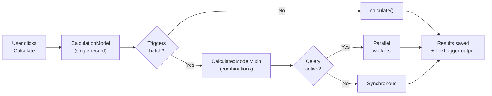

Once data is in the system, it needs to be transformed into business insight. Lex App provides building blocks for running calculations — from single-record transforms to batch generation across hundreds of combinations — with logging, parallel execution, and automatic fallback.

## Building Blocks

### [[features/processing/calculations|Calculations]]
The `CalculationModel` base class gives you a built-in state machine (`NOT_CALCULATED` → `IN_PROGRESS` → `SUCCESS`), automatic error capture, and a calculate button in the UI. You implement one method — `calculate()` — and the framework handles everything else.

### [[features/processing/batch calculations|Batch Calculations]]
`CalculatedModelMixin` is the framework's combination engine. Declare the dimensions (`defining_fields`), tell it what values each dimension can take (`get_selected_key_list()`), and it generates every combination — deduplicating, clustering for parallel execution, and dispatching to Celery or running synchronously.

### [[features/processing/celery and async calculations|Celery & Async Calculations]]
When a calculation triggers many children, the framework can dispatch them to [Celery](https://docs.celeryq.dev/) workers in parallel. If Celery isn't available, the framework falls back to synchronous processing automatically — your code doesn't change either way.

### [[features/processing/logging|Logging]]
`LexLogger` produces rich, Markdown-formatted log entries during calculations. Tables, headings, DataFrames, code blocks — all stored in the database and displayed in the frontend's calculation log panel. Context-aware: it automatically links logs to the correct calculation and model instance.
