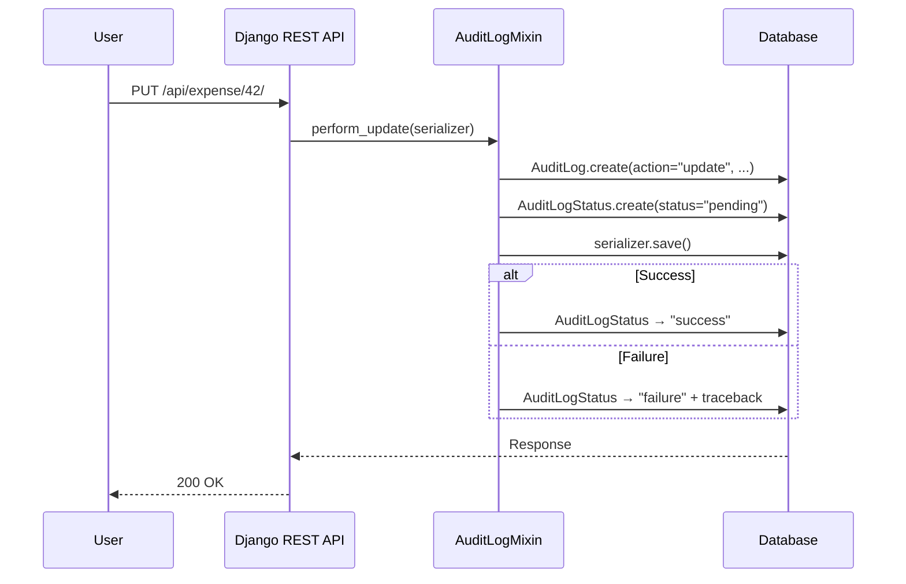

Every API operation in LEX — create, update, delete — is automatically recorded in an `AuditLog` table. This happens transparently via `AuditLogMixin`, which hooks into the [Django REST Framework](https://www.django-rest-framework.org/) view layer. You don't need to configure or enable anything — audit logging is always active.

## What Gets Recorded

Every time a user creates, updates, or deletes a record through the API, an `AuditLog` entry is created with:

| Field | Description |
|---|---|
| `date` | Timestamp of the operation |
| `author` | The user who performed the action |
| `resource` | The model name (e.g., `expense`, `team`) |
| `action` | `create`, `update`, or `delete` |
| `payload` | The full serialized data at the time of the operation |
| `content_type` + `object_id` | A [generic relation](https://docs.djangoproject.com/en/stable/ref/contrib/contenttypes/) linking back to the affected record |

## How It Works

The key insight: the audit log is created **before** the actual operation, with a `pending` status. If the operation succeeds, the status is updated to `success` and the payload is refreshed with the final state. If it fails, the status becomes `failure` and the error traceback is stored. This means even failed operations are recorded — critical for security auditing.

## Audit Log vs. Bitemporal History

These two systems serve different but complementary purposes:

| Aspect | Audit Logs | [[features/tracking/bitemporal history\|Bitemporal History]] |
|---|---|---|
| **What it tracks** | Who did what, when | What the data looked like over time |
| **Granularity** | Operation-level (create/update/delete) | Field-level (every value change) |
| **Scope** | API operations only | All changes (API, hooks, calculations) |
| **Time dimensions** | One (system time) | Two (valid time + system time) |
| **Primary use** | Security auditing, compliance | Time-travel queries, corrections |
| **Failure tracking** | Yes (pending/success/failure) | No (only successful changes) |

Together, they provide a complete audit trail: bitemporal history tells you *what changed*, audit logs tell you *who requested the change and whether it succeeded*.

## Bulk Operations

Bulk updates and deletes are also tracked via `BulkAuditLogMixin`. Each individual record in a bulk operation gets its own audit log entry — so a bulk update of 100 records creates 100 audit log entries.

## Resilience

The audit system includes built-in resilience:

- **Deadlock retries** — database operations are automatically retried on transient errors (deadlocks, serialization failures)
- **ContentType cache healing** — if Django's ContentType cache goes stale (e.g., after a migration), the system detects and auto-corrects it
- **Error preservation** — failed operations store the full traceback for debugging

> [!note]
> Audit logs are effectively read-only. They are designed to be an immutable record of operations — only administrators should modify or delete them.

## In the Frontend

Audit logs aren't just a database table — they're surfaced directly in the interface:

- **[[interface/record-detail/audit log tab|Audit Log Tab]]** — every record detail page includes an Audit Log tab showing all operations that affected that specific record
- **[[interface/record-detail/timeline tab|Timeline Tab]]** — the audit feed view at the bottom of the timeline integrates audit events with the visual change history

See [[interface/record-detail/index|Record Detail]] for the full user-facing documentation.
