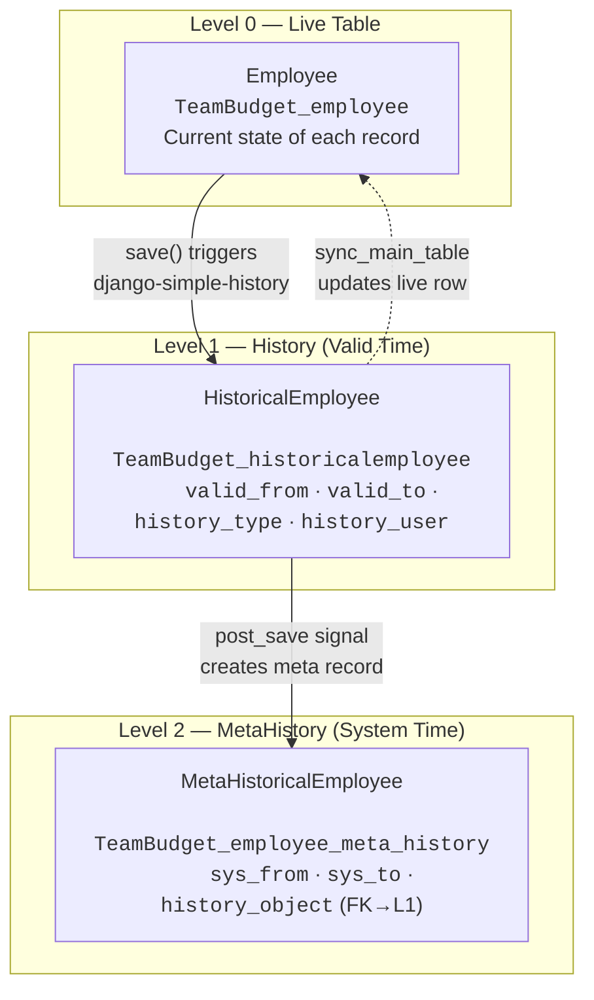

Every `LexModel` automatically tracks changes along two independent time dimensions — *valid time* (when something was true in the real world) and *system time* (when the system recorded the change). This builds on the [[features/tracking/history|standard history layer]] (which records *what* changed) by adding a second table — **MetaHistory** — that records *when the system learned about each change*.

> [!tip]
> If you haven't read it yet, start with [[features/tracking/history|History (Simple History)]] — it explains the foundation that this page extends.

## The Problem: One Dimension Isn't Enough

Standard history gives you a `valid_from` / `valid_to` timeline — when each version was true. But consider a salary correction: an employee's salary was *actually* €60,000 since January 1st, but HR only entered the correction on March 15th. A single time dimension can't capture both facts. You need a second dimension to record *when the system learned about the change* independently of *when the change was effective*.

## The Two Time Dimensions

Lex App extends django-simple-history to track **two independent time dimensions**:

| Dimension | Question It Answers | Fields | Layer |
|---|---|---|---|
| **Valid Time** | When was this *true in the real world*? | `valid_from`, `valid_to` | Level 1 — History |
| **System Time** | When did the *system learn* about this? | `sys_from`, `sys_to` | Level 2 — MetaHistory |

Together, these four fields let you answer any temporal query: "What did we *think* was true *at this point in time*?"

## Zero Configuration

You don't need to configure anything. Every model that inherits from `LexModel` gets the full bitemporal architecture automatically:

```python title="Input/Employee.py"
from lex.core.models.LexModel import LexModel
from django.db import models


class Employee(LexModel):
    name = models.CharField(max_length=200)
    salary = models.DecimalField(max_digits=10, decimal_places=2)
    role = models.CharField(max_length=200)
```

That single class definition produces **three database tables** and **three Python classes** — all managed by the framework:

| What | Python Class | Database Table | Purpose |
|---|---|---|---|
| **Live data** | `Employee` | `TeamBudget_employee` | Current truth |
| **History** (Level 1) | `HistoricalEmployee` | `TeamBudget_historicalemployee` | Valid-time snapshots |
| **MetaHistory** (Level 2) | `MetaHistoricalEmployee` | `TeamBudget_employee_meta_history` | System-time snapshots |

<!-- 📸 TODO: Add screenshot of the frontend history panel -->

## The Three-Layer Architecture

Here's how a single save flows through all three layers:



### Level 0 — The Live Table

This is your model's normal table (`TeamBudget_employee`). It always reflects the **currently valid** state of each record. When you query `Employee.objects.all()`, you're reading Level 0.

### Level 1 — History (Valid Time)

Lex App replaces django-simple-history's default `history_date` field with **`StandardHistory`** — a custom provider that uses bitemporal naming:

| Field | Type | Description |
|---|---|---|
| `valid_from` | `DateTimeField` | When this version became true in the real world |
| `valid_to` | `DateTimeField` (nullable) | When it was superseded. `NULL` = still current |
| `history_type` | `CharField(1)` | `+` Created · `~` Changed · `-` Deleted |
| `history_user` | `ForeignKey(User)` | Who made the change |
| `history_change_reason` | `TextField` | Optional reason for the change |

Every create, update, or delete on your model creates a new row in the history table with a full snapshot of all field values at that moment.

**Automatic chaining:** When a new history row is created, a signal handler walks all Level 1 rows for the same record and *chains* the `valid_to` fields — each row's `valid_to` is set to the next row's `valid_from`, forming a continuous timeline. The latest row always has `valid_to = NULL`.

### Level 2 — MetaHistory (System Time)

This is where Lex App goes beyond standard history. The framework creates a **second** history table — a *history of the history* — called **MetaHistory**. Each time a Level 1 row is created or modified, a corresponding Level 2 row records *when the system learned about it*:

| Field | Type | Description |
|---|---|---|
| `sys_from` | `DateTimeField` | When the system recorded this knowledge |
| `sys_to` | `DateTimeField` (nullable) | When superseded. `NULL` = current knowledge |
| `history_object` | `ForeignKey` | Points back to the Level 1 history row |
| `meta_history_type` | `CharField(1)` | `+` Created · `~` Changed · `-` Deleted |
| `meta_task_name` | `CharField` | Celery task name (for scheduled activations) |
| `meta_task_status` | `CharField` | Task status: `NONE`, `SCHEDULED`, `ACTIVE` |

Like Level 1, the `sys_to` fields are automatically chained — each meta row's `sys_to` points to the next row's `sys_from`, so you get a continuous system-time timeline.

### Why Two Levels?

Level 1 alone tells you "what versions exist and when they were valid." But it can't answer "what did the system *believe* at a specific point in time?" — because Level 1 rows can be corrected retroactively (e.g., changing `valid_from` on a backdated salary). Level 2 captures every such correction with its own timestamp, making the full history **immutable and auditable**.

## How the Signal Chain Works

When you save a record, the framework orchestrates the three layers through Django signals:

```
User saves Employee instance
       │
       ▼
┌──────────────────────────────────────────────────────────┐
│  1. django-simple-history creates a Level 1 row          │
│     using StandardHistory (valid_from, valid_to)         │
└──────────────────────┬───────────────────────────────────┘
                       │  post_save signal fires 3 handlers:
                       │
    ┌──────────────────┼──────────────────────┐
    ▼                  ▼                      ▼
chain_valid_to    create_meta          sync_main_table
    │                  │                      │
    │  Chains          │  Creates a           │  Updates Level 0
    │  valid_to        │  Level 2 meta        │  (live table) to
    │  across all      │  record with         │  reflect the
    │  L1 rows         │  sys_from = now()    │  currently valid
    │  for this PK     │                      │  L1 row
    │                  ▼                      │
    │         ┌────────────────┐              │
    │         │ MetaHistory    │              │
    │         │ post_save      │              │
    │         │ fires:         │              │
    │         │ chain_sys_to   │              │
    │         └────────────────┘              │
    │                                         │
    └─────────────────────────────────────────┘
```

> [!note]
> The signal handlers use `SELECT FOR UPDATE` with deterministic ordering to prevent deadlocks and infinite recursion. Thread-local suppression guards ensure that internal re-saves don't trigger the chain again.

## Valid Time vs. System Time — An Example

Say you have an employee record:

1. **Jan 1:** Employee created with salary €50,000.

   | Table | What Happens |
   |---|---|
   | Level 0 | `Employee(salary=50000)` |
   | Level 1 | `HistoricalEmployee(valid_from=Jan 1, valid_to=NULL, salary=50000)` |
   | Level 2 | `MetaHistoricalEmployee(sys_from=Jan 1, sys_to=NULL)` → points to L1 row |

2. **Mar 15:** HR discovers the salary should have been €60,000 since Jan 1. A correction is made with `valid_from = Jan 1`:

   | Table | What Happens |
   |---|---|
   | Level 0 | `Employee(salary=60000)` — updated to current truth |
   | Level 1 | New row: `HistoricalEmployee(valid_from=Jan 1, valid_to=NULL, salary=60000)` <br>Old row chained: `valid_to = Jan 1` (superseded) |
   | Level 2 | New meta: `MetaHistoricalEmployee(sys_from=Mar 15, sys_to=NULL)` → points to new L1 row <br>Old meta chained: `sys_to = Mar 15` |

Now you can answer two different questions:

- **"What salary did we *believe* was correct on Feb 1?"** → Query Level 2 with `sys_from ≤ Feb 1` → finds the original meta row → points to L1 row with salary €50,000
- **"What salary was *actually* correct on Feb 1?"** → Query Level 1 with `valid_from ≤ Feb 1`, latest version → €60,000

This distinction is critical for audit trails, regulatory compliance, and financial reporting.

## Querying History

### All versions of a record (Level 1)

```python
employee = Employee.objects.get(pk=1)
history = employee.history.all()  # ordered by -valid_from, -history_id

for version in history:
    print(f"{version.valid_from} → {version.valid_to}: €{version.salary}")
```

### Time-travel: Valid Time (what was actually true?)

```python
from lex.core.services.Bitemporal import get_queryset_as_of
from django.utils import timezone
import datetime

# Pass the main model class → queries Level 1 (valid time)
feb_1 = timezone.make_aware(datetime.datetime(2026, 2, 1))
valid_at_feb = get_queryset_as_of(Employee, feb_1)
# Returns history rows where valid_from ≤ Feb 1 and (valid_to > Feb 1 or valid_to is NULL)
```

### Time-travel: System Time (what did we believe?)

```python
# Pass the history model class → queries Level 2 (system time)
HistoricalEmployee = Employee.history.model
system_at_feb = get_queryset_as_of(HistoricalEmployee, feb_1)
# Returns meta-history rows where sys_from ≤ Feb 1 and (sys_to > Feb 1 or sys_to is NULL)
```

> [!note]
> Django 5.x enforces timezone-aware datetimes. Always use `timezone.make_aware()` or `timezone.now()` when working with temporal queries.

> [!tip]
> The `get_queryset_as_of` helper auto-detects which layer to query based on what you pass: a **main model** triggers a valid-time query (Level 1), a **history model** triggers a system-time query (Level 2).

## The REST API

The history endpoint supports time-travel via the `as_of` query parameter:

```
GET /api/employee/42/history/              → all Level 1 versions
GET /api/employee/42/history/?as_of=2026-02-01T00:00:00Z  → Level 2 snapshot at that system time
```

Each response entry includes:

```json
{
  "history_id": 7,
  "valid_from": "2026-01-01T00:00:00Z",
  "valid_to": null,
  "history_type": "+",
  "user": { "id": 1, "email": "hr@company.com", "name": "Jane Doe" },
  "snapshot": { "name": "Alice", "salary": "60000.00", "role": "Engineer" },
  "system_history": [
    { "sys_from": "2026-03-15T09:30:00Z", "sys_to": null, "task_status": "NONE" }
  ]
}
```

The `snapshot` contains all field values at that version, serialized through your model's default serializer. The `system_history` array contains the Level 2 meta records for that history row.

## In the Frontend

The bitemporal model powers several parts of the user interface:

- **[[interface/record-detail/timeline tab|Timeline Tab]]** — a visual timeline showing changes along both time dimensions, with a version details drawer for inspecting specific snapshots
- **[[interface/record-detail/history tab|History Tab]]** — a full grid of all historical versions with the **As-Of** control for time-travel queries
- **As-Of Control** — a date picker in the grid toolbar that lets users view data as it existed at any point in the past

See [[interface/record-detail/index|Record Detail]] for the full user-facing documentation.
