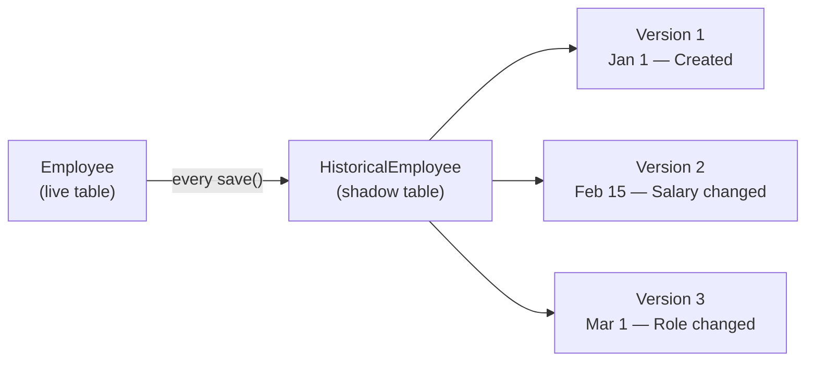

Every `LexModel` automatically tracks every change — create, update, delete — in a *shadow table* alongside your data. This is built on [django-simple-history](https://django-simple-history.readthedocs.io/), a mature Django library that Lex App extends with bitemporal naming and automatic signal wiring. You don't configure anything — it just works.

## What django-simple-history Does

The idea is straightforward: for every model, there's a **second table** that stores a full copy of the row every time something changes. Each copy gets a timestamp and a reference to who made the change. The result is a complete, append-only log of every version that ever existed.



This is not a diff or a changelog — each history row contains **all field values** at that point in time. If your model has 10 fields, every history row has all 10. This makes it trivial to reconstruct the full state of any record at any moment.

## What You Get Automatically

When you define a model inheriting from `LexModel`, the framework registers it with `StandardHistory` — Lex App's extension of `HistoricalRecords`. This creates two things:

### The History Model

For every model class, a corresponding **Historical** class is generated at runtime:

| Your Model | Generated History Class | Database Table |
|---|---|---|
| `Employee` | `HistoricalEmployee` | `TeamBudget_historicalemployee` |
| `Expense` | `HistoricalExpense` | `TeamBudget_historicalexpense` |
| `BudgetSummary` | `HistoricalBudgetSummary` | `TeamBudget_historicalbudgetsummary` |

The naming is deterministic: `Historical` + your class name for the Python class, and your app label + `_historical` + model name (lowercased) for the database table.

### The History Fields

Each history row contains all of your model's fields, plus these tracking fields:

| Field | Type | Description |
|---|---|---|
| `history_id` | `AutoField` | Primary key of the history row (not the same as your model's PK). In API responses the original record's `id` is preserved as-is; use the `id_field` property when you need the history-row PK. |
| `valid_from` | `DateTimeField` | When this version was recorded (replaces django-simple-history's `history_date`) |
| `valid_to` | `DateTimeField` (nullable) | When this version was superseded. `NULL` = still current |
| `history_type` | `CharField(1)` | `+` Created · `~` Changed · `-` Deleted |
| `history_user` | `ForeignKey(User)` | The user who made the change |
| `history_change_reason` | `TextField` | Optional explanation for the change |

> [!note]
> Standard django-simple-history uses a single `history_date` field. Lex App's `StandardHistory` replaces that with `valid_from` and adds `valid_to`, renaming the time dimension to match the bitemporal model. The `valid_to` fields are automatically chained — each row's `valid_to` is set to the next row's `valid_from`, forming a continuous timeline.

## How It's Triggered

You don't call any history API. Every time Django's ORM executes a `save()` or `delete()` on your model, django-simple-history intercepts it and creates a history row automatically. This includes:

- Direct `model.save()` calls
- `Model.objects.create()`
- QuerySet `.update()` (with bulk history enabled)
- Admin changes, API calls, lifecycle hooks — anything that touches the ORM

The history row is created in the **same database transaction** as the change itself, so it's impossible for a change to succeed without its history being recorded.

## Querying History

Every `LexModel` instance has a `.history` manager that gives you access to the history table:

### All versions of a record

```python
employee = Employee.objects.get(pk=1)

# All historical versions, newest first
for version in employee.history.all():
    print(f"{version.history_type} at {version.valid_from}: salary={version.salary}")
```

Output:
```
~ at 2026-03-01 09:00:00+00:00: salary=65000.00
~ at 2026-02-15 14:30:00+00:00: salary=60000.00
+ at 2026-01-01 08:00:00+00:00: salary=50000.00
```

### The previous version

```python
# Most recent history entry
latest = employee.history.first()

# The version before that
previous = employee.history.filter(history_id__lt=latest.history_id).first()

# What changed?
if latest.salary != previous.salary:
    print(f"Salary changed from {previous.salary} to {latest.salary}")
```

### Who changed what?

```python
# Find all changes by a specific user
changes_by_jane = Employee.history.filter(history_user__email="jane@company.com")

# Find all deletions
deletions = Employee.history.filter(history_type="-")
```

### History across all records

```python
# The history manager is also available on the class
HistoricalEmployee = Employee.history.model

# All history rows for the entire model (not just one record)
all_changes = HistoricalEmployee.objects.all().order_by("-valid_from")

# Changes in the last 24 hours
from django.utils import timezone
import datetime

yesterday = timezone.now() - datetime.timedelta(days=1)
recent = HistoricalEmployee.objects.filter(valid_from__gte=yesterday)
```

## What History Rows Look Like

Here's a concrete example. Say you have an `Employee` with `pk=42`:

| `history_id` | `id` (original PK) | `valid_from` | `valid_to` | `history_type` | `name` | `salary` | `role` | `history_user` |
|---|---|---|---|---|---|---|---|---|
| 103 | 42 | Mar 1, 09:00 | `NULL` | `~` | Alice | 65,000 | Senior Engineer | jane |
| 87 | 42 | Feb 15, 14:30 | Mar 1, 09:00 | `~` | Alice | 60,000 | Engineer | jane |
| 51 | 42 | Jan 1, 08:00 | Feb 15, 14:30 | `+` | Alice | 50,000 | Engineer | admin |

Reading bottom-to-top: Alice was created on Jan 1 with salary €50,000, got a raise to €60,000 on Feb 15, and was promoted to Senior Engineer with another raise on Mar 1. The `valid_to` chain shows exactly when each version was superseded.

## Skipping History for Specific Models

Not every model needs history tracking. Upload models, temporary data, and other transient records can be excluded via the `untracked_models` section in `model_structure.yaml`:

```yaml title="model_structure.yaml"
untracked_models:
  teamupload: null
  employeeupload: null
  expenseupload: null
```

See [[features/data-pipeline/model structure|Model Structure]] for details.

When a model is untracked, no `Historical*` table is created and no history overhead is incurred.

## The Limitation: One Time Dimension

Standard history gives you a powerful "what changed and when" trail. But it tracks only **one time dimension** — the moment the system recorded the change. It can't distinguish between:

- "When was this **actually true** in the real world?" (valid time)
- "When did the **system learn** about this?" (system time)

Consider a backdated salary correction entered on March 15th but effective since January 1st. A single-dimension history can't represent both dates on the same row. That's the problem that [[features/tracking/bitemporal history|Bitemporal History]] solves by adding a second layer — MetaHistory — that tracks system time independently.

> [!tip]
> If your application only needs "what changed and when" with no backdated corrections, the standard history described on this page is everything you need — and it's already active on every `LexModel`. The bitemporal extension adds value when you need retroactive corrections, regulatory compliance, or "what did we believe at time X?" queries.
