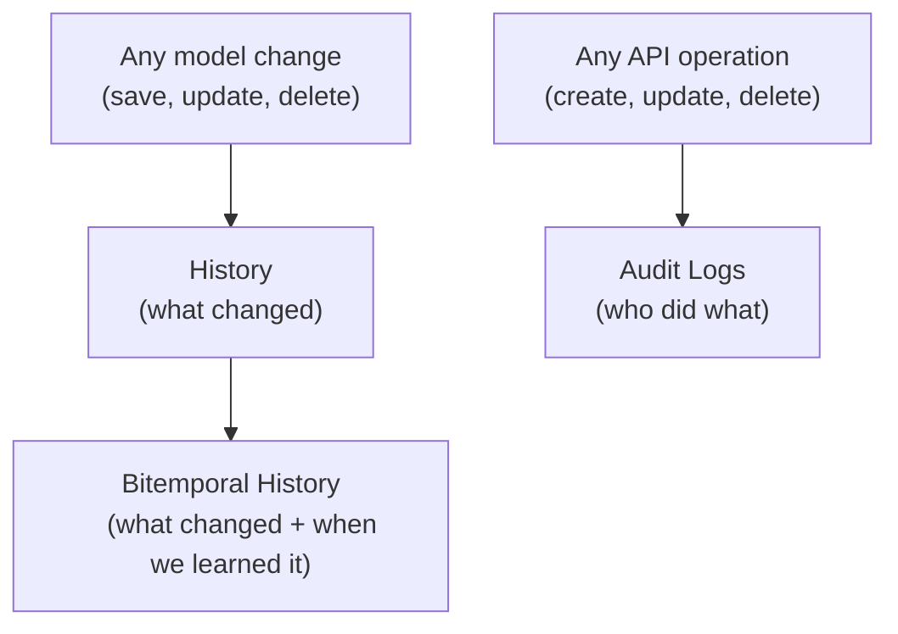

In regulated environments — finance, healthcare, compliance — you can't just store data. You need to prove *who* did *what*, *when*, and *what the data looked like* at any point in time. Lex App provides three complementary systems for this, all automatic and zero-configuration.

## Building Blocks

### [[features/tracking/history|History (Simple History)]]
Every `LexModel` automatically records a full snapshot on every create, update, and delete — powered by [django-simple-history](https://django-simple-history.readthedocs.io/) with Lex App's `StandardHistory` extension. This gives you a complete version log with `valid_from`, `valid_to`, the user who made the change, and the history type (`+` created, `~` changed, `-` deleted). No configuration needed.

### [[features/tracking/bitemporal history|Bitemporal History]]
On top of standard history, Lex App adds a second layer — **MetaHistory** — that tracks *system time* independently of *valid time*. This lets you answer not just "what changed" but "what did the system *believe* at a specific point in time?" Critical for backdated corrections, regulatory compliance, and financial auditing.

### [[features/tracking/audit logs|Audit Logs]]
Every API operation — create, update, delete — is automatically recorded with the user, timestamp, resource, action, and full payload. Operations are tracked with a status lifecycle (`pending` → `success` or `failure`), so even failed operations are preserved. Built into the [Django REST Framework](https://www.django-rest-framework.org/) view layer via `AuditLogMixin`.

## How They Work Together

The three systems form a layered audit trail — each answers different questions:

| Question | Which System Answers It |
|---|---|
| "What did record #42 look like last week?" | **[[features/tracking/history\|History]]** — full field snapshot at any version |
| "Who deleted record #42?" | **[[features/tracking/audit logs\|Audit Logs]]** — author, action, timestamp |
| "Did the API call succeed or fail?" | **[[features/tracking/audit logs\|Audit Logs]]** — status + error traceback |
| "What did we *think* was true on March 1st?" | **[[features/tracking/bitemporal history\|Bitemporal History]]** — system time query |
| "What was *actually* correct on March 1st?" | **[[features/tracking/bitemporal history\|Bitemporal History]]** — valid time query |
