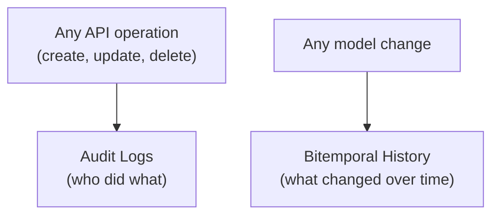

In regulated environments — finance, healthcare, compliance — you can't just store data. You need to prove *who* did *what*, *when*, and *what the data looked like* at any point in time. LEX provides two complementary systems for this, both automatic and zero-configuration.

## Building Blocks

### [[features/tracking/audit logs|Audit Logs]]
Every API operation — create, update, delete — is automatically recorded with the user, timestamp, resource, action, and full payload. Operations are tracked with a status lifecycle (`pending` → `success` or `failure`), so even failed operations are preserved. Built into the [Django REST Framework](https://www.django-rest-framework.org/) view layer via `AuditLogMixin`.

### [[features/tracking/bitemporal history|Bitemporal History]]
Every `LexModel` automatically records changes along two time dimensions: *valid time* (when something was true) and *system time* (when the system learned about it). Built on [django-simple-history](https://django-simple-history.readthedocs.io/), this gives you a complete, immutable history of data over time — with full time-travel support.

## How They Work Together

| Question | Which System Answers It |
|---|---|
| "Who deleted record #42?" | **Audit Logs** — author, action, timestamp |
| "What did record #42 look like before the deletion?" | **Bitemporal History** — full field snapshot |
| "Did the API call succeed or fail?" | **Audit Logs** — status + error traceback |
| "What did we *think* was true on March 1st?" | **Bitemporal History** — system time query |
