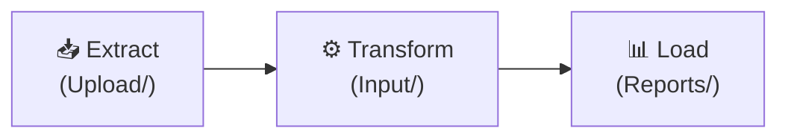

Lex App is an [open-source](https://github.com/ExcellenceCloudGmbH/lex-app) [Python](https://www.python.org/)/[Django](https://docs.djangoproject.com/) framework for building data-driven business applications. You define your models and business logic; Lex App gives you the web UI, REST API, authentication, real-time updates, and a full audit trail — out of the box.

At its heart, Lex App follows the **ETL pattern** — Extract, Transform, Load — the same pattern that powers data pipelines everywhere:

**Upload models** ingest raw data — CSV files, Excel sheets, API payloads. **Input models** hold your business entities and domain logic. **Report models** compute summaries, run analytics, and surface results through interactive [Streamlit](https://docs.streamlit.io/) dashboards. Every step is tracked with [[features/tracking/bitemporal history|bitemporal history]], every action logged, every permission enforced.

## Get Started

1. [[installation|Install Lex App]] and set up your environment
2. [[project structure|Understand the project structure]] and the ETL folder convention
3. Work through the [[tutorial/index|TeamBudget Tutorial]] to build a real app
4. Explore [[features/index|all building blocks]] or dive into the [[reference/index|reference]]

## Explore the Interface

Already using Lex App? Explore the [[interface/index|user interface documentation]] — the [[interface/the-grid/index|data grid]], [[interface/record-detail/index|record detail]], [[interface/the-grid/saved views|saved views]], [[interface/themes|themes]], and more.

## Migrating from V1?

If you're moving an existing project from `generic_app`, follow the [[migration/refactoring/index|step-by-step refactoring series]]. It covers everything from import updates to database migration.
