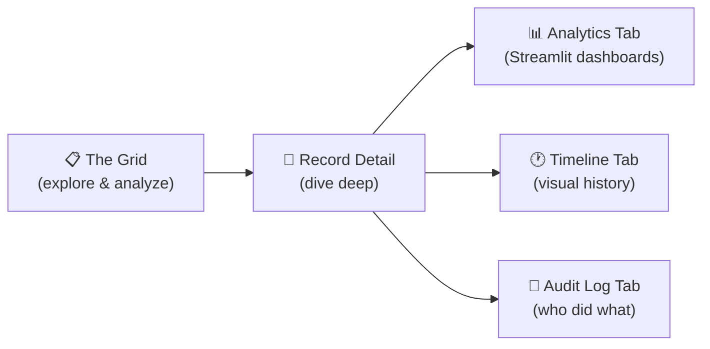

The Lex App interface is where data becomes decisions. It's built around two core experiences: **the grid**, where you explore, filter, and shape your data like a spreadsheet — and the **record detail**, where you dive deep into a single entry, its analytics, its history, and its audit trail.

Everything is designed so you never lose context. Switch from a high-level portfolio view to a single record's timeline, then jump to an embedded analytics dashboard — all without navigating away or re-authenticating.

## What You'll Find Here

### [[interface/the-grid/index|The Grid]]
Your primary workspace. An [AG Grid](https://www.ag-grid.com/) Enterprise–powered datagrid that feels like Excel but works like a database. Filter, sort, group, pivot, and export — then save your setup as a reusable view.

### [[interface/record-detail/index|Record Detail]]
Click any row to see its full story across five tabs: a field summary, embedded analytics, a visual timeline, full version history with time-travel, and a per-record audit log.

### [[interface/themes|Themes]]
Work in **Light** or **Dark** mode — switch instantly based on your preference or environment.

### [[interface/navigation|Navigation]]
A stable, professional sidebar organizes your models into groups. Global search and breadcrumbs keep you oriented no matter how deep you go.

## How It Connects

The interface sits on top of the [[features/index|building blocks]]. Every feature you see here — the grid, the audit log, the history timeline — is powered by a backend building block that a developer configured. As a user, you get all of this out of the box without writing a line of code.

| What You See | What Powers It |
|---|---|
| Data tables with filters and grouping | [[features/data-pipeline/model structure\|Model Structure]] + [AG Grid Enterprise](https://www.ag-grid.com/) |
| Validation errors when editing | [[features/data-pipeline/serializers\|Serializers]] |
| Timeline and history tabs | [[features/tracking/bitemporal history\|Bitemporal History]] |
| Audit log per record | [[features/tracking/audit logs\|Audit Logs]] |
| Embedded Streamlit dashboards | [[features/access-and-ui/streamlit dashboards\|Streamlit Dashboards]] |
| Calculation logs with progress | [[features/processing/logging\|LexLogger]] |
| Field and row restrictions | [[features/access-and-ui/permissions\|Permissions]] |
