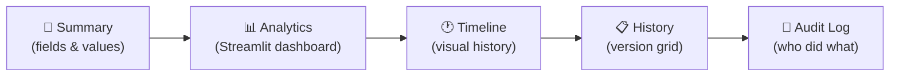

Click any row in the grid, and you're taken to its full story. The record detail page is where a single entry goes from a line of data to a living document — with its current state, embedded analytics, visual history, and a complete audit trail.

## The Five Tabs

Every record detail page has up to five tabs, each offering a different perspective on the same data:



### [[interface/record-detail/summary tab|Summary]]
The record's current values displayed as a clean card layout. Choose how many columns to show, switch between serializer presets for different field sets, and export the record as PDF.

### [[interface/record-detail/analytics tab|Analytics]]
An embedded [Streamlit](https://docs.streamlit.io/) dashboard scoped to this specific record. Charts, KPIs, custom visualizations — all computed live and displayed without leaving the page.

### [[interface/record-detail/timeline tab|Timeline]]
A visual timeline of every change this record has gone through. See who changed what, when, and compare versions side-by-side in a detail drawer.

### [[interface/record-detail/history tab|History]]
The full history of all versions of this record, displayed in a grid. Use the **As-Of** control to time-travel — see what this record looked like at any point in the past.

### [[interface/record-detail/audit log tab|Audit Log]]
All operations (create, update, delete) that have been performed on this record, with the author, timestamp, and full payload for each event.

## The Toolbar

Above the tabs, a toolbar gives you quick access to:

| Control | What It Does |
|---|---|
| **View Preset** | Switch between serializer presets (like different zoom levels on the same record) |
| **Column Layout** | Toggle between 1, 2, or 3 column layouts for the Summary tab |
| **Edit** | Jump to the edit form for this record |
| **Export to PDF** | Download the current Summary tab as a PDF document |

> [!example]- 📸 Screenshot — Record detail toolbar
> 

## Navigating Between Records

Use the breadcrumbs at the top to navigate back to the grid. The breadcrumb trail always shows your full path:

```
Home › Teams & People › Expense › #42
```

Click **Expense** to return to the grid — your filters, grouping, and scroll position are preserved, so you pick up right where you left off.
