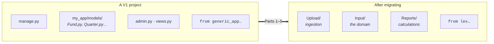

This section is for teams migrating an existing V1 project to the current Lex App framework. If you're starting a new project, you can skip this entirely — head to [[getting started]] instead.

The shape of the change, before the parts break it down. A V1 project is a
Django app — `manage.py`, a nested package, `admin.py`, `views.py`, and imports
from `generic_app`. Lex App has none of that scaffolding: models live in three
ETL folders and everything is imported from `lex.*`.

`manage.py`, `admin.py` and `views.py` have no replacement — the framework
provides what they did. The work is moving the models and rewriting the
imports, which is what Part 1 covers before anything else.

## Refactoring Series

A hands-on, step-by-step series that walks you through every aspect of converting a V1 codebase:

1. [[migrating-from-v1/refactoring/Part 1 — Project Structure & Imports|Part 1 — Project Structure & Imports]]
2. [[migrating-from-v1/refactoring/Part 2 — Models & Fields|Part 2 — Models & Fields]]
3. [[migrating-from-v1/refactoring/Part 3 — Calculations|Part 3 — Calculations]]
4. [[migrating-from-v1/refactoring/Part 4 — Lifecycle Hooks|Part 4 — Lifecycle Hooks]]
5. [[migrating-from-v1/refactoring/Part 5 — Logging & Permissions|Part 5 — Logging & Permissions]]

> [!tip]
> Start with Part 1 and work through in order. Each part builds on the previous one and includes side-by-side comparisons of old vs. new code.

## Reference

- [[migrating-from-v1/import migration|Import Migration]] — systematic import update walkthrough
- [[migrating-from-v1/legacy registration|Legacy Registration]] — how dynamic freeze manifests work
