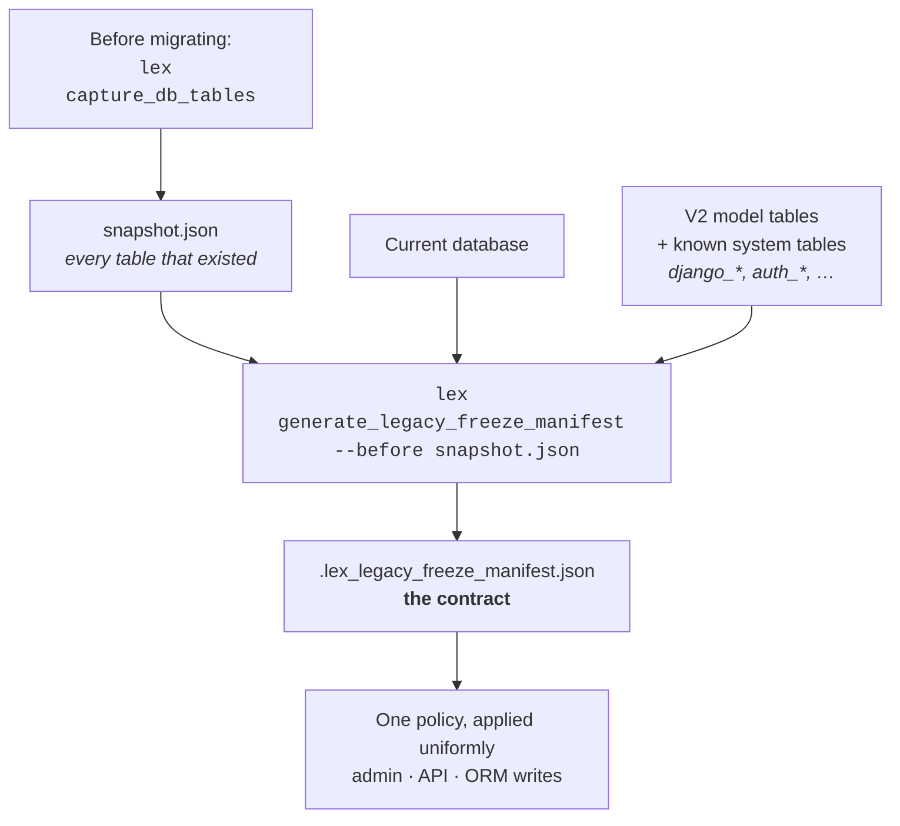

For this migration architecture, **dynamic registration with a freeze manifest** is the correct mechanism — not static read-only model definitions. This page explains why.

## What "Static" Would Mean

Developers would define explicit Django model classes for each legacy table, wire serializers and admin entries manually, and deploy code changes whenever the legacy table set changes. This appears simpler at first, but it breaks down at scale.

## Why Static Doesn't Work Here

> [!warning]- Schema layer problems
> - Static classes assume known schema ahead of time. Legacy tables may have extra columns, different types, or different nullability across environments.
> - Primary-key edge cases are common. Some legacy tables have no PK or use composite keys — Django ORM assumes a single PK.
> - Static registration inflates startup coupling. Every static model must be import-safe at startup.

> [!warning]- Permissions layer problems
> - Read-only must be enforced across admin, API, model methods, and ORM save/delete simultaneously. With static per-table code, each table is another chance to forget a layer.
> - Different developers implement read-only wrappers differently → inconsistent enforcement.

> [!warning]- Release layer problems
> - Static model inventory drifts from actual DB during migration windows.
> - Each new client with a slightly different legacy footprint requires code changes and redeploys.
> - Testing matrix explodes with per-project table set variations.

> [!warning]- Data integrity problems
> - Legacy databases are not homogeneous across clients.
> - Static mapping can silently misrepresent column types.
> - Teams are tempted to "fix" the DB to match static code — dangerous during migration.

## How a Manifest Is Produced

The manifest is not written by hand. It is the **difference** between the
database as it stood before migration and the tables V2 accounts for, so the
tables left over are exactly the legacy ones:

Both commands are in [[reference/CLI Commands]], and
[[ship-and-operate/backup and restore]] shows them in a working sequence. The
snapshot has to be taken **before** the migration runs — after it, the
difference no longer exists to be measured.

## Why Dynamic + Freeze Manifest Works

| Property | Benefit |
|---|---|
| **Manifest is the contract** | Captures exactly which tables to preserve as archive |
| **Built from DB introspection** | Field mapping from actual database, not historical assumptions |
| **Centralized policy** | Admin, API, and write restrictions applied uniformly |
| **Deterministic** | Same DB + same code = same manifest = same behavior |

## When Static Is Acceptable

Only if **all** of these are true:
- One fixed table set across all deployments
- No per-client schema variance
- Strict long-term code ownership
- No ongoing V1→V2 onboarding

> [!warning]
> These conditions do **not** match this migration program.
