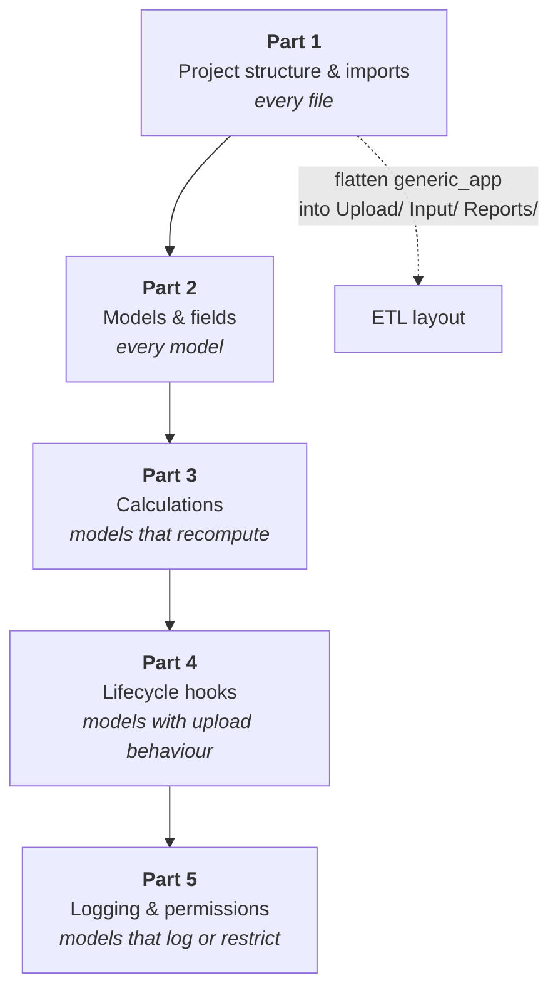

This is a hands-on, step-by-step guide for migrating a V1 (`generic_app`) project to the current Lex App framework. Work through it in order — each part builds on the previous one.

If you're starting a new project from scratch, skip this entirely and follow the [[start-here/tutorial/index|TeamBudget Tutorial]] instead.

## Before You Start

Make sure you have:

- A working V1 project that you want to migrate
- `lex-app` installed (`pip install lex-app`)
- Familiarity with the V1 codebase (model files, `generic_app` imports)

> [!important]
> **Back up your database before starting.** Always have a restore point before making sweeping changes to your codebase.

## The Series

1. [[migrating-from-v1/refactoring/Part 1 — Project Structure & Imports|Part 1 — Project Structure & Imports]] — restructure your project into ETL folders and update all imports from `generic_app` to `lex.*`
2. [[migrating-from-v1/refactoring/Part 2 — Models & Fields|Part 2 — Models & Fields]] — convert your model base classes and clean up legacy fields
3. [[migrating-from-v1/refactoring/Part 3 — Calculations|Part 3 — Calculations]] — migrate `ConditionalUpdateMixin` to `CalculationModel`
4. [[migrating-from-v1/refactoring/Part 4 — Lifecycle Hooks|Part 4 — Lifecycle Hooks]] — replace `UploadModelMixin` with explicit `@hook` decorators
5. [[migrating-from-v1/refactoring/Part 5 — Logging & Permissions|Part 5 — Logging & Permissions]] — upgrade `CalculationLog` to `LexLogger` and `ModificationRestriction` to `permission_*` methods

Parts 1 and 2 touch every file; the rest are scoped to the models that use the
feature in question, so a project with no upload models can skip most of Part 4:

## How Long Does It Take?

| Project Size | Estimated Time |
|---|---|
| Small (< 10 models) | 1–2 days |
| Medium (10–30 models) | 3–5 days |
| Large (30+ models) | 1–2 weeks |

## Quick Reference

Keep these open while you work:

- [[reference/V1 to V2 Import Map]] — complete import replacement table
- [[migrating-from-v1/import migration]] — systematic import update walkthrough
