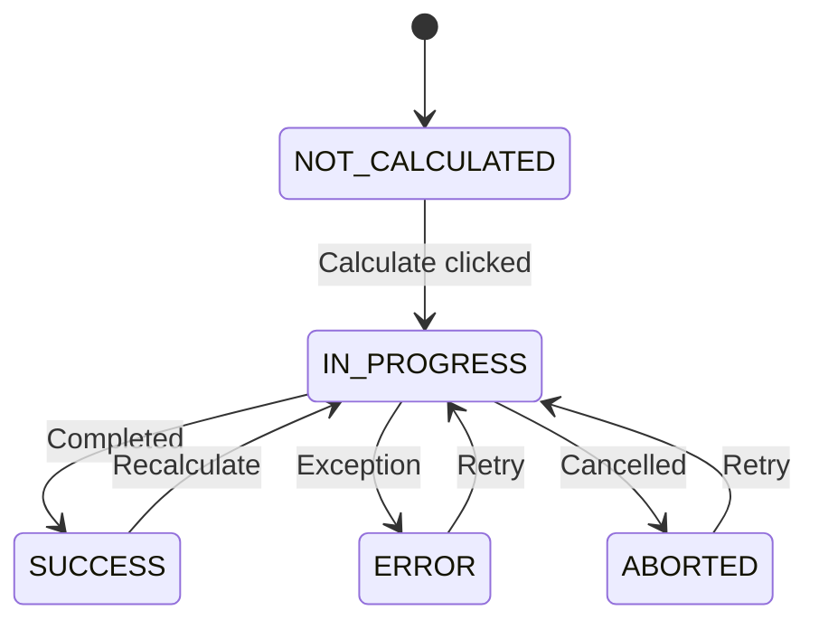

If your V1 project uses `ConditionalUpdateMixin` for on-demand calculations, this part walks you through migrating to `CalculationModel`. The new system is simpler — you write less code and get more features.

## What Changes

| Aspect | V1 (`ConditionalUpdateMixin`) | Current (`CalculationModel`) |
|---|---|---|
| Base class | `ConditionalUpdateMixin` | `CalculationModel` |
| Method name | `update()` | `calculate()` |
| Decorator | `@conditional_calculation` | Not needed |
| State field | Boolean `is_calculated` (true/false) | Enum with 5 states |
| Recursion guard | Manual `dont_update` flag | Automatic |
| Error handling | Manual `try/catch` | Automatic |
| Save | Manual `self.save()` | Automatic |

## Step-by-Step Conversion

### 1. Change the Base Class

```python
# Before
from generic_app.generic_models.upload_model import ConditionalUpdateMixin

class CalculateNAV(ConditionalUpdateMixin):
    pass
```

```python
# After
from lex.core.models.CalculationModel import CalculationModel

class CalculateNAV(CalculationModel):
    pass
```

### 2. Rename `update()` to `calculate()`

```python
# Before
@ConditionalUpdateMixin.conditional_calculation
def update(self):
    # ... business logic ...
    self.save()
```

```python
# After
def calculate(self):
    # ... business logic ...
    # No self.save() needed — the framework does it
```

### 3. Remove the Decorator

The `@conditional_calculation` decorator is no longer needed. `CalculationModel` handles the state transitions internally via `@hook(AFTER_UPDATE)`.

### 4. Remove the Recursion Guard

```python
# Before
def update(self):
    self.dont_update = True
    self.nav_value = self.compute_nav()
    self.save()
    self.dont_update = False
```

```python
# After
def calculate(self):
    self.nav_value = self.compute_nav()
    # No recursion guard, no save — both are automatic
```

### 5. Remove Manual Error Handling (Optional)

V1 required you to wrap your logic in `try/catch` blocks. The framework now catches exceptions automatically and stores the error in `calculation_error_message`:

```python
# Before
def update(self):
    try:
        self.nav_value = self.compute_nav()
    except Exception as e:
        self.error_message = str(e)
        self.save()
        raise
```

```python
# After
def calculate(self):
    self.nav_value = self.compute_nav()
    # If this raises, the framework sets is_calculated = "ERROR"
    # and stores the traceback in calculation_error_message
```

> [!tip]
> You can still add custom error handling if you want to log specific messages via [[features/processing/logging|LexLogger]] before the exception propagates.

## Full Before/After Example

### Before (V1)

```python
from generic_app.generic_models.upload_model import ConditionalUpdateMixin, IsCalculatedField, CalculateField
from generic_app.submodels.CalculationLog import CalculationLog

class CalculateNAV(ConditionalUpdateMixin):
    quarter = models.ForeignKey('Quarter', on_delete=models.CASCADE)
    is_calculated = IsCalculatedField(default=False)
    calculate = CalculateField()
    dont_update = False
    nav_value = models.DecimalField(max_digits=19, decimal_places=2, null=True)
    error_message = models.TextField(null=True, blank=True)

    @ConditionalUpdateMixin.conditional_calculation
    def update(self):
        try:
            self.dont_update = True
            investments = Investment.objects.filter(quarter=self.quarter)
            total = sum(inv.market_value for inv in investments)
            self.nav_value = total

            CalculationLog.create(
                f"NAV calculated: {total}",
                calculation_object=self
            )
            self.save()
        except Exception as e:
            self.error_message = str(e)
            self.save()
            raise
        finally:
            self.dont_update = False
```

### After (Current)

```python
from lex.core.models.CalculationModel import CalculationModel
from lex.audit_logging.handlers.LexLogger import LexLogger
from django.db import models

class CalculateNAV(CalculationModel):
    quarter = models.ForeignKey('Quarter', on_delete=models.CASCADE)
    nav_value = models.DecimalField(max_digits=19, decimal_places=2, null=True)

    def calculate(self):
        investments = Investment.objects.filter(quarter=self.quarter)
        total = sum(inv.market_value for inv in investments)
        self.nav_value = total

        LexLogger().add_text(f"NAV calculated: {total}").log()
```

That's **14 lines** instead of **27 lines**, with better error handling, state tracking, and logging.

## Fields You Can Remove

After converting, remove these fields from your model — they're now inherited:

- [ ] `is_calculated = IsCalculatedField(...)`
- [ ] `calculate = CalculateField()`
- [ ] `dont_update = False`
- [ ] `error_message` fields (replaced by `calculation_error_message`)

## The New State Machine

V1's `is_calculated` was a simple boolean (true/false). The current system uses a 5-state enum:



This gives you proper progress tracking, retry capability, and clear error states. See [[features/processing/calculations]] for the full details.

## Checkpoint

- [ ] All `ConditionalUpdateMixin` classes converted to `CalculationModel`
- [ ] `update()` methods renamed to `calculate()`
- [ ] `@conditional_calculation` decorators removed
- [ ] `dont_update` flags removed
- [ ] Manual `self.save()` calls inside `calculate()` removed
- [ ] `IsCalculatedField` and `CalculateField` definitions removed
- [ ] Logging calls updated from `CalculationLog` to `LexLogger` (detail in [[migration/refactoring/Part 5 — Logging & Permissions|Part 5]])

Next: [[migration/refactoring/Part 4 — Lifecycle Hooks|Part 4 — Lifecycle Hooks]].
