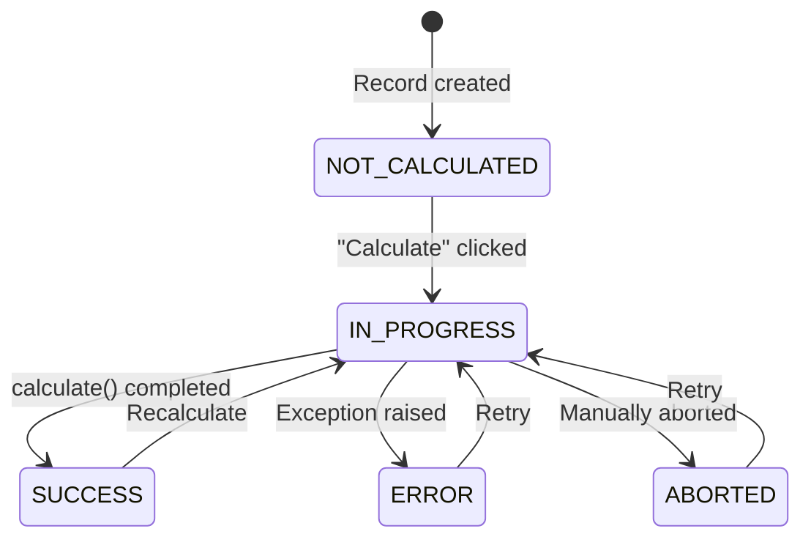

`CalculationModel` extends [[reference/LexModel Internals|LexModel]] with a built-in state machine and a `calculate()` hook. It's the base class for any model that performs on-demand computation — upload processing, report generation, data transformations, etc.

> [!tip]
> Browse the full source on [GitHub](https://github.com/ExcellenceCloudGmbH/lex-app/blob/lex-app-v2/lex/core/models/CalculationModel.py).

```python
from lex.core.models.CalculationModel import CalculationModel
```

## The State Machine

Every `CalculationModel` has an `is_calculated` field that transitions through five states:



| State | Constant | Meaning |
|---|---|---|
| `NOT_CALCULATED` | `CalculationModel.NOT_CALCULATED` | Default — record exists but hasn't been processed |
| `IN_PROGRESS` | `CalculationModel.IN_PROGRESS` | Calculation is running (triggers `calculate()` via lifecycle hook) |
| `SUCCESS` | `CalculationModel.SUCCESS` | Calculation completed without error |
| `ERROR` | `CalculationModel.ERROR` | An exception was raised — error details are stored on the record |
| `ABORTED` | `CalculationModel.ABORTED` | Calculation was manually cancelled |

The `is_calculated` field is **not editable** in the UI — it's managed entirely by the framework. When a user clicks **Calculate ▶️** in the frontend, the framework sets `is_calculated = IN_PROGRESS`, which triggers the `calculate_hook`.

## `calculate()` Method

Override this method with your business logic. The framework handles everything else:

```python
class BudgetSummary(CalculationModel):
    team = models.ForeignKey(Team, on_delete=models.CASCADE)
    total_expenses = models.DecimalField(max_digits=12, decimal_places=2, default=0)

    def calculate(self):
        expenses = Expense.objects.filter(employee__team=self.team)
        self.total_expenses = expenses.aggregate(
            total=models.Sum("amount")
        )["total"] or 0
```

**What you don't need to write:**

| Concern | Handled By |
|---|---|
| `self.save()` | Framework saves automatically after `calculate()` returns |
| Error handling | Framework catches exceptions and sets `is_calculated = ERROR` |
| State transitions | Lifecycle hooks manage the `IN_PROGRESS → SUCCESS/ERROR` flow |
| Logging context | [[reference/LexLogger API|LexLogger]] automatically links to the current calculation |
| Concurrency | Runs inside `transaction.atomic()` by default |

> [!note]
> The legacy method name `update()` is also supported — if you override `update()` instead of `calculate()`, the framework will call it. We recommend using `calculate()` for new code.

## Atomic vs Non-Atomic

By default, `calculate()` runs inside a [Django](https://docs.djangoproject.com/) `transaction.atomic()` block — if anything fails, all database changes are rolled back. To opt out (for long-running calculations that should commit incrementally), set:

```python
class LargeImport(CalculationModel):
    is_atomic = False

    def calculate(self):
        # Commits happen as you go — no rollback on failure
        ...
```

## Celery Integration

In production, calculations can be dispatched to [Celery](https://docs.celeryq.dev/) workers for background/parallel processing. The framework checks two things automatically:

1. Is the `CELERY_ACTIVE` environment variable set to `true`?
2. Does the `calculate()` method have a `.delay()` attribute (i.e., is it decorated with `@lex_shared_task`)?

If both are true, the calculation is dispatched to a Celery worker via `calc_and_save.delay()`. Otherwise, it runs synchronously in the request thread.

To make a calculation Celery-capable, decorate it with `@lex_shared_task`:

```python
from lex.lex_app.celery_tasks import lex_shared_task

class HeavyReport(CalculationModel):
    @lex_shared_task
    def calculate(self):
        ...
```

`@lex_shared_task` wraps your method with context-aware dispatch, automatic status callbacks (`SUCCESS` / `ERROR`), and audit logging context propagation to worker processes. Without the decorator, `calculate()` always runs synchronously — even when `CELERY_ACTIVE=true`.

> [!note]
> Set `CELERY_ACTIVE=true` in your project's `.env` file to enable Celery dispatch. You also need a running Redis instance (or [Memurai](https://www.memurai.com/get-memurai) on Windows) as the message broker.

See [[features/processing/celery and async calculations]] for the full setup guide — environment variables, running workers, and the `WaitForTasks` / `FireAndForget` context managers.

## Nested Calculations

When a parent calculation triggers a child, wrap the child execution in `model_logging_context` to preserve the log hierarchy:

```python
from lex.audit_logging.utils.ModelContext import model_logging_context

class ParentReport(CalculationModel):
    def calculate(self):
        child = ChildReport.objects.get(pk=self.child_id)
        with model_logging_context(child):
            child.is_calculated = "IN_PROGRESS"
            child.save()
```

## Batch Generation with CalculatedModelMixin

When you need to generate **many records** from dimensional combinations (e.g., one liability per award per upload), use `CalculatedModelMixin` instead. It provides a combination engine, duplicate handling, and parallel dispatch — see [[reference/CalculatedModelMixin Internals]] for the API reference and [[features/processing/batch calculations]] for the full guide.

## Inherited Features

Since `CalculationModel` extends `LexModel`, your calculation models also get:

- `created_by` / `edited_by` tracking
- `pre_validation()` / `post_validation()` hooks
- All `permission_*()` methods
- `streamlit_main()` / `streamlit_class_main()` for dashboards
- Full [[features/tracking/bitemporal history|bitemporal history]] (unless listed in `untracked_models`)

## Quick Reference

```python
from lex.core.models.CalculationModel import CalculationModel
from lex.audit_logging.handlers.LexLogger import LexLogger

class MyCalculation(CalculationModel):
    # Define your fields
    input_field = models.ForeignKey(...)
    result_field = models.DecimalField(...)

    def calculate(self):
        # 1. Query data
        # 2. Compute results
        # 3. Assign to self.result_field (framework saves)
        # 4. Log with LexLogger (optional)
        logger = LexLogger()
        logger.add_heading("Results")
        logger.add_text("Done!")
        logger.log()
```
