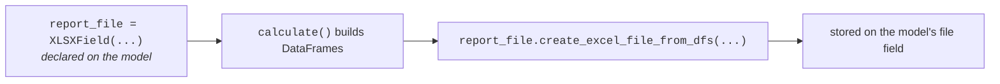

Use `XLSXField` and `PDFField` for files generated by a report model.

The field is declared on the model, filled during `calculate()`, and the
workbook it produces is stored on that same field:




```python
from lex.core.fields import PDFField, XLSXField
from lex.core.models.CalculationModel import CalculationModel


class LiabilityReport(CalculationModel):
    report_file = XLSXField(upload_to="reports/")
    summary_pdf = PDFField(upload_to="reports/")

    def calculate(self):
        self.report_file.create_excel_file_from_dfs(
            "liability.xlsx",
            [self.build_dataframe()],
            sheet_names=["Liability"],
        )
        self.save()
```

The Excel helpers are available directly on the field value, so
`self.report_file.create_excel_file_from_dfs(...)` is the usual form. Existing
code that calls the helper through `XLSXField` continues to work too.

Both fields default to a `max_length` of `300`, which leaves room for nested
report paths and generated filenames. Pass `max_length=` when you need a
different database column length.

`XLSXField.create_excel_file_from_dfs()` accepts a file name, a list of
DataFrames, and optional sheet names, formatting, comments, and index settings.
The generated workbook is stored with the model's file field.
