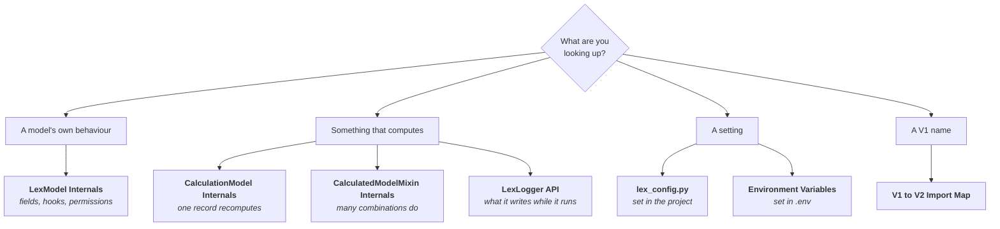

Quick-lookup reference for Lex App development. All source code is available on [GitHub](https://github.com/ExcellenceCloudGmbH/lex-app).

The sections below group these pages by what they are. If you know the question
but not the page, this groups them by what you are trying to find out:

`CLI Commands` and `Report File Fields` sit outside that split — the first is
every `lex` command, the second is what a report model writes to disk.

## Core Classes

- [[reference/LexModel Internals|LexModel Internals]] — fields, lifecycle hooks, permissions, and how the base model works
- [[reference/CalculationModel Internals|CalculationModel Internals]] — the state machine, `calculate()`, and async dispatch
- [[reference/CalculatedModelMixin Internals|CalculatedModelMixin Internals]] — the combination engine, `defining_fields`, parallel dispatch

## APIs & Tools

- [[reference/LexLogger API|LexLogger API]] — every `LexLogger` method with examples
- [[reference/CLI Commands|CLI Commands]] — every `lex` command at a glance
- [[reference/Report File Fields|Report File Fields]] — generated Excel and PDF files on report models

## Configuration

- [[reference/lex_config|lex_config.py]] — the project-wide settings file: `INITIAL_DATA`, `PROJECT_GROUPS`, `TAB_DISPLAY_NAMES`, `DEFAULT_SERIALIZER_NAME`
- [[reference/Environment Variables|Environment Variables]] — runtime variables the framework reads from `.env`

## Migration

- [[reference/V1 to V2 Import Map|V1 → V2 Import Map]] — complete import replacement table for migration
