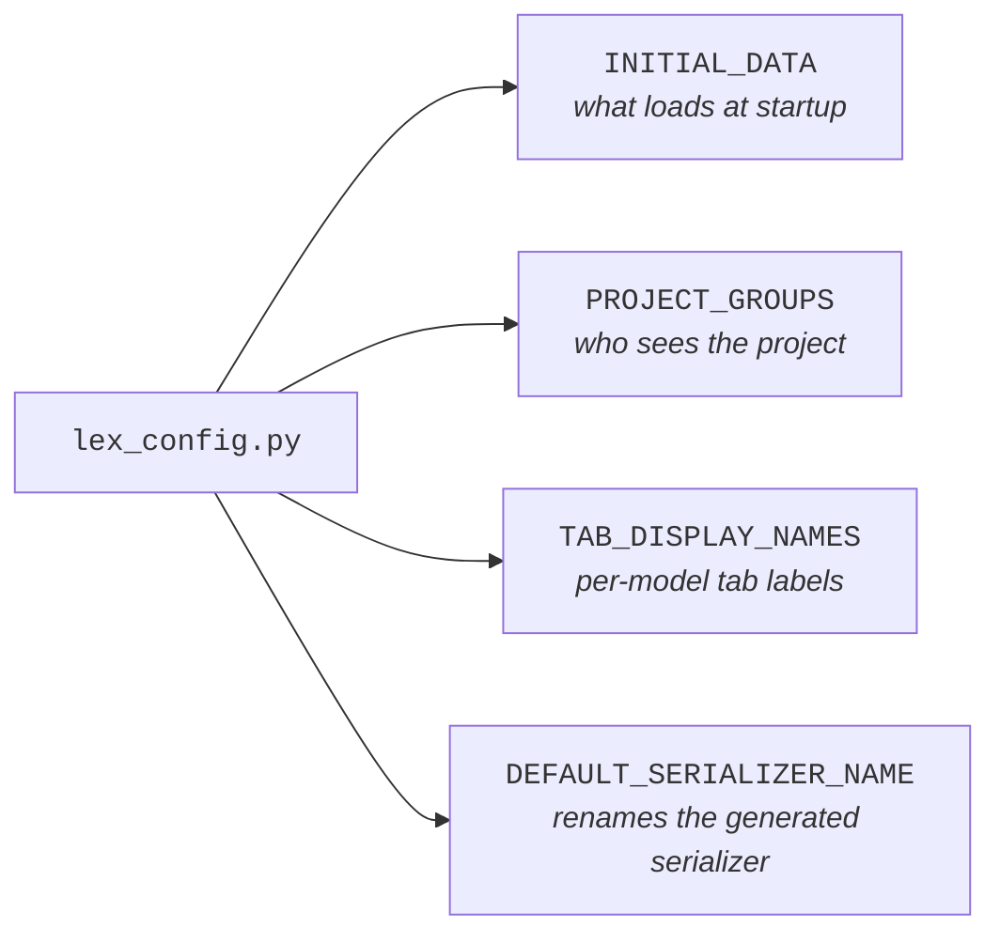

`lex_config.py` lives at your project root and holds project-wide settings the framework reads at boot. It's a plain Python module — the framework imports it once and pulls the keys it cares about. Most projects only set two or three of these.

> [!note]
> This page is a one-stop index. The individual feature pages linked from each section are the place to go for examples and edge cases.

## Keys at a glance




| Key                       | Purpose                                                                              | Documented in                                                                  |
| ------------------------- | ------------------------------------------------------------------------------------ | ------------------------------------------------------------------------------ |
| `INITIAL_DATA`            | Path to the JSON file the framework loads on **server start** to seed your database  | [[model-your-data/initial data]]                                        |
| `PROJECT_GROUPS`          | List of [Keycloak](https://www.keycloak.org/documentation) group names to create on `lex init` | [[start-here/tutorial/Part 4 — Validation & Permissions]], [[access-and-dashboards/permissions]] |
| `TAB_DISPLAY_NAMES`       | Friendly labels for the tabs in the record-detail view                               | [[using-the-app/record-detail/index]]                                              |
| `DEFAULT_SERIALIZER_NAME` | Name of the serializer the framework picks when no explicit one is requested         | [[model-your-data/serializers]]                                         |

## `INITIAL_DATA`

```python title="lex_config.py"
INITIAL_DATA = "Tests/test_data.json"
```

The path (relative to the project root) of the JSON fixture loaded **on server start** — `lex start`, and only when every model it references is empty. Neither `lex init` nor `lex create_db` touches it; the loader is gated on the app running under uvicorn. Use it to seed reference data — categories, lookup tables, demo records — so a fresh database isn't empty. See [[model-your-data/initial data]] for the file format and the bulk-load behaviour.

## `PROJECT_GROUPS`

```python title="lex_config.py"
PROJECT_GROUPS = ["team_budget", "finance", "hr_manager"]
```

A flat list of [Keycloak](https://www.keycloak.org/documentation) group names. On `lex init`, the framework makes sure each group exists in the configured Keycloak realm so your permission methods can check membership via `user_context.groups`. You don't assign users to groups here — that happens in the Keycloak admin UI or via your IdP — `PROJECT_GROUPS` just guarantees the groups exist.

## `TAB_DISPLAY_NAMES`

```python title="lex_config.py"
TAB_DISPLAY_NAMES = {
    "__default__": {"history_tab": "Change history"},
    "expensereport": {"history_tab": "Revisions", "audit_log_tab": "Who touched this"},
}
```

Keyed by **model name** (lowercase), not by tab. Each value is a dict that may
carry `history_tab` and `audit_log_tab` — those two are the only overridable
labels. `"__default__"` applies to every model without an entry of its own.

> [!warning] A flat `{tab: label}` dict is accepted and ignored
> The loader type-checks the outer dict only, so the tab-keyed shape passes
> validation, changes nothing, and reports no error. If your labels are not
> taking effect, this is why.

## `DEFAULT_SERIALIZER_NAME`

```python title="lex_config.py"
DEFAULT_SERIALIZER_NAME = "compact"
```

Not the serializer used for unqualified requests — that is always `"default"`.

This is the **alias** under which the framework re-registers its own
auto-generated serializer when your project overrides `"default"` on a model.
Without it, overriding `"default"` would leave the framework's full-fidelity
serializer unreachable, and the internal endpoints that need it — history
snapshots, foreign-key reference loaders, `model_info` — would get your
override instead.

Two consequences worth knowing: a request with no `?serializer=` still gets the
framework's serializer rather than a project one, and setting this to the name
of a serializer you already define silently disables the alias. See
[[model-your-data/serializers]] for the selection mechanic.

## Where it fits in the project

`lex_config.py` is a file you create at the project root, beside `.env`, `model_structure.yaml`, `migrations/` and your `Upload/` · `Input/` · `Reports/` folders. `lex setup` does not generate it — that command writes `.env`, the IDE run configurations and `migrations/`, and nothing else. See [[start-here/project structure|Project structure]] for the full layout.

