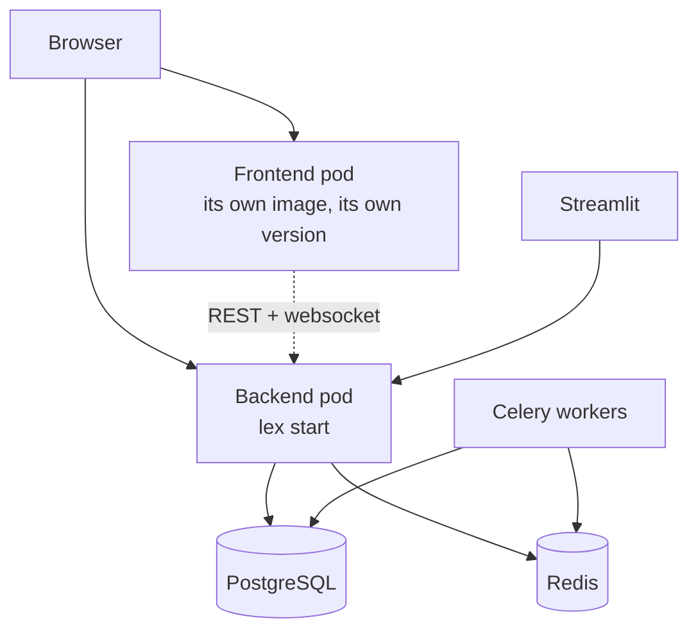

What a Lex App installation runs, and what each process needs. How you schedule these — containers, a cluster, plain systemd units — is your platform's business; this is what the framework expects either way.

## The processes

| Process | Command | Needed when |
|---|---|---|
| **Web** | `lex start --loop asyncio lex_app.asgi:application --host 0.0.0.0 --port 8000` | Always |
| **Celery workers** | `lex celery-workers --count N` | The application has calculations that dispatch asynchronously |
| **Streamlit** | `lex streamlit` | The application has dashboards |
| **Recovery supervisor** | `lex-recovery-supervisor` | Long-running calculations that must survive a worker dying |
| **Recovery beat** | `lex-recovery-beat` | Alongside the supervisor |
| **Flower** | `lex flower` | Optional; a web view of the Celery queues |

Drop `--reload` for anything that is not a developer's laptop.

`lex celery` passes its arguments straight through to Celery, for the cases the wrapper does not cover.

## Migrations at deploy time

`lex_migrate` runs `makemigrations`, then `migrate`, then `createcachetable`. Generating migrations at deploy time is deliberate: an application's models live in its own repository, and a framework upgrade can require a migration in *your* app that nobody wrote by hand.

```bash
lex_migrate                     # makemigrations + migrate + createcachetable
lex_migrate --no-makemigrations # only migrate + createcachetable
```

> [!warning] `--no-makemigrations` is not a safe default
> If you manage migrations yourself, a framework upgrade that widens a column
> leaves Django believing the new width against an unchanged database. The
> symptom is not a clear error at deploy — it is a `DataError` later, on the
> first row that needs the extra width. [[ship-and-operate/upgrading|Upgrading]]
> has a worked example of exactly this.

## Startup probes

The web process runs migrations and registers every model before it answers. On a large database that is minutes, not seconds.

Size the **startup** probe against the slowest migration you expect, not against a healthy boot. A startup probe that expires mid-migration kills the pod, the next one starts the same migration from the beginning, and the deployment fails in a way that reads like a crash loop rather than a timeout. Measured on one instance: a 340-second migration against a 600-second budget — comfortable until the database grew.

Liveness and readiness are a different question and can be tight; see [[ship-and-operate/monitoring and health|Monitoring & health]].

## The interface

The web interface is a built bundle vendored into the `lex-app` package, and a hosted installation serves it from a **separate pod**. That has one consequence worth internalising:

**Upgrading `lex-app` does not upgrade the interface.** The two are versioned and deployed independently, and an older interface serving a newer backend is a supported, common state. A feature that spans both — a new control that calls a new endpoint — arrives only when both sides have moved.



The dotted line is the one to remember: the interface talks to the backend
over the API, and the two are upgraded independently.

## Related

- [[ship-and-operate/configuration|Configuration]] — what these processes read
- [[calculations/celery and async calculations|Celery & async calculations]] — what the workers are for
- [[reference/CLI Commands|CLI Commands]] — every command and flag
