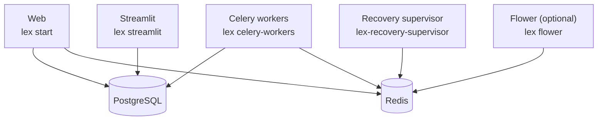

Everything between "it works on my machine" and "it runs for other people, and keeps running."

This section is about the framework's side of that. How your organisation provisions hosts, clusters and databases is yours; what Lex App expects of them is here.

| Page | Answers |
|---|---|
| [[ship-and-operate/configuration\|Configuration]] | What has to be set, what has a safe default, and what happens when something is missing |
| [[ship-and-operate/deploying\|Deploying]] | The processes an installation runs, and what each one needs |
| [[ship-and-operate/upgrading\|Upgrading]] | Moving an application to a newer `lex-app`, including the migrations it may require |
| [[ship-and-operate/monitoring and health\|Monitoring & health]] | The endpoints to probe, the queues to watch, where the logs go |
| [[ship-and-operate/troubleshooting\|Troubleshooting]] | Symptoms that have actually happened, and what each one turned out to be |

## The shape of an installation

A Lex App installation is more than one process, and they can be scaled and restarted independently:

Not every installation runs all of them. An application with no calculations needs no workers; one with no dashboards needs no Streamlit process.

> [!important] The interface is a separate deployment
> The web interface ships as a built bundle inside the `lex-app` package, but
> in a hosted installation the frontend and backend run as **separate pods**.
> An older interface can serve a newer backend perfectly well — which means a
> feature that is half interface and half backend does not arrive just because
> you upgraded `lex-app`. See [[ship-and-operate/upgrading|Upgrading]].
