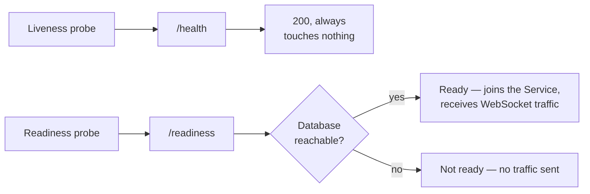

What to probe, what to watch, and where the output goes.

## Health endpoints

| Path | Served by | Use for |
|---|---|---|
| `/health` | The web process | **Liveness only** — is the process alive? |
| `/api/health` | The web process | The same check, under the API prefix |
| `/readiness` | The web process | **Readiness** — can it actually serve? |
| `/api/readiness` | The web process | The same check, under the API prefix |
| `/_stcore/health` | The Streamlit proxy | Liveness of the dashboard process |

**`/health` and `/readiness` are deliberately different checks, and pointing the
wrong probe at the wrong one has a specific failure mode.**

`/health` answers *is the process alive* and returns 200 without touching
Django, Channels or the database. That is what makes it a good liveness probe
and a bad readiness one: a pod that has booted but cannot yet reach the database
passes it, is marked Ready, joins the Service, and answers real requests with
`/server-not-ready`. `/readiness` verifies the database first, so the pod only
becomes Ready once it can serve.

`/_stcore/health` is deliberately **public** — it carries no session, because a probe that had to authenticate would report the auth system's health rather than the process's.

Keep liveness and readiness tight. Size the *startup* probe separately and generously; see [[ship-and-operate/deploying|Deploying]] for why.

## Watching the queues

`lex flower` serves [Flower](https://flower.readthedocs.io/), a web view of the Celery queues: what is running, what is waiting, what failed and what retried.

The number worth alerting on is **queue depth over time**. A depth that rises and falls is a busy system; a depth that only rises is a worker that has died without the queue noticing.

## Recovery

`lex-recovery-supervisor` exists for exactly that case: work that was picked up by a worker which then died. It requeues such tasks within a bounded number of attempts, driven by a **heartbeat** — a task that is still beating is still alive, however long it has been running.

That distinction matters. A long calculation is not a stuck one, and any recovery mechanism keyed on elapsed time rather than liveness will eventually kill the longest, most important run in the system.

## Logs

Application logs go through the `lex.*` logger hierarchy and out of the process's stdout, for whatever your platform collects.

Two things about the proxy's access log are worth knowing, because they were chosen rather than defaulted:

- **4xx and 5xx are logged at WARNING**, so they survive an installation running at `LEX_LOG_LEVEL=WARNING`. That is the whole reason it exists — a browser reporting a failed asset could not previously be traced to a status code at all.
- **A successful static response is not logged** unless `LEX_PROXY_ACCESS_LOG_STATIC` is set. A Streamlit page preloads around a hundred chunks, and logging them buries the one line anyone needs.

Query strings are never written out, only noted as present. The embedded dashboard is bootstrapped with a token in the URL, and an access log echoing it would copy that credential into log storage and every downstream shipper.

## What to alert on

| Signal | Meaning |
|---|---|
| `/health` failing | The web process is down — it touches nothing else, so this is never a database symptom |
| `/readiness` failing while `/health` passes | The process is up but cannot reach the database |
| Celery queue depth only rising | Workers are gone, or wedged |
| A rise in 5xx in the proxy log | Upstream Streamlit is failing or restarting |
| Repeated startup-probe kills | The probe budget is under the migration time, not a crash |

## Related

- [[ship-and-operate/troubleshooting|Troubleshooting]] — what these symptoms turned out to be
- [[calculations/celery and async calculations|Celery & async calculations]] — how work reaches the queues
