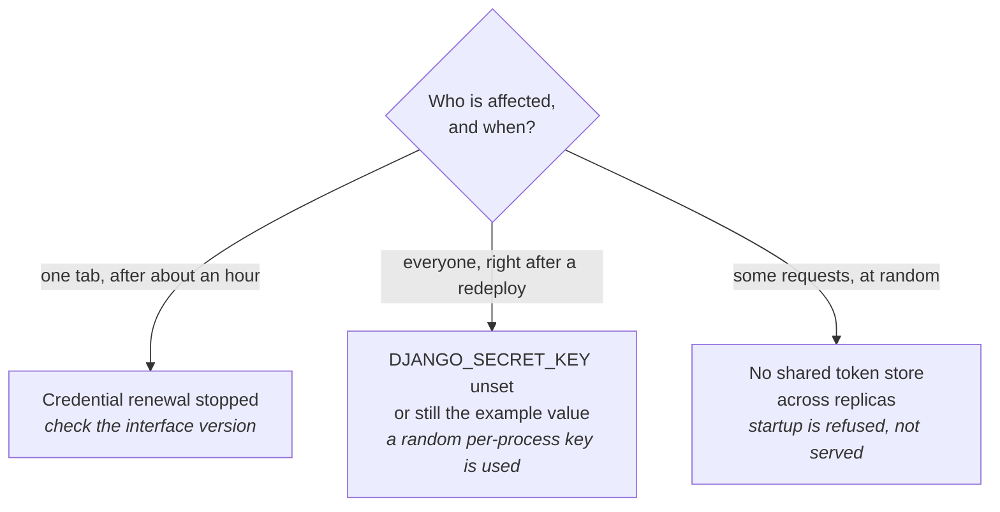

Symptoms that have actually happened on real installations, and what each one turned out to be. Ordered roughly by how often they come up.

Three of the entries below are sign-in problems with different causes, and the
symptom alone tells you which:

## The deployment fails, and the logs look like a crash loop

**Check the startup probe budget before anything else.** The web process runs migrations and registers every model before it answers a request. If the startup probe expires mid-migration the pod is killed, the replacement starts the same migration from the beginning, and it repeats.

Nothing in the log says "timeout" — you see a partial migration and a restart, which reads like a crash. Measured on one instance: a 340-second migration against a 600-second budget, comfortable until the data grew.

Fix the probe, not the migration.

## An embedded dashboard stops working after it has been open a while

The dashboard's credentials are renewed in the background. If that stops, the session expires on the access token's own lifetime and the symptom is a tab that worked for a while and then did not.

Fixed across 2.1.10, 2.1.11, and again in 2.2.1 for dashboards that stayed open long enough for the original iframe handshake token to go stale. In a normal install, upgrading `lex-app` also upgrades the matching `lex-app-frontend` package. If you override the frontend package yourself, update that too — the renewal has a browser-side half. See [[ship-and-operate/upgrading|Upgrading]].

## A document or asset fails to download, with no error anywhere

If the log shows nothing at all for the failed request, that is itself the finding: access logging for the proxy is at WARNING for 4xx and 5xx, so a request that produced _no_ line produced no response either — the connection was dropped rather than answered.

The known cause is a pooled upstream connection the Streamlit server had already closed, which surfaced as an unhandled exception rather than a status. Answered as a 502 since 2.1.10, with one retry for requests that had not yet sent a byte.

If the browser shows `ERR_HTTP2_PROTOCOL_ERROR` and a download stalls at 0 bytes, upgrade to 2.2.1 or later. That release fixes proxied responses that were tolerated over HTTP/1.1 but could be rejected by an HTTP/2 intermediary mid-download.

## `lex init` fails against Keycloak

`lex init` synchronises models and permissions with Keycloak, so it needs the client configuration to exist and to be reachable.

- Missing credentials — `lex init --bootstrap` opens the browser bootstrap flow.
- You are managing the client yourself and the preflight is in the way — `lex init --skip-client-preflight`.

## Everyone is signed out after a redeploy

Session cookies are signed with a key derived from `DJANGO_SECRET_KEY`. If that key is not set — or is still the published example value, which is excluded on purpose — the framework falls back to a random per-process key and warns. It works, and it is discarded on every restart.

Set `DJANGO_SECRET_KEY` to a stable, per-installation value. See [[ship-and-operate/configuration|Configuration]].

## Sessions work intermittently across replicas

Two replicas with no shared token store will each accept only the sessions they created. The framework refuses to start in this configuration rather than serving it, because "works about half the time" is harder to diagnose than a startup failure.

## A report is saved under a name nobody chose

`XLSXField` and `PDFField` advertise a 300-character limit that did not apply before 2.1.11 — every plain declaration was `varchar(100)`, and an over-length name was truncated silently rather than rejected.

On 2.1.11 or later, ensure the widening migration was actually generated and applied. If you deploy with `--no-makemigrations` it was not, and the silent truncation becomes a `DataError` instead. [[ship-and-operate/upgrading|Upgrading]] has the detail.

## `lex --help` does not list the command I was told to run

It only lists the ten commands the CLI implements itself. Django management commands — `init`, `migrate`, `create_db`, `sync_keycloak`, `lex_migrate` and the rest — work but do not appear, because listing them would mean starting Django just to print help.

[[reference/CLI Commands|CLI Commands]] is the complete list.

## Still stuck

Collect these before asking, because they are what the first three questions will be:

- The exact `lex-app` version, and the interface version if they differ.
- Whether the deployment ran `lex_migrate` with or without `--no-makemigrations`.
- The pod log around the failure — including the absence of lines, which is evidence.
