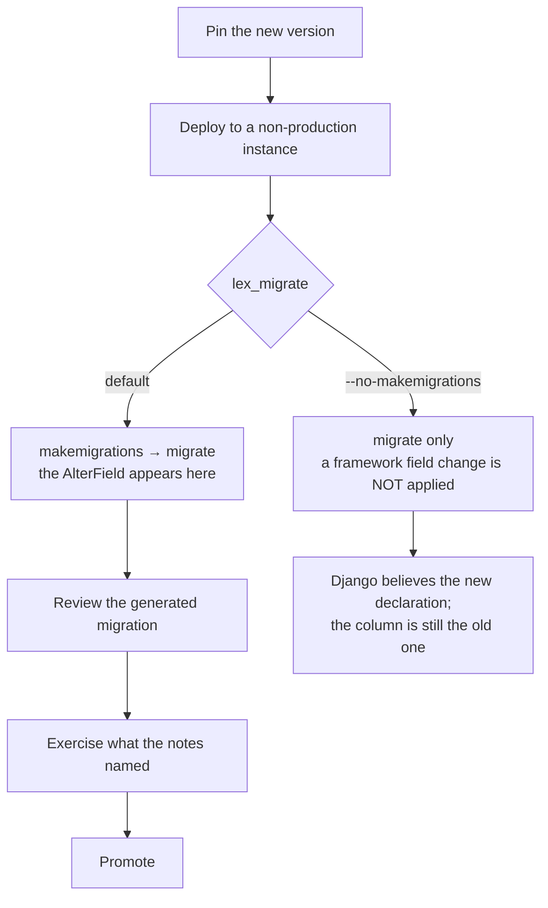

Moving an application to a newer `lex-app`. Most upgrades are a version bump and a deploy. The two things worth checking are migrations your app has to generate, and whether you have deliberately overridden the frontend package that ships alongside `lex-app`.

## Pin the version

```
lex-app==2.2.0
```

Not `>=`. A framework upgrade can require a migration in your application (see below), so it should happen when you decide, not when a rebuild happens to pick up a newer release.

## Read the release notes first

Every release publishes notes on [GitHub](https://github.com/ExcellenceCloudGmbH/lex-app/releases) and on the changelog. Two things there are worth more than the feature list:

- The **Upgrade note** at the bottom. When there is nothing to do it says so; when there is, that is where it is.
- Whether anything was **withdrawn**. Interface work shipped in 2.1.3 was rolled back in 2.1.4 and returned in 2.2.0 — a feature list read in isolation would have been wrong twice.

## Migrations your application has to generate

A framework change can alter a field your models use, and the migration then belongs to _your_ app, not to `lex-app`.

**A worked example, from 2.1.11.** `XLSXField` and `PDFField` had always advertised `max_length=300`, and it had never applied — every plain declaration was silently `varchar(100)`, and an over-length report name was quietly truncated rather than rejected. Fixing it means every application using either field gets one `AlterField` per report column on its next `makemigrations`.

- Deploying with `lex_migrate` (the default) — the migration is generated and applied. Nothing to do.
- Deploying with `--no-makemigrations` — **not safe for this upgrade.** Django believes 300 against an unchanged `varchar(100)` column, and the old silent truncation becomes a `DataError` on the first long filename.

The pattern generalises: if a release note mentions a field's width, type or constraint, either let `lex_migrate` generate the migration or generate it yourself before deploying.

## The interface is pinned alongside `lex-app`

The web interface now lives in `lex-app-frontend`, a separate package that `lex-app` depends on. In a normal install, upgrading `lex-app` also installs the matching frontend version.

So the default rule is now the opposite of the old one:

> **Upgrading `lex-app` normally upgrades the interface too.**

You only need to think about the interface version separately if you have deliberately pinned or overridden `lex-app-frontend` yourself. That is still a valid deployment choice — just test the pair together when a release mentions a browser-side half, like Streamlit widgets or dashboard token renewal.

## Order of operations

1. Read the release notes, including the upgrade note.
2. Pin the new version.
3. Deploy to a non-production instance and let `lex_migrate` run.
4. Check the migration it generated — this is where an unexpected `AlterField` shows up.
5. Exercise the parts of your application that touch whatever the notes mentioned.
6. Promote.

Step 3 is the one with a fork in it. `lex_migrate` generates migrations and
applies them; `--no-makemigrations` applies only what already exists:



The right-hand branch is the one to be careful with, and only on upgrades that
change a field: the schema and Django's idea of it drift apart silently, and the
first over-length value turns what used to be quiet truncation into a
`DataError`.

## Downgrading

Reinstall the older pin and redeploy. The caveat is migrations: a migration your app generated during the upgrade is not reversed by reinstalling the old package. If step 4 produced one, plan the reverse before you need it.

## Related

- [[ship-and-operate/deploying|Deploying]] — `lex_migrate` and startup probes
- [[migrating-from-v1/index|Migrating from V1]] — the different, larger job of moving off `generic_app`
