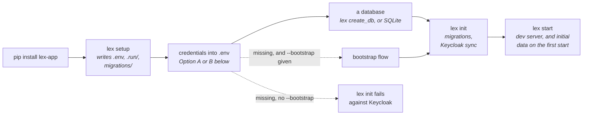

Install the `lex-app` package. This gives you the `lex` CLI tool and all framework dependencies.

```bash
pip install lex-app
```

Verify it worked:

```bash
pip show lex-app
```

> [!warning] Not `lex --version`
> The `lex` CLI has no `--version` option — it answers
> `Error: No such option '--version'`. `pip show lex-app` is the reliable
> check, and it also prints where the package was installed from, which is
> what you actually want when two checkouts are in play.

> [!tip]
> Make sure you're using **Python 3.12**. Check with `python3.12 --version`.

## Run `lex setup`

Navigate to your project directory and run:

```bash
lex setup
```

This generates a few things for you:

- `.run/` — PyCharm run configurations (Init, Start, Streamlit, Reflex, and the rest)
- `.vscode/launch.json` — VS Code launch configurations (if VS Code settings are present)
- `.env` — Environment configuration template
- `migrations/` — Django migrations folder

## Configure Your Environment

The `.env` file is the **single source of truth** for runtime configuration.

The whole first run is a handful of commands, and only `lex init` needs
credentials in place:


```mermaid
flowchart LR
    I["pip install lex-app"] --> S["lex setup<br/><i>writes .env, .run/,<br/>migrations/</i>"]
    S --> C["credentials into .env<br/><i>Option A or B below</i>"]
    C --> D["a database<br/><i>lex create_db, or SQLite</i>"]
    D --> N["lex init<br/><i>migrations,<br/>Keycloak sync</i>"]
    N --> R["lex start<br/><i>dev server, and initial<br/>data on the first start</i>"]
    C -.->|"missing, and --bootstrap given"| BS["bootstrap flow"]
    BS --> N
    C -.->|"missing, no --bootstrap"| F["lex init fails<br/>against Keycloak"]
```

### Option A: Let `lex init` bootstrap the credentials

`lex setup` does not prompt for anything — it writes the files listed above and
exits. The flow that can fetch credentials for you is a flag on `lex init`:

```bash
lex init --bootstrap
```

With `--bootstrap`, `lex init` starts the bootstrap flow **when the Keycloak
environment variables are missing**. Without it (the default) `lex init` fails
against Keycloak instead, because it needs the client configuration to exist
and be reachable.

### Option B: Manual

1. Log in to [Excellence Cloud](https://excellence-cloud.de)
2. Go to Clients and Click Create a new Client
3. Select client type → **development**
4. Enable **confidential**
5. Copy the credentials into your `.env`:

```env
KEYCLOAK_URL=keycloak_url
KEYCLOAK_REALM=keycloak_realm
OIDC_RP_CLIENT_ID=your_client_id
OIDC_RP_CLIENT_SECRET=your_client_secret
OIDC_RP_CLIENT_UUID=your_client_uuid
```

## Choose a Database

`lex init` creates your tables, so it needs a database it can reach. Out of the
box that is PostgreSQL on your own machine, with these fixed settings — none of
them come from `.env`:

| Setting | Value |
|---|---|
| Host and port | `localhost:5432` |
| User | `django` |
| Password | `lundadminlocal` |
| Database | `db_` followed by your project folder's name in lower case — `db_teambudget` for the tutorial |

Create that user once — in `psql`, as a PostgreSQL superuser — with the right
to create databases:

```sql
CREATE USER django WITH PASSWORD 'lundadminlocal' CREATEDB;
```

Then let the framework create the database itself — it does nothing if the
database already exists:

```bash
lex create_db
```

No PostgreSQL on this machine? Use SQLite instead, with one line in `.env`:

```env
DATABASE_DEPLOYMENT_TARGET=local
```

The database is then a file at your project root, named after the project
folder (`TeamBudget.sqlite3` for the tutorial), created the first time
migrations run. `lex create_db` has nothing to do and says so. The other
connection profiles, for deployed instances, are listed under
[[reference/Environment Variables#Database|Environment Variables]].

## Initialize the Application

`lex init` is the primary initialization command. It does three things:

1. **Applies migrations** — creates/updates database tables from your models
2. **Syncs to Keycloak** — registers your project models as "Resources" and permissions as "Scopes"
3. **Enables access management** — you can now manage permissions on [Excellence Cloud](https://excellence-cloud.de)

### Via PyCharm (easiest)

1. Open the **Run Configuration** dropdown (top-right toolbar)
2. Select **"Init"**
3. Click the green ▶️ Run button (or press `Shift+F10`)

PyCharm automatically loads your `.env` file.

### Via Terminal

```bash
# Load environment variables first
set -a; source .env; set +a

# Then initialize
lex init
```

> [!tip]
> If your Keycloak credentials are still missing, run `lex init --bootstrap` instead. It opens the browser-based setup flow and then continues with the normal init steps.

> [!note]- Windows (PowerShell)
>
> ```powershell
> # Load environment variables
> Get-Content .env | ForEach-Object {
>     if ($_ -match '^([^=]+)=(.*)$') {
>         [System.Environment]::SetEnvironmentVariable($matches[1], $matches[2])
>     }
> }
>
> # Initialize
> lex init
> ```

> [!important]
> **When to run `lex init` again:** Whenever you add a new model, new field, or change permission methods — any change that creates a new migration file.

## Start the Dev Server

### Via PyCharm

Select **"Start"** from the Run Configuration dropdown → click ▶️.

### Via Terminal

```bash
set -a; source .env; set +a
lex start --reload --loop asyncio lex_app.asgi:application
```

Your application is now running at `http://localhost:8000`. Opening it sends
you to Keycloak to sign in: use your Excellence Cloud account — the one you set
the client up with — and you land back in the app.

## Troubleshooting

> [!warning]- Database connection errors
>
> - `connection refused` on `localhost:5432`, or `password authentication failed for user "django"`: the default profile cannot reach PostgreSQL with the fixed settings in [[start-here/installation#Choose a Database|Choose a Database]]
> - No PostgreSQL to point it at: set `DATABASE_DEPLOYMENT_TARGET=local` in `.env` to use SQLite

> [!warning]- "Environment variable not set" errors
>
> - **PyCharm:** Make sure `.env` is in your project root
> - **Terminal:** Always run `set -a; source .env; set +a` before any `lex` command

> [!warning]- "ModuleNotFoundError: lex" errors
>
> - Make sure `lex-app` is installed: `pip install lex-app`
> - Verify you're using Python 3.12
> - Check that your virtual environment is activated

> [!warning]- Keycloak connection errors
>
> - Verify `KEYCLOAK_URL` in your `.env`
> - Check that `OIDC_RP_CLIENT_ID` and `OIDC_RP_CLIENT_SECRET` are correct
> - Confirm your client exists on [Excellence Cloud](https://excellence-cloud.de)

> [!warning]- "`lex init` refuses to sync this client"
>
> - In local development, `lex init` expects a **confidential** Keycloak client with a `localhost` redirect URI
> - If you're intentionally using a different setup, rerun with `lex init --skip-client-preflight`

Got everything set up? Learn about the [[start-here/project structure]] or jump straight to [[start-here/running your app]].
