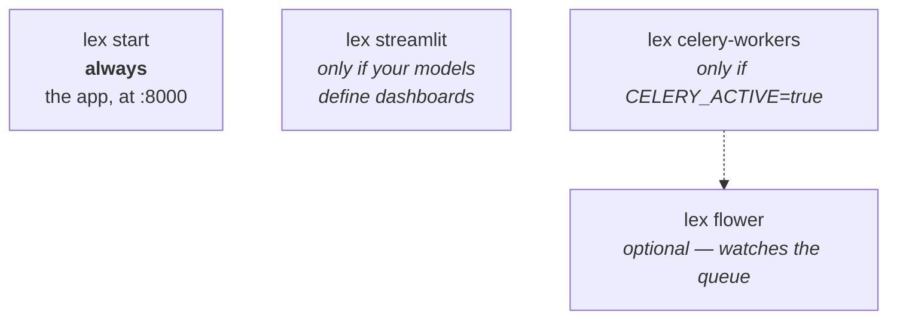

Once you've [[start-here/installation|installed and initialized]] your Lex App application, you can run it locally. We recommend using [PyCharm](https://www.jetbrains.com/pycharm/) (the run configurations handle everything automatically), but the terminal works just as well.

A running app is more than one process, and which ones you need depends on what
you are doing:



`lex start` on its own is enough to browse data, edit records and run
calculations: with `CELERY_ACTIVE` unset — the default — a calculation runs
in-process and finishes before the request returns. Turn Celery on and the same
click dispatches to a worker instead, so `lex celery-workers` has to be running
or the calculation sits in the queue and nothing appears to happen.

## Using PyCharm

The `lex setup` command generates ready-to-use run configurations in the `.run/` folder. Open the **Run Configuration** dropdown in the top-right toolbar and you'll see:

| Configuration | What It Does                             |
| ------------- | ---------------------------------------- |
| **Init**      | Applies migrations and syncs to Keycloak |
| **Start**     | Starts the development server            |
| **Streamlit** | Runs the Streamlit dashboard server      |

Select **"Start"** and click the green ▶️ button. Your app is now running at `http://localhost:8000`.

> [!tip]
> PyCharm run configurations automatically load your `.env` file. No manual sourcing needed.

## Using the Terminal

If you're not using PyCharm, you'll need to load environment variables manually before running any `lex` command:

```bash
# Load environment variables
set -a; source .env; set +a

# Start the development server
lex start --reload --loop asyncio lex_app.asgi:application
```

The `--reload` flag enables hot-reloading so the server restarts automatically when you change code.

## Running Streamlit Dashboards

If your models define [[access-and-dashboards/streamlit dashboards|Streamlit dashboards]], you need to start the Streamlit server separately:

### Via PyCharm

Select **"Streamlit"** from the Run Configuration dropdown.

### Via Terminal

```bash
set -a; source .env; set +a
lex streamlit
```

> [!tip]
> PyCharm's Streamlit run configuration handles all environment variables automatically. We recommend using it for local development.

`lex streamlit` starts the Streamlit app and the authentication proxy together. Locally, the defaults are enough. In HTTPS deployments, a stable `DJANGO_SECRET_KEY` is enough for dashboard sessions unless you want to override it with `SESSION_SECRET`; if you run multiple proxy replicas, set a shared `TOKEN_REDIS_URL` / `REDIS_URL` too so sessions survive load balancing.

## What's Next?

Now that your app is running, explore the [[home|features]] to see what Lex App gives you out of the box. If you want a guided walkthrough, try the [[start-here/tutorial/index|TeamBudget Tutorial]].
