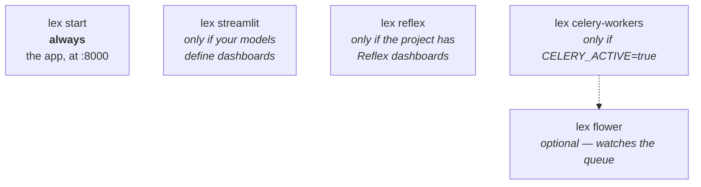

Once you've [[start-here/installation|installed and initialized]] your Lex App application, you can run it locally. We recommend using [PyCharm](https://www.jetbrains.com/pycharm/) (the run configurations handle everything automatically), but the terminal works just as well.

A running app is more than one process, and which ones you need depends on what
you are doing:


```mermaid
flowchart TB
    S["lex start<br/><b>always</b><br/>the app, at :8000"]
    T["lex streamlit<br/><i>only if your models</i><br/><i>define dashboards</i>"]
    X["lex reflex<br/><i>only if the project has</i><br/><i>Reflex dashboards</i>"]
    W["lex celery-workers<br/><i>only if CELERY_ACTIVE=true</i>"]
    F["lex flower<br/><i>optional — watches the queue</i>"]
    W -.-> F
```

`lex start` on its own is enough to browse data, edit records and run
calculations: with `CELERY_ACTIVE` unset — the default — a calculation runs
in-process and finishes before the request returns. Turn Celery on and the same
click dispatches to a worker instead, so `lex celery-workers` has to be running
or the calculation sits in the queue and nothing appears to happen.

## Using PyCharm

The `lex setup` command generates ready-to-use run configurations in the `.run/` folder. Open the **Run Configuration** dropdown in the top-right toolbar and you'll see eleven:

| Configuration | What It Does |
|---|---|
| **Init** | Applies migrations and syncs your models' permissions to Keycloak |
| **Start** | Starts the development server, restarting it when your code changes |
| **Streamlit** | Runs the Streamlit dashboard server |
| **Reflex** | Runs the Reflex dashboard server |
| **Celery Workers** | Starts background workers — only needed with `CELERY_ACTIVE=true`. Asks how many to start |
| **Flower** | A web view of the Celery queue |
| **Make migrations** | Writes migration files for your model changes, without applying them |
| **Migrate** | Applies migrations, without the Keycloak sync |
| **Create DB** | Creates the PostgreSQL database if it doesn't exist yet; does nothing on SQLite |
| **Flush DB** | Deletes **every row** in the database, after asking you to confirm. The next **Start** loads your initial data again |
| **Setup With AI** | Configures the LEX AI integration — see [[reference/CLI Commands#AI Commands\|AI Commands]] |

Select **"Start"** and click the green ▶️ button. Your app is now running at `http://localhost:8000`.

> [!tip]
> PyCharm run configurations automatically load your `.env` file. No manual sourcing needed.


## Using the Terminal

If you're not using PyCharm, you'll need to load environment variables manually before running any `lex` command:

```bash
# Load environment variables
set -a; source .env; set +a

# Start the development server
lex start --reload --loop asyncio lex_app.asgi:application
```

The `--reload` flag enables hot-reloading so the server restarts automatically when you change code.

## Running Streamlit Dashboards

If your models define [[access-and-dashboards/streamlit/index|Streamlit dashboards]], you need to start the Streamlit server separately:

### Via PyCharm

Select **"Streamlit"** from the Run Configuration dropdown.

### Via Terminal

```bash
set -a; source .env; set +a
lex streamlit
```

> [!tip]
> PyCharm's Streamlit run configuration handles all environment variables automatically. We recommend using it for local development.

`lex streamlit` starts the Streamlit app and the authentication proxy together. Locally, the defaults are enough. In HTTPS deployments, set a fixed `SESSION_SECRET`; if you run multiple proxy replicas, set a shared `TOKEN_REDIS_URL` / `REDIS_URL` too so dashboard sessions survive restarts and load balancing.

## Running Reflex Dashboards

If the project has [[access-and-dashboards/reflex/index|Reflex dashboards]], start the Reflex server beside the app — select **"Reflex"** from the Run Configuration dropdown, or from a terminal:

```bash
set -a; source .env; set +a
lex reflex
```

The dashboards are at `http://localhost:8502`. The first run writes `rxconfig.py` at the project root and builds Reflex's frontend, so it takes longer than the runs after it, which also reload when you change a file. Reflex Enterprise, which signs users in, needs the machine signed in to Reflex once: `lex reflex login`. [[access-and-dashboards/reflex/running and deploying|Running & Deploying]] has the rest.

## What's Next?

Now that your app is running, explore the [[home|features]] to see what Lex App gives you out of the box. If you want a guided walkthrough, try the [[start-here/tutorial/index|TeamBudget Tutorial]].
