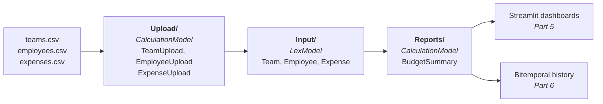

In this tutorial, you'll build a complete Lex App application from scratch — a **team budget tracker** called TeamBudget. By the end, you'll have used every major Lex App feature: models, calculations, lifecycle hooks, logging, permissions, serializers, [Streamlit](https://docs.streamlit.io/) dashboards, and bitemporal history.

You'll also see how Lex App projects follow the **ETL pattern** — Extract, Transform, Load — reflected directly in your folder structure.

## What You'll Build

TeamBudget tracks teams, employees, and expenses. It includes:

- **Upload models** — CSV ingestion for teams, employees, and expenses (Extract)
- **Input models** — `Team`, `Employee`, `Expense` as core business entities (Transform)
- **Report models** — `BudgetSummary` with automatic calculations (Load)
- **Serializers** — API validation via [Django REST Framework](https://www.django-rest-framework.org/)
- **Permissions** — field-level and row-level access control
- **Dashboards** — interactive [Streamlit](https://docs.streamlit.io/) visualizations
- **History** — full [[history-and-audit/bitemporal history|bitemporal]] audit trail

Those pieces are one path, not a list of features — a CSV becomes three domain
records, and those records become a calculated summary you can then dashboard
and audit:




## Prerequisites

Before starting, make sure you have:

- Lex App installed and configured (see [[start-here/installation]]) — [source on GitHub](https://github.com/ExcellenceCloudGmbH/lex-app)
- [PyCharm](https://www.jetbrains.com/pycharm/) (recommended) or any Python-capable editor
- Access to [Excellence Cloud](https://excellence-cloud.de) for [Keycloak](https://www.keycloak.org/documentation) setup

## Project Structure

Lex App uses a flat project layout — no `manage.py`, no nested [Django](https://docs.djangoproject.com/) app folders. Your project is organized into three ETL folders:

```
TeamBudget/
├── .env
├── .run/
│   ├── Init.run.xml
│   └── Start.run.xml
├── lex_config.py
├── migrations/
├── sample_data/
│   ├── teams.csv
│   ├── employees.csv
│   └── expenses.csv
├── model_structure.yaml
│
├── Input/                     ← Core business entities (Transform)
│   ├── __init__.py
│   ├── Team.py
│   ├── Employee.py
│   ├── Expense.py
│   └── serializers.py
│
├── Upload/                    ← Data ingestion (Extract)
│   ├── __init__.py
│   ├── TeamUpload.py
│   ├── EmployeeUpload.py
│   └── ExpenseUpload.py
│
├── Reports/                   ← Calculations & output (Load)
│   ├── __init__.py
│   └── BudgetSummary.py
│
└── Tests/                     ← Initial data & integration tests
    ├── test_data.json
    ├── 01_create_teams.json
    ├── 02_create_employees.json
    └── 03_create_expenses.json
```

> [!important]
> This follows the **ETL convention**: `Upload/` for ingestion, `Input/` for domain models, `Reports/` for output. See [[start-here/project structure]] for more details.

## Tutorial Parts

Work through these in order:

1. [[start-here/tutorial/Part 1 — Project Setup|Part 1 — Project Setup]] — create the project, configure your environment, run Init
2. [[start-here/tutorial/Part 2 — Data Models|Part 2 — Data Models]] — define `Team`, `Employee`, and `Expense` models plus upload models and serializers
3. [[start-here/tutorial/Part 3 — Calculations & Logging|Part 3 — Calculations & Logging]] — build `BudgetSummary` as a `CalculationModel` with `LexLogger`
4. [[start-here/tutorial/Part 4 — Validation & Permissions|Part 4 — Validation & Permissions]] — add `pre_validation()`, `post_validation()`, and `permission_*` methods
5. [[start-here/tutorial/Part 5 — Streamlit Dashboards|Part 5 — Streamlit Dashboards]] — attach interactive dashboards to your models
6. [[start-here/tutorial/Part 6 — History in Action|Part 6 — History in Action]] — explore the bitemporal history panel
