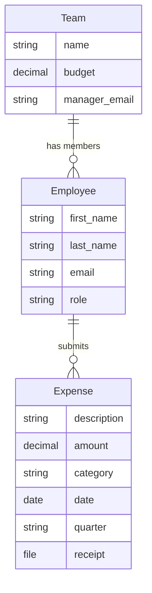

In this part, you'll create the three core input models for TeamBudget — `Team`, `Employee`, and `Expense` — then build upload models that ingest CSV data, and finally add a serializer for API-level validation. By the end, you'll have data flowing through the full ETL pipeline.

## The Plan



> [!important]
> **One file per model class.** Input models go in `Input/`, upload models in `Upload/`, report models in `Reports/`. This follows the [[project structure|ETL convention]].

## Create the Input Models

These are your core business entities — the **Transform** layer of the ETL pipeline. They live in the `Input/` folder.

### `Input/Team.py`

In PyCharm, right-click the `Input/` folder → **New → Python File** → name it `Team`:

```python title="Input/Team.py"
from django.db import models
from lex.core.models.LexModel import LexModel


class Team(LexModel):
    """A department/team with a quarterly budget."""

    name = models.CharField(max_length=100)
    budget = models.DecimalField(
        max_digits=12,
        decimal_places=2,
        help_text="Quarterly budget in EUR",
    )
    manager_email = models.EmailField(
        help_text="Email of the team manager",
    )

    def __str__(self):
        return self.name
```

By inheriting from `LexModel`, your model automatically gets a database table, REST API endpoints, [AG Grid](https://www.ag-grid.com/)-powered frontend, `created_by`/`edited_by` tracking, and full [[features/tracking/bitemporal history|bitemporal history]]. We recommend starting every data model from `LexModel` — see [[reference/LexModel Internals]] for a complete list of what it provides.

### `Input/Employee.py`

```python title="Input/Employee.py"
from django.db import models
from lex.core.models.LexModel import LexModel

from Input.Team import Team


class Employee(LexModel):
    """A team member linked to a specific team."""

    first_name = models.CharField(max_length=100)
    last_name = models.CharField(max_length=100)
    email = models.EmailField(unique=True)
    team = models.ForeignKey(Team, on_delete=models.CASCADE)
    role = models.CharField(
        max_length=50,
        choices=[
            ("employee", "Employee"),
            ("manager", "Manager"),
            ("cfo", "CFO"),
        ],
        default="employee",
    )

    def __str__(self):
        return f"{self.first_name} {self.last_name}"
```

> [!note]
> The import `from Input.Team import Team` follows the folder structure: `Input/` is the package, `Team` is the module. All Lex App imports work this way.

### `Input/Expense.py`

```python title="Input/Expense.py"
from django.db import models
from lex.core.models.LexModel import LexModel

from Input.Employee import Employee


class Expense(LexModel):
    """An individual expense submission with receipt upload."""

    employee = models.ForeignKey(Employee, on_delete=models.CASCADE)
    description = models.CharField(max_length=255)
    amount = models.DecimalField(max_digits=10, decimal_places=2)
    category = models.CharField(
        max_length=50,
        choices=[
            ("travel", "Travel"),
            ("software", "Software"),
            ("equipment", "Equipment"),
            ("meals", "Meals & Entertainment"),
            ("office", "Office Supplies"),
            ("other", "Other"),
        ],
    )
    date = models.DateField(help_text="Date the expense was incurred")
    quarter = models.CharField(
        max_length=10,
        help_text="e.g. Q1 2026",
    )
    receipt = models.FileField(
        upload_to="receipts/",
        null=True,
        blank=True,
        help_text="Upload a photo or PDF of the receipt",
    )

    def __str__(self):
        return f"{self.description} — €{self.amount}"
```

## Create the Upload Models

These are the **Extract** layer — `CalculationModel` subclasses that ingest CSV files. They live in the `Upload/` folder.

### `Upload/TeamUpload.py`

```python title="Upload/TeamUpload.py"
import pandas as pd
from django.db import models
from lex.core.models.CalculationModel import CalculationModel
from lex.audit_logging.handlers.LexLogger import LexLogger

from Input.Team import Team


class TeamUpload(CalculationModel):
    """Upload a CSV file to create Team records."""

    file = models.FileField(
        upload_to="uploads/",
        help_text="CSV with columns: name, budget, manager_email",
    )

    def __str__(self):
        return f"Team Upload — {self.file.name}"

    def calculate(self):
        logger = LexLogger()
        df = pd.read_csv(self.file.path)

        logger.add_heading("Team Upload Results")

        created = 0
        for _, row in df.iterrows():
            team, was_created = Team.objects.update_or_create(
                name=row["name"],
                defaults={
                    "budget": row["budget"],
                    "manager_email": row["manager_email"],
                },
            )
            if was_created:
                created += 1

        logger.add_table(
            headers=["Metric", "Value"],
            rows=[
                ["Rows in CSV", str(len(df))],
                ["Teams created", str(created)],
                ["Teams updated", str(len(df) - created)],
            ],
        )
        logger.log()
```

### `Upload/EmployeeUpload.py`

```python title="Upload/EmployeeUpload.py"
import pandas as pd
from django.db import models
from lex.core.models.CalculationModel import CalculationModel
from lex.audit_logging.handlers.LexLogger import LexLogger

from Input.Team import Team
from Input.Employee import Employee


class EmployeeUpload(CalculationModel):
    """Upload a CSV file to create Employee records."""

    file = models.FileField(
        upload_to="uploads/",
        help_text="CSV with columns: first_name, last_name, email, team, role",
    )

    def __str__(self):
        return f"Employee Upload — {self.file.name}"

    def calculate(self):
        logger = LexLogger()
        df = pd.read_csv(self.file.path)

        logger.add_heading("Employee Upload Results")

        created = 0
        errors = []
        for _, row in df.iterrows():
            try:
                team = Team.objects.get(name=row["team"])
                _, was_created = Employee.objects.update_or_create(
                    email=row["email"],
                    defaults={
                        "first_name": row["first_name"],
                        "last_name": row["last_name"],
                        "team": team,
                        "role": row.get("role", "employee"),
                    },
                )
                if was_created:
                    created += 1
            except Team.DoesNotExist:
                errors.append(f"Team '{row['team']}' not found for {row['email']}")

        logger.add_table(
            headers=["Metric", "Value"],
            rows=[
                ["Rows in CSV", str(len(df))],
                ["Employees created", str(created)],
                ["Errors", str(len(errors))],
            ],
        )

        if errors:
            logger.add_heading("Errors", level=2)
            for error in errors:
                logger.add_text(f"⚠️ {error}")

        logger.log()
```

### `Upload/ExpenseUpload.py`

```python title="Upload/ExpenseUpload.py"
import pandas as pd
from django.db import models
from lex.core.models.CalculationModel import CalculationModel
from lex.audit_logging.handlers.LexLogger import LexLogger

from Input.Employee import Employee
from Input.Expense import Expense


class ExpenseUpload(CalculationModel):
    """Upload a CSV file to create Expense records."""

    file = models.FileField(
        upload_to="uploads/",
        help_text="CSV with columns: description, amount, category, date, quarter, employee_email",
    )

    def __str__(self):
        return f"Expense Upload — {self.file.name}"

    def calculate(self):
        logger = LexLogger()
        df = pd.read_csv(self.file.path)

        logger.add_heading("Expense Upload Results")

        created = 0
        errors = []
        for _, row in df.iterrows():
            try:
                employee = Employee.objects.get(email=row["employee_email"])
                Expense.objects.create(
                    employee=employee,
                    description=row["description"],
                    amount=row["amount"],
                    category=row["category"],
                    date=row["date"],
                    quarter=row["quarter"],
                )
                created += 1
            except Employee.DoesNotExist:
                errors.append(
                    f"Employee '{row['employee_email']}' not found "
                    f"for expense '{row['description']}'"
                )

        logger.add_table(
            headers=["Metric", "Value"],
            rows=[
                ["Rows in CSV", str(len(df))],
                ["Expenses created", str(created)],
                ["Errors", str(len(errors))],
            ],
        )

        if errors:
            logger.add_heading("Errors", level=2)
            for error in errors:
                logger.add_text(f"⚠️ {error}")

        logger.log()
```

## Add a Serializer

By default, Lex App generates a basic API serializer for every model. We recommend adding custom validation for any model where data quality matters. Create a `serializers.py` file alongside the model it applies to — this uses [Django REST Framework](https://www.django-rest-framework.org/) serializers. See [[features/data-pipeline/serializers]] for the full guide.

The serializer below does three things:

1. **Field-level validation** — rejects negative amounts before they hit the database
2. **Cross-field validation** — enforces a business rule that depends on both `amount` *and* `category`
3. **PATCH-safe design** — falls back to `self.instance` when only one field is sent (inline grid edits send partial updates)

```python title="Input/serializers.py"
from rest_framework import serializers
from lex.api.views.model_entries.mixins.PermissionAwareSerializerMixin import add_permission_checks

from Input.Expense import Expense


@add_permission_checks
class ExpenseDefaultSerializer(serializers.ModelSerializer):
    class Meta:
        model = Expense
        fields = '__all__'

    def validate_amount(self, value):
        """Amounts must be positive."""
        if value <= 0:
            raise serializers.ValidationError("Amount must be positive.")
        return value

    def validate(self, attrs):
        """Enforce business rules across fields.

        On partial updates (PATCH) attrs only contains the fields that
        were sent, so fall back to the existing instance values.
        """
        amount = attrs.get('amount')
        category = attrs.get('category')

        # Fall back to existing values during partial updates
        if self.instance:
            if amount is None:
                amount = self.instance.amount
            if category is None:
                category = self.instance.category

        if amount and amount > 5000 and category == 'meals':
            raise serializers.ValidationError({
                'amount': "Meal expenses over €5,000 are not allowed."
            })
        return attrs


Expense.api_serializers = {
    'default': ExpenseDefaultSerializer,
}
```

> [!tip]
> The `@add_permission_checks` decorator ensures your serializer respects the [[features/access-and-ui/permissions|permission system]]. Validation errors show directly in the frontend UI.

> [!warning] Partial updates and cross-field validation
> Lex uses **PATCH** requests when you edit a cell inline in the grid. A PATCH only sends the changed field — so `attrs` won't contain fields you didn't touch. Always fall back to `self.instance` for the "other" field in cross-field checks, otherwise the rule silently passes.

## Organize the Frontend Navigation

The [AG Grid](https://www.ag-grid.com/)-powered frontend shows all models in a sidebar. We recommend organizing them into logical groups with a `model_structure.yaml` file in your project root. This file controls three things:

```yaml title="model_structure.yaml"
# ┌─────────────────────────────────────────────
# │ 1. model_structure — sidebar navigation tree
# │    Keys are group names; values are model names
# │    (lowercase, matching the Python class name).
# │    Use null as the leaf value.
# └─────────────────────────────────────────────
model_structure:
  Teams & People:
    team: null
    employee: null
  Expenses:
    expense: null
  Data Import:
    teamupload: null
    employeeupload: null
    expenseupload: null

# ┌─────────────────────────────────────────────
# │ 2. model_styling — display names for sidebar groups
# │    Adds emoji or custom labels. Keys must match
# │    the group names above.
# └─────────────────────────────────────────────
model_styling:
  Teams & People:
    name: "👥 Teams & People"
  Expenses:
    name: "💶 Expenses"
  Data Import:
    name: "📥 Data Import"

# ┌─────────────────────────────────────────────
# │ 3. untracked_models — excluded from history tracking
# │    Models listed here won't generate historical
# │    records (saves storage for transient data like
# │    uploads). They still appear in the sidebar
# │    if listed in model_structure above.
# └─────────────────────────────────────────────
untracked_models:
  teamupload: null
  employeeupload: null
  expenseupload: null
```

| YAML Section | Purpose |
|---|---|
| `model_structure` | Defines the sidebar navigation tree. Group names are keys; model names (lowercase) are leaves with value `null`. Supports nesting for sub-groups. |
| `model_styling` | Customizes group display names with emoji or labels. Keys must match the group names in `model_structure`. |
| `untracked_models` | Excludes models from [django-simple-history](https://django-simple-history.readthedocs.io/) tracking. We recommend untracking upload models and other transient data to save storage. |

> [!tip]
> For a production example with nested sub-groups, see the [Armira project’s model_structure.yaml](https://github.com/ExcellenceCloudGmbH/lex-app) in `project_example/`. See [[features/data-pipeline/model structure]] for the full reference.

## Apply to the Database

Select **"Init"** from the run configuration dropdown in PyCharm → click ▶️.

> [!note]- Terminal alternative
> **Linux / macOS:**
> ```bash
> set -a; source .env; set +a
> lex Init
> ```
> **Windows PowerShell:**
> ```powershell
> lex Init
> ```

## Import Sample Data

Lex App has a built-in **initial data upload** feature — you write JSON files that describe which objects to create, and the framework loads them **automatically on server start** when the database is empty. No scripts, no manual clicking required.

> [!tip]
> This section covers just enough to get your tutorial data loaded. For the full reference — including `update` and `delete` actions, file uploads, and advanced patterns — see [[features/data-pipeline/initial data|Initial Data Upload]].

### Create the Test Data Files

Create a `Tests/` folder in your project root with these files:

```json title="Tests/test_data.json"
[
  {"subprocess": "Tests/01_create_teams.json"},
  {"subprocess": "Tests/02_create_employees.json"},
  {"subprocess": "Tests/03_create_expenses.json"}
]
```

The main `test_data.json` is an ordered list of **subprocesses** — each one is a separate JSON file that gets executed in sequence.

```json title="Tests/01_create_teams.json"
[
  {
    "class": "Team",
    "action": "create",
    "tag": "team_design",
    "parameters": {
      "name": "Design",
      "budget": 15000.00,
      "manager_email": "thomas.mueller@apex-consulting.com"
    }
  },
  {
    "class": "Team",
    "action": "create",
    "tag": "team_engineering",
    "parameters": {
      "name": "Engineering",
      "budget": 25000.00,
      "manager_email": "sarah.becker@apex-consulting.com"
    }
  },
  {
    "class": "Team",
    "action": "create",
    "tag": "team_marketing",
    "parameters": {
      "name": "Marketing",
      "budget": 10000.00,
      "manager_email": "lisa.hoffmann@apex-consulting.com"
    }
  }
]
```

Each object specifies a model **class**, an **action** (`create`, `update`, or `delete`), and the field **parameters**. The **tag** is a label you can reference later — for example, when creating employees that reference a team.

```json title="Tests/02_create_employees.json (excerpt)"
[
  {
    "class": "Employee",
    "action": "create",
    "tag": "emp_anna",
    "parameters": {
      "first_name": "Anna",
      "last_name": "Schmidt",
      "email": "anna.schmidt@apex-consulting.com",
      "team": "tag:team_design",
      "role": "employee"
    }
  }
]
```

Notice `"team": "tag:team_design"` — the `tag:` prefix resolves to the Team object created earlier with that tag. This is how you wire up foreign key relationships without knowing database IDs.

Dates use the `datetime:` prefix: `"date": "datetime:2026-01-15"`.

> [!tip]
> See the full files in `Tests/01_create_teams.json`, `02_create_employees.json`, and `03_create_expenses.json` for the complete dataset matching the `sample_data/` CSVs.

### Configure `lex_config.py`

Create a file called `lex_config.py` in your project root. This is the **project-level configuration file** that Lex App reads on startup:

```python title="lex_config.py"
INITIAL_DATA = "Tests/test_data.json"
```

`INITIAL_DATA` tells the framework where to find your seed data file. The path is relative to your project root.

> [!note]
> `lex_config.py` is also where you define `PROJECT_GROUPS` for [Keycloak](https://www.keycloak.org/documentation) access control (covered in [[tutorial/Part 4 — Validation & Permissions|Part 4]]). You can add it now if you like:
> ```python title="lex_config.py"
> INITIAL_DATA = "Tests/test_data.json"
> PROJECT_GROUPS = ["team_budget"]
> ```

### Start the Server

Select **"Start"** from the run configuration dropdown in PyCharm → click ▶️.

> [!note]- Terminal alternative
> **Linux / macOS:**
> ```bash
> set -a; source .env; set +a
> lex start
> ```
> **Windows PowerShell:**
> ```powershell
> lex start
> ```

On startup, Lex App automatically:
1. Reads `INITIAL_DATA` from `lex_config.py`
2. Validates the path and checks the JSON structure
3. Checks whether **all referenced models are empty**
4. If every check passes, processes the JSON files — creating all objects in order with `tag:` and `datetime:` references resolved

You'll see log messages like:

```
Loading initial data from Tests/test_data.json...
```

Open `http://localhost:8000` and navigate to **Teams & People → Team** — you should see your three teams. Check **Employees** and **Expenses** too.

> [!warning]
> Initial data loads **only once** — when every model referenced in the JSON is empty. If you've already created any Team, Employee, or Expense row (manually or from a previous load), the auto-load is skipped. To re-trigger it, clear all data first (e.g., drop and recreate the database with `lex create_db` followed by **Init**).

> [!note]- Alternative: Manual upload via the UI
> You can also import data through the frontend upload models:
>
> 1. Run **Start** → open `http://localhost:8000`
> 2. Navigate to **Data Import → Team Upload** → upload `sample_data/teams.csv` → click **Calculate** ▶️
> 3. Repeat for **Employee Upload** with `employees.csv`
> 4. Repeat for **Expense Upload** with `expenses.csv`
>
> Import order matters: teams first, then employees, then expenses.

## Checkpoint

At this point you have:
- Three input models in `Input/` (`Team.py`, `Employee.py`, `Expense.py`)
- Three upload models in `Upload/` for CSV ingestion
- A serializer in `Input/serializers.py` for API validation
- Organized frontend sidebar with named groups
- `lex_config.py` with the initial data path configured
- Sample data auto-loaded from `Tests/test_data.json` on server start

Next up: [[tutorial/Part 3 — Calculations & Logging|Part 3 — Calculations & Logging]] where you'll build `BudgetSummary` in the `Reports/` folder.
