Lex App uses a stable, professional navigation system designed for daily use. The sidebar organizes your models into logical groups, breadcrumbs track where you are, and global search gets you anywhere instantly.

## The Sidebar

The left sidebar is your primary navigation. Models are organized into collapsible groups — defined by your team's `model_structure.yaml` configuration — so related entities stay together.

Each group can have a custom icon and display name. For example, a fund management project might show:

- 📥 **Data Import** — upload models for CSV ingestion
- 👥 **Teams & People** — core entities
- 💶 **Expenses** — financial records
- 📊 **Reports** — calculated summaries


The sidebar collapses to icons on smaller screens, giving you more room for the grid while keeping navigation accessible.

> [!tip]
> If you're a developer configuring the sidebar, see [[model-your-data/model structure]] for the `model_structure.yaml` reference.



## Breadcrumbs

A breadcrumb trail at the top of every page shows your current location. It
always starts from the **home** icon and traces the path to where you are. On a
table, that is the group and the model:

```
⌂ › Funds › Fund
```

The group segment carries a dropdown, so you can jump sideways to another model
in the same group without going back to the sidebar. Click **Funds** itself, or
the home icon, to go up.

Click any breadcrumb to jump back to that level — from a record detail page back to the table, or from a table back to the home screen.


## Global Search

The search bar at the top of the sidebar lets you find any model instantly. Start typing and matching models appear — select one to navigate there directly.

This is especially useful in large projects with dozens of models: instead of scrolling through the sidebar, just type the first few letters.


## Page Transitions

Navigation between pages uses smooth transitions — no full-page reloads, no flickering. The application is a single-page app (SPA), so switching between models, views, and records feels instantaneous.
