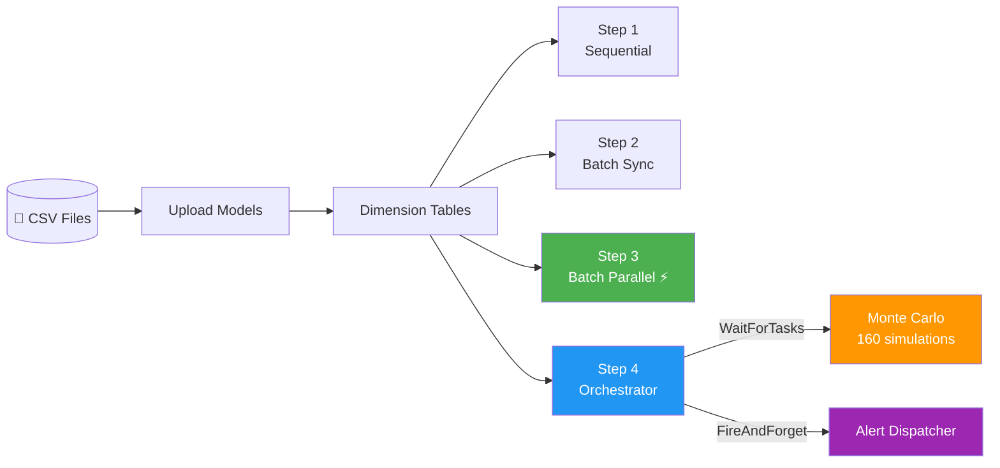

# Workshop: Parallelisation in LEX

> **Duration:** ~90 minutes  
> **Level:** Intermediate  
> **Prerequisites:** Completed the [Getting Started](../getting%20started.md) guide and the [Tutorial](../tutorial/)

## What You'll Build

A **supply chain risk analysis system** for a fictional logistics company
called **NovaTrans**.  By the end you'll have:

- 4 CSV upload models that ingest real data
- An inventory optimiser (sequential calculation)
- A demand forecast engine (batch calculation)
- A parallel demand forecast engine (same logic, 5–8× faster)
- A Monte Carlo risk simulator with 160 supplier–warehouse combinations
- An orchestrator that uses `WaitForTasks` and `FireAndForget`

## Workshop Parts

| Part | Topic | Duration |
|------|-------|----------|
| [Part 1 — Data Ingestion](part-1-data-ingestion.md) | Upload models, CSV parsing, LexLogger | 20 min |
| [Part 2 — Sequential Analysis](part-2-sequential-analysis.md) | CalculationModel, state machine, heavy computation | 15 min |
| [Part 3 — Batch Processing](part-3-batch-processing.md) | CalculatedModelMixin, defining_fields, cartesian product | 15 min |
| [Part 4 — Parallelisation](part-4-parallelisation.md) | parallelizable_fields, @lex_shared_task, Celery | 20 min |
| [Part 5 — Orchestration](part-5-orchestration.md) | WaitForTasks, FireAndForget, multi-phase pipeline | 20 min |

## The NovaTrans Story

NovaTrans operates **8 distribution hubs** across 4 continents:

| Hub | Region | Country | Capacity |
|-----|--------|---------|----------|
| Frankfurt Hub | EMEA | Germany | 50 000 units |
| Shanghai Hub | APAC | China | 75 000 units |
| Los Angeles Hub | AMERICAS | United States | 60 000 units |
| São Paulo Hub | AMERICAS | Brazil | 45 000 units |
| Dubai Hub | MEA | UAE | 55 000 units |
| Mumbai Hub | APAC | India | 40 000 units |
| Singapore Hub | APAC | Singapore | 65 000 units |
| Rotterdam Hub | EMEA | Netherlands | 70 000 units |

They handle **12 product categories** from **20 international suppliers**,
generating ~2 300 shipment records per year.

Every month the operations team runs a risk analysis pipeline:

1. **Upload** the latest shipment data
2. **Optimise** inventory levels per warehouse
3. **Forecast** demand for each warehouse × product pair
4. **Simulate** supplier disruption risk (Monte Carlo)
5. **Alert** stakeholders about high-risk combinations

The challenge?  Running 96 demand forecasts and 160 Monte Carlo
simulations **sequentially** takes minutes.  With LEX's parallelisation
it takes seconds.

> [!tip] Ready?
> Start with [Part 1 — Data Ingestion](part-1-data-ingestion.md) →
