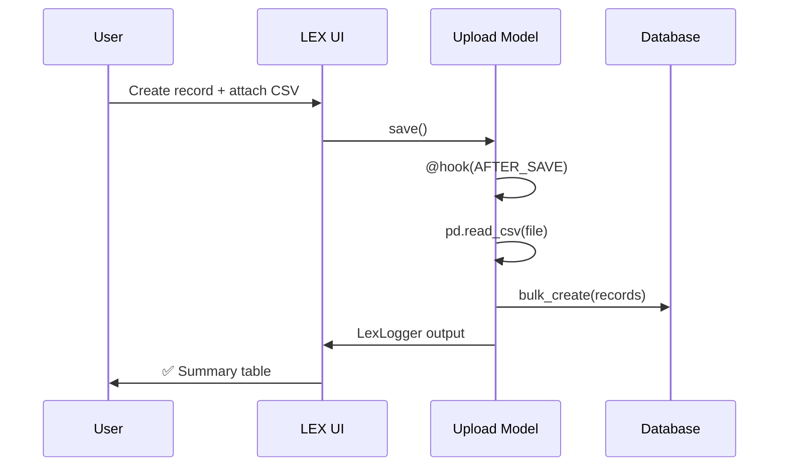

# Part 1 — Data Ingestion

> **Goal:** Upload 4 CSV files into LEX using Upload models, populating
> Warehouse, ProductCategory, Supplier, and ShipmentRecord tables.

## Test Data

The workshop ships with a data generator (`Workshop/generate_test_data.py`)
that creates 4 CSV files in `Workshop/TestData/`:

| File | Records | Description |
|------|---------|-------------|
| `warehouses.csv` | 8 | Global distribution hubs with capacity and coordinates |
| `product_categories.csv` | 12 | Product lines with weight, volume, value, shelf-life |
| `suppliers.csv` | 20 | International suppliers with reliability scores |
| `shipment_history.csv` | ~2 300 | 12 months of shipment records (Jan–Dec 2024) |

```bash
cd project_example
python Workshop/generate_test_data.py
```

The shipment data includes realistic features:
- **Seasonality** — Electronics spike in Q4, Agricultural peaks in summer
- **Supplier affinity** — Each product has 3–4 preferred suppliers
- **Delay distribution** — Unreliable suppliers have higher delay probability
- **Damage rates** — Fragile/perishable goods have higher base damage

## Dimension Models (Input/)

Each dimension is a plain `LexModel` — one file per model:

```
Workshop/Input/
├── Warehouse.py         # name, region, country, capacity, coordinates
├── ProductCategory.py   # name, sku_prefix, weight, volume, unit_value
├── Supplier.py          # name, country, lead_time, reliability_score
└── ShipmentRecord.py    # FKs to above + date, quantity, cost, delay
```

> [!note] One model per file
> LEX convention: each model lives in its own `.py` file, named after the
> class.  The framework auto-discovers them — no need for `app_label`.

### ShipmentRecord — The Key Model

This is the main transactional table.  Every downstream calculation reads
from it:

```python
class ShipmentRecord(LexModel):
    warehouse = models.ForeignKey("Workshop.Warehouse", ...)
    product_category = models.ForeignKey("Workshop.ProductCategory", ...)
    supplier = models.ForeignKey("Workshop.Supplier", ...)
    ship_date = models.DateField()
    quantity = models.IntegerField()
    unit_cost = models.FloatField()
    delay_days = models.IntegerField(default=0)
    damage_rate = models.FloatField(default=0.0)
    order_id = models.CharField(max_length=20, unique=True)
```

## Upload Models (Upload/)

Upload models follow the LEX pattern: extend `LexModel`, add a `FileField`,
and use `@hook(AFTER_SAVE)` to process the file on save.

```
Workshop/Upload/
├── UploadWarehouses.py
├── UploadProducts.py
├── UploadSuppliers.py
└── UploadShipments.py
```

### Pattern: CSV Upload with LexLogger

Here's the warehouse upload as an example:

```python
class UploadWarehouses(LexModel):
    id = models.AutoField(primary_key=True)
    upload_name = models.CharField(max_length=200)
    data_file = models.FileField(upload_to="workshop_uploads/")
    upload_comment = models.TextField(blank=True, default="")

    @hook(AFTER_SAVE)
    def process_upload(self):
        # 1. Clear old data
        Warehouse.objects.filter().delete()

        # 2. Read CSV
        df = pd.read_csv(self.data_file.path)

        # 3. Build objects
        created = []
        for _, row in df.iterrows():
            obj = Warehouse(name=row["name"], region=row["region"], ...)
            created.append(obj)

        # 4. Bulk create
        Warehouse.objects.bulk_create(created)

        # 5. Log results
        logger.add_heading("📦 Warehouse Upload Complete", level=2)
        logger.add_table(
            headers=["Name", "Region", "Country", "Capacity"],
            rows=[[w.name, w.region, w.country, ...] for w in created],
        )
        logger.log()
```

> [!important] Upload order matters
> Upload in this order because ShipmentRecord has foreign keys to the
> other three tables:
> 1. Warehouses → 2. Products → 3. Suppliers → 4. Shipments

### The Shipment Upload — FK Resolution

The most interesting upload is `UploadShipments`.  It builds lookup caches
to avoid N+1 queries:

```python
@hook(AFTER_SAVE)
def process_upload(self):
    # Build lookup caches
    wh_cache = {w.name: w for w in Warehouse.objects.all()}
    prod_cache = {p.name: p for p in ProductCategory.objects.all()}
    sup_cache = {s.name: s for s in Supplier.objects.all()}

    for _, row in df.iterrows():
        wh = wh_cache.get(row["warehouse"])
        prod = prod_cache.get(row["product_category"])
        sup = sup_cache.get(row["supplier"])
        # ... resolve FKs by name, skip unmatched rows
```

The log output includes per-warehouse shipment counts, per-product
breakdowns, and delivery performance statistics.

## Try It

1. Run `lex makemigrations && lex migrate`
2. Start the app: `lex start`
3. Navigate to **Workshop → Upload Data**
4. Create each upload record, attach the CSV, and save
5. Check the Calculation Log — you'll see rich Markdown output



> [!tip] Next step
> With data loaded, move on to [Part 2 — Sequential Analysis](part-2-sequential-analysis.md) →
