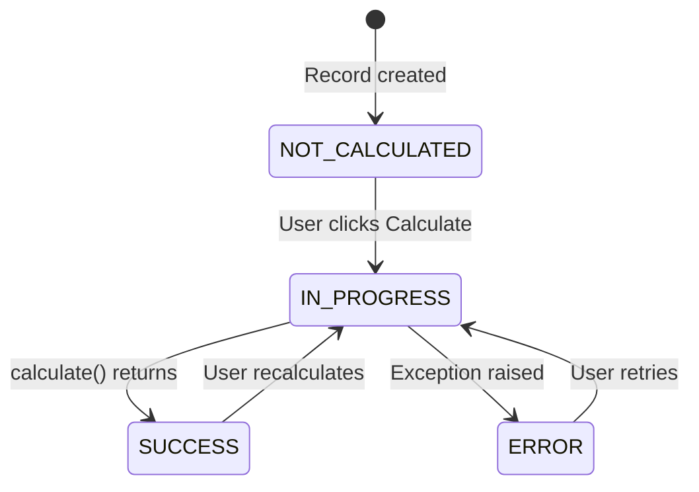

# Part 2 — Sequential Analysis

> **Goal:** Create an `InventoryOptimizer` that analyses a single
> warehouse — safety stock, EOQ, reorder points — using `CalculationModel`.

## CalculationModel — The Basics

A `CalculationModel` is a Django model with a **state machine**:



The user:
1. Creates a record (selects a warehouse)
2. Clicks **Calculate**
3. LEX calls `calculate()`, updates `is_calculated` status
4. Results appear in the Calculation Log

## The InventoryOptimizer

Located at `Workshop/Reports/InventoryOptimizer.py`:

```python
class InventoryOptimizer(CalculationModel):
    warehouse = models.ForeignKey(Warehouse, on_delete=models.CASCADE)

    # Computed outputs
    total_products_analysed = models.IntegerField(default=0)
    total_safety_stock_units = models.FloatField(default=0)
    total_carrying_cost_eur = models.FloatField(default=0)
    avg_service_level = models.FloatField(default=0)
    computation_seconds = models.FloatField(default=0)
```

### What `calculate()` Does

For every product category in the selected warehouse:

1. **Loads shipment history** — quantities, delays, costs
2. **Statistical analysis** — mean demand (μ), standard deviation (σ)
3. **Bootstrap confidence intervals** — 500 resampling iterations
4. **Safety stock** — $Z \cdot \sqrt{LT \cdot \sigma_d^2 + \mu_d^2 \cdot \sigma_{LT}^2}$
5. **Economic Order Quantity** — $\sqrt{\frac{2DS}{H}}$
6. **Reorder point** — $\mu_d \times LT + \text{Safety Stock}$
7. **Carrying cost** — monthly holding cost estimate

Each product takes ~120 ms of computation (statistical analysis +
bootstrap).  With 12 products per warehouse, one calculation takes
~1.5 s.

### Rich Log Output

The `LexLogger` produces a detailed Markdown report:

```
## 📦 Inventory Optimisation — Frankfurt Hub
Analysing **12 products** across **285 shipment records** …

---

### Product-Level Analysis
| Product | μ Demand | σ Demand | 95% CI | Safety Stock | EOQ | ... |
|---------|----------|----------|--------|-------------|-----|-----|
| Electronics | 382 | 147 | [340–425] | 612 | 284 | ... |
| Pharmaceuticals | 891 | 302 | ... | ... | ... | ... |
| ...

---

### Summary
| Metric | Value |
|--------|-------|
| Products analysed | 12 |
| Total safety stock | 8,432 units |
| Monthly carrying cost | €14,281.50 |
| ⏱️ Computation time | **1.52 s** |
```

## The Problem

To analyse **all 8 warehouses** the user must:
1. Create 8 `InventoryOptimizer` records
2. Click Calculate on each one
3. Wait ~1.5 s × 8 = **~12 seconds** total
4. Results are spread across 8 separate log entries

> [!warning] This doesn't scale
> What if NovaTrans opens 50 warehouses?  What if each analysis takes
> 30 seconds instead of 1.5?  We need a way to generate and run all
> combinations automatically.

That's what Step 3 introduces: `CalculatedModelMixin`.

## Try It

1. Navigate to **Workshop → Step 1 - Sequential Analysis**
2. Create an `InventoryOptimizer` record, select a warehouse
3. Click **Calculate**
4. Open the Calculation Log — see the detailed analysis table
5. Try creating records for 2–3 more warehouses and notice the
   cumulative time

> [!tip] Next step
> Move on to [Part 3 — Batch Processing](part-3-batch-processing.md) to automate
> the cross-product generation →
