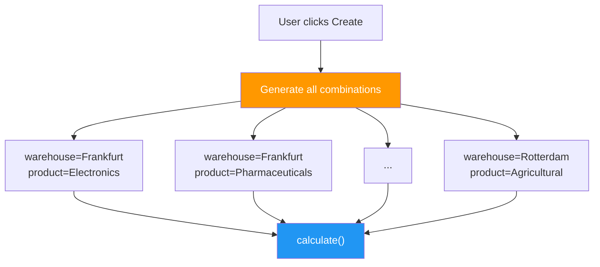

# Part 3 — Batch Processing

> **Goal:** Use `CalculatedModelMixin` to automatically generate and
> compute 96 demand forecasts (8 warehouses × 12 products) — all from
> a single **Create** click.

## CalculatedModelMixin — Batch Generation

Where `CalculationModel` processes one record at a time,
`CalculatedModelMixin` generates **all combinations** of its
`defining_fields` and runs `calculate()` on each.



### The DemandForecast Model

```python
class DemandForecast(CalculatedModelMixin):
    warehouse = models.ForeignKey(Warehouse, on_delete=models.CASCADE)
    product_category = models.ForeignKey(ProductCategory, on_delete=models.CASCADE)

    defining_fields = ["warehouse", "product_category"]
    #                    ↑ This tells LEX which fields to cross-product

    # Computed outputs
    forecast_units_next_quarter = models.FloatField(default=0)
    trend_slope = models.FloatField(default=0)
    seasonality_index = models.FloatField(default=1.0)
    confidence_lower = models.FloatField(default=0)
    confidence_upper = models.FloatField(default=0)
```

### How `defining_fields` Works

When you call `DemandForecast.create()`, LEX:

1. **Reads all Warehouses** (8) and all ProductCategories (12)
2. **Generates the cartesian product** → 96 combinations
3. **Creates or updates** a `DemandForecast` record for each
4. **Calls `calculate()`** on each record sequentially

```python
# This happens inside CalculatedModelMixin.create():
for warehouse in Warehouse.objects.all():
    for product in ProductCategory.objects.all():
        forecast, _ = DemandForecast.objects.get_or_create(
            warehouse=warehouse,
            product_category=product,
        )
        forecast.calculate()
```

### The Forecast Algorithm

Each `calculate()` call runs on the shipment history for that specific
warehouse × product pair:

1. **Exponential smoothing** (α = 0.3) — weights recent observations more
2. **Trend detection** — linear regression on the time series
3. **Seasonality index** — ratio of recent quarter vs. annual mean
4. **Forecast** — `(smoothed_tail + trend × periods) × seasonality`
5. **Bootstrap CI** — 500 resampling iterations for the 90% confidence band

Each forecast takes ~120 ms (real computation + statistical bootstrap).

### The Timing Problem

With 96 records running sequentially:

$$T_{total} = 96 \times 0.12\,\text{s} \approx 15\,\text{seconds}$$

On a single thread.  Blocked.  No parallelism.

> [!warning] Bottleneck identified
> 15 seconds for 96 forecasts.  What about 500 products × 20 warehouses
> = 10 000 forecasts?  That's **20 minutes** on the main thread.

## The Key Insight

Look at the model — every warehouse's forecasts are **independent**
of each other.  Frankfurt's Electronics forecast doesn't need to know
about Shanghai's Textiles.  We could split the work by warehouse and
run 8 groups in parallel.

That's exactly what Step 4 does — with just **two lines of code**.

## Try It

1. Navigate to **Workshop → Step 2 - Batch Sequential**
2. Click **Create** on `DemandForecast`
3. Watch the log — you'll see all 96 forecasts computed one by one
4. Note the total time in the log output (~15 seconds)
5. Keep this number in mind for comparison with Step 4

> [!tip] Next step
> Move on to [Part 4 — Parallelisation](part-4-parallelisation.md) to add two lines
> and watch the same 96 forecasts complete in ~2 seconds →
