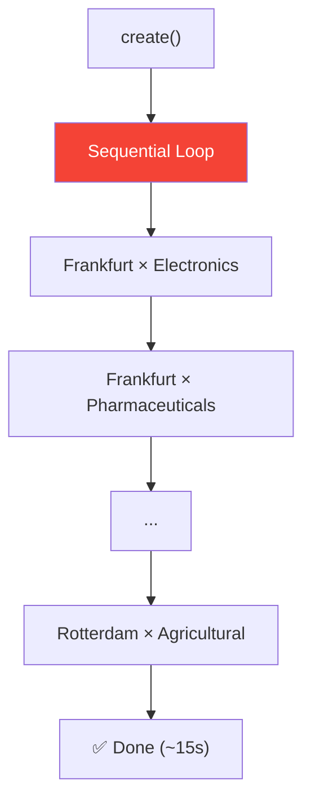
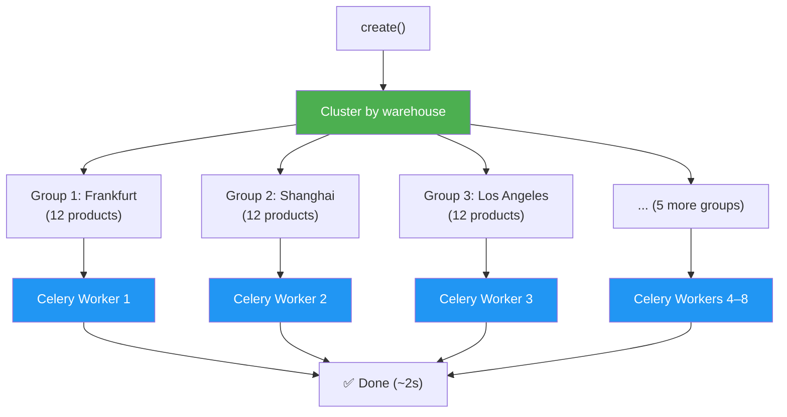

# Part 4 — Parallelisation

> **Goal:** Take the exact same forecast model from Step 3, add **two
> lines**, and watch it run 5–8× faster with Celery workers.

## The Two-Line Change

Compare `DemandForecast` (Step 2) with `DemandForecastParallel` (Step 3):

```diff
  class DemandForecastParallel(CalculatedModelMixin):
      warehouse = models.ForeignKey(Warehouse, on_delete=models.CASCADE)
      product_category = models.ForeignKey(ProductCategory, on_delete=models.CASCADE)

      defining_fields = ["warehouse", "product_category"]

+     # ⚡ THE KEY ADDITION ⚡
+     parallelizable_fields = ["warehouse"]

      # ... same output fields ...

+     @lex_shared_task
      def calculate(self):
          # ... identical business logic ...
```

That's it.  **No other changes.**  The forecast algorithm, the bootstrap,
the log output — all untouched.

## How It Works

### Without `parallelizable_fields` (Step 2)



All 96 records run one after another on the **main thread**.

### With `parallelizable_fields = ["warehouse"]` (Step 3)



LEX's `ModelClusterManager`:
1. Groups the 96 records by `warehouse` → **8 groups of 12**
2. Dispatches each group as a Celery task
3. Each worker processes its 12 products sequentially (~1.5 s)
4. All 8 groups run **simultaneously** → wall clock ~2 s

### The Math

$$T_{parallel} = \frac{T_{sequential}}{n_{workers}} = \frac{15\,\text{s}}{8} \approx 2\,\text{s}$$

In practice, overhead (task serialisation, network) adds ~0.5 s, so
expect ~2–3 s total.

## `@lex_shared_task` — What It Does

The decorator wraps `calculate()` so it can run in two modes:

| Mode | When | Behaviour |
|------|------|-----------|
| **Synchronous** | No Celery, or inside `WaitForTasks` without workers | Calls `calculate()` directly |
| **Asynchronous** | `CELERY_ACTIVE=true` + workers running | Serialises the call, dispatches to Redis, worker picks it up |

The method signature doesn't change.  The decorator handles all the
Celery plumbing transparently.

## Prerequisites for Parallel Execution

```bash
# Terminal 1: Start Redis (if not already running)
redis-server

# Terminal 2: Start Celery workers
export CELERY_ACTIVE=true
lex celery worker --concurrency=4

# Terminal 3: Start the LEX app
export CELERY_ACTIVE=true
lex start
```

> [!important] Both app and workers need CELERY_ACTIVE=true
> Without it, LEX falls back to synchronous execution and you won't
> see any speedup.

## Try It — Side by Side Comparison

1. Make sure Step 2's `DemandForecast` has already run (note the time)
2. Navigate to **Workshop → Step 3 - Batch Parallel**
3. Click **Create** on `DemandForecastParallel`
4. Compare the timing:

| Model | Records | Strategy | Expected Time |
|-------|---------|----------|---------------|
| `DemandForecast` | 96 | Sequential | ~15 s |
| `DemandForecastParallel` | 96 | 8 parallel groups | ~2 s |

The log output for each individual forecast is identical — same tables,
same metrics.  But the wall clock time is dramatically different.

> [!tip] Next step
> Move on to [Part 5 — Orchestration](part-5-orchestration.md) to learn `WaitForTasks`
> and `FireAndForget` — the tools for composing complex multi-model
> pipelines →
